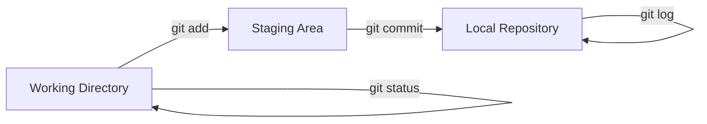

# Instalación, Configuración y Comandos Básicos

# Ejercicio: Configuración de Git y Primer Repositorio Local

## 📋 Objetivo
Configurar Git correctamente en el sistema y crear el primer repositorio local, aplicando conceptos fundamentales de control de versiones.

---

## 🛠️ Requerimientos

- **Sistema operativo:** Windows 10/11, macOS, o Linux
- **Terminal/Command Line:** Git Bash (Windows), Terminal (macOS/Linux)
- **Git:** Versión 2.0 o superior
- **Editor de código:** VS Code (recomendado) o cualquier editor de texto

---

## 📝 Pasos Realizados

### 1. Verificación de Instalación de Git

Primero, verificamos que Git esté instalado correctamente en el sistema:

```bash
git --version
```

**Resultado:**
```
git version 2.47.0.windows.1
```

### 2. Configuración Inicial de Git

Configuramos la identidad del usuario que aparecerá en los commits:

```bash
# Configurar nombre de usuario
git config --global user.name "Tu Nombre Completo"

# Configurar email
git config --global user.email "tu.email@ejemplo.com"

# Configurar editor por defecto (VS Code)
git config --global core.editor "code --wait"

# Configurar rama principal como 'main'
git config --global init.defaultBranch main
```

### 3. Verificación de Configuración

Verificamos que todas las configuraciones se aplicaron correctamente:

```bash
git config --list --show-origin
```

**Configuraciones clave verificadas:**
- ✅ `user.name`: Nombre del usuario
- ✅ `user.email`: Correo electrónico
- ✅ `core.editor`: Editor configurado
- ✅ `init.defaultbranch`: Rama principal (main)

### 4. Creación del Primer Repositorio

#### 4.1 Crear carpeta del proyecto

```bash
mkdir Carrer_Path_Datos
cd Carrer_Path_Datos
```

#### 4.2 Inicializar repositorio Git

```bash
git init
```

**Resultado:**
```
Initialized empty Git repository in /ruta/Carrer_Path_Datos/.git/
```

#### 4.3 Crear archivo README.md inicial

```bash
echo "# Career Path - Datos" > README.md
```

#### 4.4 Verificar estado del repositorio

```bash
git status
```

**Resultado:**
```
On branch main

No commits yet

Untracked files:
  (use "git add <file>..." to include in what will be committed)
        README.md

nothing added to commit but untracked files present (use "git add" to track)
```

#### 4.5 Agregar archivo al staging area

```bash
git add README.md
```

#### 4.6 Verificar estado después del add

```bash
git status
```

**Resultado:**
```
On branch main

No commits yet

Changes to be committed:
  (use "git rm --cached <file>..." to unstage)
        new file:   README.md
```

#### 4.7 Crear el primer commit

```bash
git commit -m "Initial commit: Agregar README básico"
```

**Resultado:**
```
[main (root-commit) abc1234] Initial commit: Agregar README básico
 1 file changed, 1 insertion(+)
 create mode 100644 README.md
```

#### 4.8 Verificar historial de commits

```bash
git log --oneline
```

**Resultado:**
```
e9f78da (HEAD -> main, origin/main) ejercicio practica dia 1 añadida
9c21fc9 Update README.md
cfc8454 Update README.md
e345c8f Update README.md
3eb5fd1 Initial commit: Estructura completa Career Path Datos - 3 meses de contenido estructurado - 12 semanas con 60 días de actividades - Sistema de navegación con README.md en todos los niveles - Carpetas documentos e imagenes en cada día
```

---

## ✅ Verificación Final

### Checklist de completitud:

- [x] Git instalado y verificado
- [x] Usuario y email configurados globalmente
- [x] Editor por defecto configurado
- [x] Rama principal configurada como 'main'
- [x] Repositorio local inicializado
- [x] Primer archivo creado (README.md)
- [x] Archivo agregado al staging area
- [x] Primer commit realizado exitosamente
- [x] Historial de commits verificado

---

## 📊 Comandos Utilizados - Resumen

| Comando | Propósito |
|---------|-----------|
| `git --version` | Verificar versión de Git instalada |
| `git config --global` | Configurar opciones globales de Git |
| `git config --list` | Listar todas las configuraciones |
| `git init` | Inicializar repositorio Git en carpeta actual |
| `git status` | Ver estado actual del repositorio |
| `git add` | Agregar archivos al staging area |
| `git commit` | Crear un commit con los cambios staged |
| `git log` | Ver historial de commits |
| `git branch` | Ver y gestionar ramas |

---

## 🎯 Conceptos Clave Aprendidos

1. **Control de versiones:** Sistema que registra cambios en archivos a lo largo del tiempo
2. **Repositorio local:** Carpeta con historial de versiones gestionado por Git
3. **Staging area:** Área intermedia donde se preparan cambios antes del commit
4. **Commit:** Instantánea de los cambios en un momento específico
5. **Branch (rama):** Línea de desarrollo independiente

---

## 🔄 Flujo de Trabajo Básico de Git



**Explicación del flujo:**
1. **Working Directory:** Donde trabajas y modificas archivos
2. **Staging Area:** Preparas qué cambios incluir en el próximo commit
3. **Local Repository:** Se guardan permanentemente los commits

---

## 📚 Recursos Adicionales

- [Documentación oficial de Git](https://git-scm.com/doc)
- [Pro Git Book (gratuito)](https://git-scm.com/book/es/v2)
- [GitHub Git Cheat Sheet](https://education.github.com/git-cheat-sheet-education.pdf)
- [Visual Git Reference](https://marklodato.github.io/visual-git-guide/index-es.html)

---

## 🚀 Próximos Pasos

1. Aprender sobre ramas (branches) y merge
2. Conectar repositorio local con GitHub (remote)
3. Practicar flujo de trabajo con pull requests
4. Resolver conflictos de merge
5. Explorar GitHub Flow y buenas prácticas

---

[Volver al índice principal](../../../README.md) | [Volver al Mes 1](../../README.md) | [Volver a Semana 1](../README.md) | [Día Siguiente →](../Dia_3_Repositorios_Remotos_GitHub_SSH/README.md)
