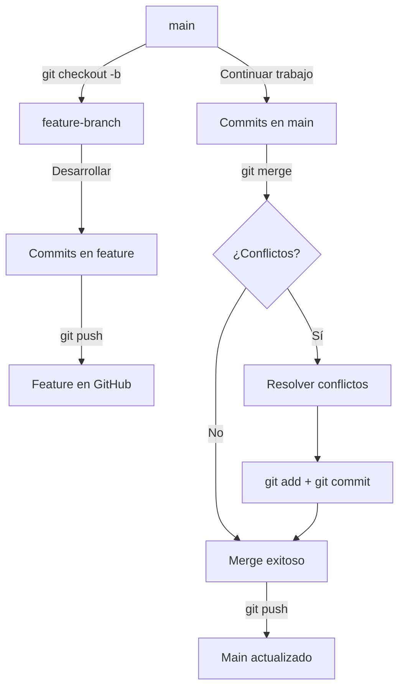

# Pull Requests, Ramas, Merge y Resolución de Conflictos

# Ejercicio: Ramas, Modificaciones y Resolución de Conflictos

## 📋 Objetivo
Dominar el trabajo con ramas en Git, crear y resolver conflictos de merge, y comprender el flujo de trabajo colaborativo mediante Pull Requests.

---

## 🛠️ Requerimientos

- **Git:** Configurado y conectado con GitHub
- **Repositorio:** Con commits previos
- **Editor de texto:** VS Code, Nano, o cualquier editor
- **Cuenta GitHub:** Activa y con SSH configurado

---

## 🌿 ¿Qué son las Ramas?

Las **ramas (branches)** son líneas independientes de desarrollo que permiten:
- ✅ Trabajar en nuevas funcionalidades sin afectar el código principal
- ✅ Desarrollar múltiples características simultáneamente
- ✅ Aislar cambios experimentales
- ✅ Facilitar la colaboración en equipos

**Conceptos clave:**
- **main/master:** Rama principal con código estable
- **feature branch:** Rama para desarrollar una funcionalidad específica
- **merge:** Integrar cambios de una rama a otra
- **conflicto:** Cuando dos ramas modifican las mismas líneas

---

## 📝 Pasos Realizados

### 0. Preparación: Crear Archivo de Trabajo

Primero creamos un archivo `.txt` para trabajar sin modificar el README principal:

```bash
# Verificar rama actual
git branch

# Asegurarse de estar en main
git checkout main

# Crear archivo de análisis
echo "# Documento de Análisis de Datos" > analisis.txt

# Agregar y commitear
git add analisis.txt
git commit -m "docs: Crear archivo inicial de análisis"

# Subir a GitHub
git push origin main
```

**Resultado:**
```
[main 08244d3] docs: Crear archivo inicial de análisis
 1 file changed, 1 insertion(+)
 create mode 100644 analisis.txt
Enumerating objects: 4, done.
Counting objects: 100% (4/4), done.
Delta compression using up to 16 threads
Compressing objects: 100% (2/2), done.
Writing objects: 100% (3/3), 317 bytes | 317.00 KiB/s, done.
Total 3 (delta 1), reused 0 (delta 0), pack-reused 0 (from 0)
remote: Resolving deltas: 100% (1/1), completed with 1 local object.
To github.com:D-Araya/Carrer_Path_Datos.git
   e504cfd..08244d3  main -> main

```

### 1. Crear Rama Feature y Hacer Cambios

#### 1.1 Crear y cambiar a nueva rama

```bash
# Crear rama y cambiar a ella
git checkout -b feature-analisis-ventas
```

**Resultado:**
```
Switched to a new branch 'feature-analisis-ventas'
```

**Estado actual:**
```
main                    ← origen
  └─ feature-analisis-ventas  ← aquí estamos
```

#### 1.2 Agregar contenido al archivo

```bash
# Agregar nueva sección
echo "" >> analisis.txt
echo "## Análisis de Ventas Mejorado" >> analisis.txt
echo "- Implementación de métricas avanzadas" >> analisis.txt
echo "- Segmentación por categorías de producto" >> analisis.txt
echo "- Análisis de tendencias y patrones estacionales" >> analisis.txt
```

#### 1.3 Verificar contenido

```bash
cat analisis.txt
```

**Contenido actual:**
```
# Documento de Análisis de Datos

## Análisis de Ventas Mejorado
- Implementación de métricas avanzadas
- Segmentación por categorías de producto
- Análisis de tendencias y patrones estacionales
```

#### 1.4 Guardar cambios

```bash
# Agregar al staging
git add analisis.txt

# Ver estado
git status

# Crear commit
git commit -m "feat: Agregar sección de análisis de ventas mejorado"
```

**Resultado:**
```
[feature-analisis-ventas 99dc71b] feat: Agregar sección de análisis de ventas mejorado
 1 file changed, 5 insertions(+)
```

#### 1.5 Subir rama a GitHub

```bash
git push origin feature-analisis-ventas
```

**Resultado:**
```
Enumerating objects: 5, done.
Counting objects: 100% (5/5), done.
Delta compression using up to 16 threads
Compressing objects: 100% (3/3), done.
Writing objects: 100% (3/3), 426 bytes | 23.00 KiB/s, done.
Total 3 (delta 1), reused 0 (delta 0), pack-reused 0 (from 0)
remote: Resolving deltas: 100% (1/1), completed with 1 local object.
remote: 
remote: Create a pull request for 'feature-analisis-ventas' on GitHub by visiting:
remote:      https://github.com/D-Araya/Carrer_Path_Datos/pull/new/feature-analisis-ventas
remote:
To github.com:D-Araya/Carrer_Path_Datos.git
 * [new branch]      feature-analisis-ventas -> feature-analisis-ventas
```

### 2. Cambiar a Main y Crear Conflicto Intencional

#### 2.1 Volver a rama main

```bash
git checkout main
```

**Resultado:**
```
Switched to branch 'main'
Your branch is up to date with 'origin/main'.
```

#### 2.2 Verificar contenido actual

```bash
cat analisis.txt
```

**Contenido en main (sin los cambios de la rama feature):**
```
# Documento de Análisis de Datos
```

#### 2.3 Agregar contenido diferente

```bash
# Agregar sección diferente en la misma posición
echo "" >> analisis.txt
echo "## Análisis de Datos Principal" >> analisis.txt
echo "- Dashboard interactivo de métricas clave" >> analisis.txt
echo "- Visualización de tendencias temporales" >> analisis.txt
echo "- Reportes automatizados semanales" >> analisis.txt
```

#### 2.4 Verificar nuevo contenido

```bash
cat analisis.txt
```

**Contenido actualizado en main:**
```
# Documento de Análisis de Datos

## Análisis de Datos Principal
- Dashboard interactivo de métricas clave
- Visualización de tendencias temporales
- Reportes automatizados semanales
```

#### 2.5 Guardar cambios en main

```bash
git add analisis.txt
git commit -m "feat: Agregar análisis de datos principal"
git push origin main
```

**Resultado:**
```

warning: in the working copy of 'analisis.txt', LF will be replaced by CRLF the next time Git touches it
[main ac56594] feat: Agregar análisis de datos principal
 1 file changed, 5 insertions(+)
Enumerating objects: 5, done.
Counting objects: 100% (5/5), done.
Delta compression using up to 16 threads
Compressing objects: 100% (3/3), done.
Writing objects: 100% (3/3), 409 bytes | 409.00 KiB/s, done.
Total 3 (delta 1), reused 0 (delta 0), pack-reused 0 (from 0)
remote: Resolving deltas: 100% (1/1), completed with 1 local object.
To github.com:D-Araya/Carrer_Path_Datos.git
   08244d3..ac56594  main -> main
```

**Estado de las ramas:**
```
main                    ← Tiene "Análisis de Datos Principal"
  └─ feature-analisis-ventas  ← Tiene "Análisis de Ventas Mejorado"
```

### 3. Intentar Merge (Crear Conflicto)

```bash
# Intentar fusionar feature en main
git merge feature-analisis-ventas
```

**Resultado - CONFLICTO:**
```
Auto-merging analisis.txt
CONFLICT (content): Merge conflict in analisis.txt
Automatic merge failed; fix conflicts and then commit the result.
```

🔴 **¡Conflicto detectado!** Git no puede decidir automáticamente qué versión mantener.

### 4. Analizar el Conflicto

#### 4.1 Ver estado del repositorio

```bash
git status
```

**Resultado:**
```
On branch main
You have unmerged paths.
  (fix conflicts and run "git commit")
  (use "git merge --abort" to abort the merge)

Unmerged paths:
  (use "git add <file>..." to mark resolution)
        both modified:   analisis.txt

no changes added to commit (use "git add" and/or "git commit -a")
```

#### 4.2 Ver marcadores de conflicto

```bash
cat analisis.txt
```

**Contenido con marcadores de conflicto:**
```
# Documento de Análisis de Datos

<<<<<<< HEAD
## Análisis de Datos Principal
- Dashboard interactivo de métricas clave
- Visualización de tendencias temporales
- Reportes automatizados semanales
=======
## Análisis de Ventas Mejorado
- Implementación de métricas avanzadas
- Segmentación por categorías de producto
- Análisis de tendencias y patrones estacionales
>>>>>>> feature-analisis-ventas
```

**Explicación de marcadores:**
- `<<<<<<< HEAD`: Inicio del contenido de la rama actual (main)
- `=======`: Separador entre versiones
- `>>>>>>> feature-analisis-ventas`: Fin del contenido de la otra rama

### 5. Resolver el Conflicto

#### 5.1 Abrir archivo en editor

```bash
# Opción 1: VS Code
code analisis.txt

# Opción 2: Nano
nano analisis.txt

# Opción 3: Vim
vim analisis.txt
```

#### 5.2 Editar y resolver

**Estrategias de resolución:**

**Opción A - Mantener ambas secciones (RECOMENDADO):**
```
# Documento de Análisis de Datos

## Análisis de Datos Principal
- Dashboard interactivo de métricas clave
- Visualización de tendencias temporales
- Reportes automatizados semanales

## Análisis de Ventas Mejorado
- Implementación de métricas avanzadas
- Segmentación por categorías de producto
- Análisis de tendencias y patrones estacionales
```

**Opción B - Mantener solo versión de main:**
```
# Documento de Análisis de Datos

## Análisis de Datos Principal
- Dashboard interactivo de métricas clave
- Visualización de tendencias temporales
- Reportes automatizados semanales
```

**Opción C - Mantener solo versión de feature:**
```
# Documento de Análisis de Datos

## Análisis de Ventas Mejorado
- Implementación de métricas avanzadas
- Segmentación por categorías de producto
- Análisis de tendencias y patrones estacionales
```

**Para este ejercicio, usamos Opción A** (mantener ambas).

#### 5.3 Guardar el archivo

Elimina todos los marcadores de conflicto (`<<<<<<<`, `=======`, `>>>>>>>`) y guarda.

### 6. Completar el Merge

#### 6.1 Agregar archivo resuelto

```bash
# Marcar conflicto como resuelto
git add analisis.txt
```

#### 6.2 Verificar estado

```bash
git status
```

**Resultado:**
```
On branch main
All conflicts fixed but you are still merging.
  (use "git commit" to conclude merge)

Changes to be committed:
        modified:   analisis.txt
```

#### 6.3 Crear commit de merge

```bash
git commit -m "merge: Resolver conflicto entre análisis de datos y ventas

- Integrar sección de análisis de datos principal
- Integrar sección de análisis de ventas mejorado
- Mantener ambas funcionalidades para análisis completo"
[main 6a86f92] merge: Resolver conflicto entre análisis de datos y ventas
```
}
#### 6.4 Subir cambios a GitHub

```bash
git push origin main
```

**Resultado:**
```
Enumerating objects: 7, done.
Counting objects: 100% (7/7), done.
Delta compression using up to 16 threads
Compressing objects: 100% (3/3), done.
Writing objects: 100% (3/3), 594 bytes | 594.00 KiB/s, done.
Total 3 (delta 1), reused 0 (delta 0), pack-reused 0 (from 0)
remote: Resolving deltas: 100% (1/1), completed with 1 local object.
To github.com:D-Araya/Carrer_Path_Datos.git
   ac56594..6a86f92  main -> main
```

✅ **Merge completado exitosamente**

### 7. Entendiendo Pull Requests (Contexto Educativo)

#### 7.1 ¿Qué es un Pull Request?

Un **Pull Request (PR)** es una solicitud formal para integrar cambios de una rama a otra. Es especialmente útil en equipos para:
- 📝 Revisar código antes de integrarlo
- 💬 Discutir cambios propuestos
- ✅ Ejecutar pruebas automáticas (CI/CD)
- 📊 Mantener trazabilidad de decisiones

#### 7.2 Flujos de trabajo: Merge Local vs Pull Request

**Merge Local (lo que hicimos):**
```bash
git checkout main
git merge feature-analisis-ventas
git push origin main
```
✅ Rápido para proyectos personales  
✅ Control total del proceso  
❌ Sin revisión formal  
❌ Sin discusión de cambios  

**Pull Request (flujo colaborativo):**
```
1. Push rama feature → GitHub
2. Crear PR en interfaz web
3. Solicitar revisión del equipo
4. Discutir y aprobar cambios
5. Merge desde GitHub
6. Pull para sincronizar local
```
✅ Revisión de código  
✅ Discusión y aprobaciones  
✅ CI/CD automático  
❌ Proceso más largo  

#### 7.3 Intento de Crear PR (Resultado Esperado)

Al intentar crear un PR desde GitHub:

1. Ve a: `https://github.com/TU_USUARIO/Carrer_Path_Datos/compare`
2. Selecciona:
   - **base:** `main`
   - **compare:** `feature-analisis-ventas`

**Resultado obtenido:**
```
There isn't anything to compare.
main is up to date with all commits from feature-analisis-ventas.
```

#### 7.4 ¿Por qué no hay nada que comparar?

GitHub muestra este mensaje porque:

1. ✅ Ya hicimos el merge localmente (paso 6)
2. ✅ Main ya contiene todos los commits de feature
3. ✅ Ambas ramas están sincronizadas
4. ✅ No hay diferencias entre ellas

**Diagrama del estado actual:**
```
feature-analisis-ventas: A---B---C---D
                                      \
main:                    A---B---C---D---E (merge)
                                          ↑
                                    Ya integrado
```

#### 7.5 Conclusión sobre Pull Requests

**Para proyectos personales:**
- Merge local es más eficiente
- PR opcional, principalmente educativo

**Para proyectos en equipo:**
- PR es obligatorio y esencial
- Permite code review y calidad
- Facilita colaboración asíncrona

**Cuándo usar cada uno:**

| Escenario | Recomendación |
|-----------|---------------|
| Proyecto personal | Merge local |
| Contribución open source | Pull Request |
| Equipo de desarrollo | Pull Request |
| Hotfix urgente | Merge local + notificar |
| Nueva funcionalidad en equipo | Pull Request |
| Experimento rápido | Merge local |

#### 7.6 Ejemplo de Pull Request (para referencia futura)

Si quisieras experimentar el flujo completo de PR en el futuro:

**Opción A - Crear nueva rama y PR:**
```bash
# Crear nueva feature
git checkout -b feature-dashboard
echo "## Dashboard de Métricas" >> analisis.txt
git add analisis.txt
git commit -m "feat: Agregar dashboard de métricas"
git push origin feature-dashboard

# Ahora IR A GITHUB y crear PR ANTES de hacer merge local
```

**Opción B - Deshacer merge y rehacer con PR:**
```bash
# Solo si quieres practicar el flujo (CUIDADO: esto deshace trabajo)
git checkout main
git reset --hard HEAD~1  # Deshacer merge
git push origin main --force  # Actualizar remoto

# Ahora crear PR desde GitHub
# Después hacer merge desde la interfaz web
```

⚠️ **Nota:** Para este ejercicio, el merge local está completo y es válido. El PR era opcional y educativo.

### 8. Verificar Historial

#### 8.1 Ver log gráfico

```bash
git log --oneline --graph --all
```

**Resultado esperado:**
```
*   6a86f92 (HEAD -> main, origin/main) merge: Resolver conflicto entre análisis de datos y ventas
|\
| * 99dc71b (origin/feature-analisis-ventas, feature-analisis-ventas) feat: Agregar sección de análisis de ventas mejorado
* | ac56594 feat: Agregar análisis de datos principal
|/
* 08244d3 docs: Crear archivo inicial de análisis
* e504cfd Update README.md dia 3 evidencia imagen
* 0ddc511 imagen_dia_3_añadida
* 00bc4f6 Update README.md dia 3
* fd87257 practice dia 2 añadido
* 0dc978d Update README.md dia 2
* e9f78da ejercicio practica dia 1 añadida
* 9c21fc9 Update README.md
* cfc8454 Update README.md
* e345c8f Update README.md
* 3eb5fd1 Initial commit: Estructura completa Career Path Datos - 3 meses de contenido estructurado - 12 semanas con 60 días de actividades - Sistema de navegación* 3eb5fd1 Initial commit: Estructura completa Career Path Datos - 3 meses de contenido estructurado - 12 semanas con 60 días de actividades - Sistema de navegación con README.md en todos los niveles - Carpetas documentos e imagenes en cada día
```

#### 8.2 Ver todas las ramas

```bash
git branch -a
```

**Resultado:**
```
  feature-analisis-ventas
* main
  remotes/origin/feature-analisis-ventas
  remotes/origin/main
```

#### 8.3 Ver diferencias entre ramas

```bash
# Ver diferencias
git diff main feature-analisis-ventas
```

---

## ✅ Verificación Final

### Checklist de completitud:

- [x] Rama feature creada correctamente
- [x] Cambios realizados en rama feature
- [x] Cambios realizados en rama main
- [x] Conflicto generado intencionalmente
- [x] Conflicto identificado correctamente
- [x] Marcadores de conflicto comprendidos
- [x] Conflicto resuelto manualmente
- [x] Merge completado exitosamente
- [x] Cambios subidos a GitHub
- [x] Pull Request creado (opcional)
- [x] Historial verificado

---

## 📊 Comandos Utilizados - Resumen

| Comando | Propósito |
|---------|-----------|
| `git checkout -b <rama>` | Crear y cambiar a nueva rama |
| `git checkout <rama>` | Cambiar a rama existente |
| `git branch` | Listar ramas locales |
| `git branch -a` | Listar todas las ramas (locales y remotas) |
| `git merge <rama>` | Fusionar rama en la actual |
| `git status` | Ver estado durante merge |
| `git add <archivo>` | Marcar conflicto como resuelto |
| `git commit` | Completar merge |
| `git push origin <rama>` | Subir rama a GitHub |
| `git log --graph --all` | Ver historial gráfico |
| `git diff <rama1> <rama2>` | Ver diferencias entre ramas |

---

## 🔀 Conceptos Clave Aprendidos

### 1. Ramas (Branches)
Líneas independientes de desarrollo que permiten trabajar en paralelo sin afectar el código principal.

### 2. Merge
Proceso de integrar cambios de una rama a otra.

### 3. Conflicto de Merge
Ocurre cuando:
- Dos ramas modifican las mismas líneas
- Git no puede decidir automáticamente qué versión mantener
- Requiere intervención manual del desarrollador

### 4. Marcadores de Conflicto
- `<<<<<<< HEAD`: Inicio versión rama actual
- `=======`: Separador
- `>>>>>>> rama`: Fin versión otra rama

### 5. Pull Request (PR)
Solicitud formal para revisar e integrar cambios, común en flujos colaborativos.

---

## 🎯 Tipos de Merge

### Fast-Forward Merge
```
main:    A---B
              \
feature:       C---D

Después del merge:
main:    A---B---C---D
```
No hay commits divergentes, solo se mueve el puntero.

### Three-Way Merge
```
main:    A---B---C
              \   \
feature:       D---E---M

M = commit de merge
```
Hay commits divergentes, se crea commit de merge.

### Conflicto en Merge
```
main:    A---B (modifica línea X)
              \
feature:       C (modifica línea X)

Requiere resolución manual
```

---

## 🛠️ Estrategias de Resolución de Conflictos

### 1. Aceptar versión de main (ours)
```bash
git checkout --ours analisis.txt
git add analisis.txt
```

### 2. Aceptar versión de feature (theirs)
```bash
git checkout --theirs analisis.txt
git add analisis.txt
```

### 3. Resolver manualmente (recomendado)
Editar el archivo y combinar lo mejor de ambas versiones.

### 4. Abortar merge
```bash
git merge --abort
```
Vuelve al estado anterior al merge.

---

## 🚨 Solución de Problemas Comunes

### Error: "You have not concluded your merge"

**Causa:** Merge inconcluso

**Solución:**
```bash
# Ver estado
git status

# Completar merge
git add .
git commit

# O abortar
git merge --abort
```

### Error: "Cannot merge with uncommitted changes"

**Causa:** Cambios sin commitear

**Solución:**
```bash
# Guardar cambios
git add .
git commit -m "Guardar cambios antes de merge"

# O guardar temporalmente
git stash
git merge <rama>
git stash pop
```

### Conflicto complejo

**Solución:**
```bash
# Ver herramientas de merge
git mergetool

# O usar editor visual (VS Code tiene excelente soporte)
code .
```

---

## 📚 Flujo de Trabajo Recomendado



---

## 🎓 Mejores Prácticas

### ✅ Hacer:
- Crear ramas descriptivas (`feature-`, `bugfix-`, `hotfix-`)
- Hacer commits pequeños y frecuentes
- Mantener ramas actualizadas con main
- Resolver conflictos cuidadosamente
- Probar el código después del merge
- Eliminar ramas después de merge

### ❌ Evitar:
- Trabajar directamente en main
- Ramas de larga duración sin sincronizar
- Commits masivos difíciles de revisar
- Resolver conflictos apresuradamente
- Dejar ramas huérfanas sin merge

---

## 📈 Workflow GitFlow Simplificado

```
main (producción)
  └── develop (desarrollo)
       ├── feature/nueva-funcionalidad
       ├── feature/otra-funcionalidad
       └── bugfix/correccion-error
```

---

## 🚀 Próximos Pasos

1. Practicar resolución de conflictos más complejos
2. Aprender rebase como alternativa a merge
3. Explorar estrategias de branching (GitFlow, GitHub Flow)
4. Dominar cherry-pick para commits selectivos
5. Configurar protección de ramas en GitHub
6. Implementar code reviews sistemáticas

---

## 📚 Recursos Adicionales

- [Git Branching - Basic Branching and Merging](https://git-scm.com/book/en/v2/Git-Branching-Basic-Branching-and-Merging)
- [Resolving a merge conflict using the command line](https://docs.github.com/en/pull-requests/collaborating-with-pull-requests/addressing-merge-conflicts/resolving-a-merge-conflict-using-the-command-line)
- [About pull requests](https://docs.github.com/en/pull-requests/collaborating-with-pull-requests/proposing-changes-to-your-work-with-pull-requests/about-pull-requests)
- [Visualizing Git Concepts](https://git-school.github.io/visualizing-git/)

---

## 📝 Notas del Ejercicio

**Ramas creadas:**
- `main` (principal)
- `feature-analisis-ventas` (funcionalidad)

**Conflictos resueltos:** 1  
**Estrategia de resolución:** Mantener ambas secciones

**Archivo de trabajo:** `analisis.txt`

---

[Volver al índice principal](../../../README.md) | [Volver al Mes 1](../../README.md) | [Volver a Semana 1](../README.md) | [Día Siguiente →](../Dia_5_GitHub_Flow_Buenas_Practicas/README.md)
