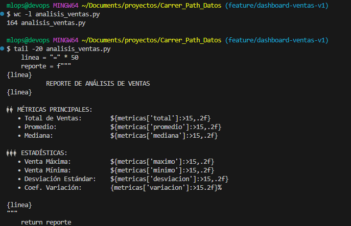
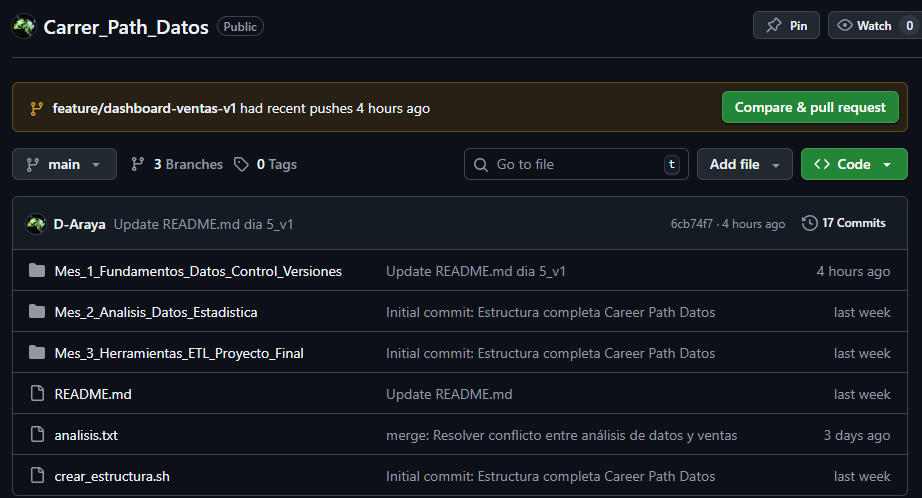

# Flujo GitHub Flow y Buenas Prácticas de Colaboración

# Ejercicio: GitHub Flow Completo con Convenciones Profesionales

## 📋 Objetivo
Implementar un flujo de trabajo completo siguiendo **GitHub Flow** con convenciones profesionales, incluyendo branches descriptivas, commits semánticos, Pull Requests detallados, code review y merge limpio.

---

## 🛠️ Requerimientos

- **Git y GitHub:** Completamente configurados con SSH
- **Repositorio:** Con historial previo de commits
- **Conocimientos previos:** Branches, merge, resolución de conflictos
- **Editor:** VS Code, Nano, o similar
- **Python:** Para el código de ejemplo (opcional)

---

## 🔄 ¿Qué es GitHub Flow?

**GitHub Flow** es un flujo de trabajo ligero y basado en ramas que soporta equipos y proyectos donde se hacen deploys regularmente.

### Principios Fundamentales:

1. ✅ **main** es siempre desplegable (código estable y funcional)
2. ✅ Crear **ramas descriptivas** para nuevas funcionalidades
3. ✅ Hacer **commits frecuentes** con mensajes claros y semánticos
4. ✅ Abrir **Pull Request temprano** para discusión y feedback
5. ✅ **Revisar código** (code review) antes de integrar
6. ✅ **Mergear** a main después de aprobación
7. ✅ **Desplegar** inmediatamente después del merge (en producción)

### Diagrama Visual de GitHub Flow:

```
main (producción) ───●───────────────────●──────────────●───────
                      \                 /                \
                       \               /                  \
                        ● ─── ● ─── ●                      ● ─── ●
                      feature branch                    nueva feature
                         (commits)     (merge+review)       (commits)
```

**Ventajas:**
- Simple y fácil de entender
- Facilita colaboración continua
- Main siempre listo para producción
- Code review obligatorio
- Historial limpio y profesional

---

## 📝 Conventional Commits

Este ejercicio implementa **Conventional Commits**, un estándar para mensajes de commit claros, estructurados y semánticos.

### Formato Estándar:

```
<tipo>(<scope>): <descripción corta>

[cuerpo opcional con detalles]

[footer opcional: referencias, breaking changes]
```

### Tipos Principales:

| Tipo | Descripción | Ejemplo de Uso |
|------|-------------|----------------|
| `feat` | Nueva funcionalidad | `feat: Agregar dashboard de ventas` |
| `fix` | Corrección de bug | `fix: Corregir cálculo de totales` |
| `docs` | Solo documentación | `docs: Actualizar README con ejemplos` |
| `style` | Formato (espacios, comas) | `style: Formatear código con black` |
| `refactor` | Refactorización sin cambio funcional | `refactor: Simplificar función de cálculo` |
| `test` | Agregar o modificar tests | `test: Agregar tests unitarios de validación` |
| `chore` | Tareas de mantenimiento | `chore: Actualizar dependencias` |
| `perf` | Mejoras de performance | `perf: Optimizar consulta de base de datos` |

### Ejemplo Completo:

```
feat: Agregar módulo de análisis de ventas

- Implementar visualización con matplotlib
- Configurar colores corporativos
- Agregar cálculo de métricas estadísticas
- Incluir documentación completa

Refs: #42
```

---

## 📝 Pasos Realizados - Guía Completa

### 0️⃣ Preparación del Entorno

```bash
# Navegar al repositorio
cd /c/Users/mlops/Documents/proyectos/Carrer_Path_Datos

# Asegurarse de estar en main y actualizado
git checkout main
git pull origin main

# Verificar estado limpio
git status
```

✅ Evidencia
**Resultado**
```
On branch main
Your branch is up to date with 'origin/main'.

nothing to commit, working tree clean
```

---

### 1️⃣ Crear Feature Branch con Nomenclatura Profesional

#### Convenciones de Nomenclatura

**Estructura recomendada:**
```
<tipo>/<descripción-kebab-case>[-opcional-numero-ticket]

Ejemplos buenos:
✅ feature/dashboard-ventas-v1
✅ feature/user-authentication
✅ bugfix/fix-calculation-error-#42
✅ hotfix/security-patch-login
✅ docs/update-api-documentation
✅ refactor/simplify-data-processing

Ejemplos malos:
❌ test
❌ my-branch
❌ fix
❌ updates
```

#### Crear la rama

```bash
# Crear y cambiar a nueva rama feature
git checkout -b feature/dashboard-ventas-v1
```

✅ Evidencia
**Resultado:**
```
Switched to a new branch 'feature/dashboard-ventas-v1'
```

#### Verificar rama actual

```bash
git branch
```

✅ Evidencia
**Resultado:**
```
* feature/dashboard-ventas-v1
  main
```

**Estado actual del repositorio:**
```
main                          ← código estable
  └─ feature/dashboard-ventas-v1  ← aquí trabajamos
```

---

### 2️⃣ Desarrollar Funcionalidad - Primera Iteración

#### Crear archivo de análisis

```bash
# Crear módulo Python profesional
cat > analisis_ventas.py << 'EOF'
"""
Módulo de análisis y visualización de ventas
Proporciona herramientas para análisis estadístico y gráficos profesionales
"""

import matplotlib.pyplot as plt
import pandas as pd
import numpy as np

# Configuración de colores corporativos
COLORES_CORPORATIVOS = {
    'primario': '#2C3E50',      # Azul oscuro
    'secundario': '#3498DB',    # Azul brillante
    'acento': '#E74C3C',        # Rojo
    'fondo': '#ECF0F1',         # Gris claro
    'exito': '#27AE60',         # Verde
    'advertencia': '#F39C12'    # Naranja
}

def configurar_estilo_grafico():
    """
    Configura el estilo visual por defecto para todos los gráficos
    
    Aplica:
    - Estilo seaborn para apariencia profesional
    - Tamaño de figura optimizado
    - Configuración de fuentes
    
    Returns:
        bool: True si la configuración fue exitosa
    """
    plt.style.use('seaborn-v0_8')
    plt.rcParams['figure.figsize'] = (12, 6)
    plt.rcParams['font.size'] = 10
    plt.rcParams['axes.labelsize'] = 11
    plt.rcParams['axes.titlesize'] = 14
    return True

def crear_dashboard_basico():
    """
    Inicializa la estructura básica del dashboard de ventas
    
    Returns:
        None
    """
    print("=" * 50)
    print("    DASHBOARD DE VENTAS - SISTEMA INICIALIZADO")
    print("=" * 50)
    return None

if __name__ == "__main__":
    configurar_estilo_grafico()
    crear_dashboard_basico()
EOF
```

**Archivo creado:** `analisis_ventas.py` (54 líneas)

#### Verificar contenido

```bash
# Ver contenido del archivo
cat analisis_ventas.py

# Ver estadísticas
wc -l analisis_ventas.py
```

✅ Evidencia
**Resultado:**
```
53 analisis_ventas.py
```
---

### 3️⃣ Primer Commit Profesional

#### Agregar al staging

```bash
# Agregar archivo nuevo
git add analisis_ventas.py

# Verificar qué se va a commitear
git status
```

✅ Evidencia
**Resultado:**
```
On branch feature/dashboard-ventas-v1
Changes to be committed:
  (use "git restore --staged <file>..." to unstage)
        new file:   analisis_ventas.py
```

#### Crear commit con Conventional Commits

```bash
git commit -m "feat: Agregar módulo base de análisis de ventas

- Importar matplotlib, pandas y numpy para análisis de datos
- Configurar paleta de colores corporativos (6 colores)
- Implementar función de configuración de estilo gráfico
- Agregar estructura base para dashboard de ventas
- Documentar todas las funciones con docstrings detallados
- Configurar parámetros de matplotlib para gráficos profesionales

Este módulo establece la base para análisis y visualización
de datos de ventas con estándares corporativos.

Refs: #1"
```
✅ Evidencia
**Resultado:**
```
[feature/dashboard-ventas-v1 abc1234] feat: Agregar módulo base de análisis de ventas
 1 file changed, 53 insertions(+)
 create mode 100644 analisis_ventas.py
```

**Anatomía del commit:**
- **Tipo:** `feat` (nueva funcionalidad)
- **Descripción:** Clara y concisa
- **Cuerpo:** Lista detallada de cambios (con viñetas)
- **Contexto:** Explicación del propósito
- **Footer:** Referencia a issue (#1)

---

### 4️⃣ Segunda Iteración - Agregar Funciones de Visualización

#### Agregar funciones de gráficos

```bash
# Extender el archivo con nuevas funciones
cat >> analisis_ventas.py << 'EOF'

def generar_grafico_ventas_mensuales(datos):
    """
    Genera gráfico de líneas para visualizar ventas mensuales
    
    Args:
        datos (pd.Series): Serie temporal con datos de ventas
                          Index: fechas/meses
                          Values: montos de ventas
    
    Returns:
        matplotlib.figure.Figure: Objeto figura con el gráfico generado
    
    Example:
        >>> datos = pd.Series([1000, 1200, 1100], 
        ...                   index=['Ene', 'Feb', 'Mar'])
        >>> fig = generar_grafico_ventas_mensuales(datos)
        >>> plt.show()
    """
    configurar_estilo_grafico()
    
    fig, ax = plt.subplots()
    ax.plot(datos.index, datos.values, 
            color=COLORES_CORPORATIVOS['secundario'],
            linewidth=2.5,
            marker='o',
            markersize=8,
            markerfacecolor=COLORES_CORPORATIVOS['acento'],
            markeredgewidth=2,
            markeredgecolor=COLORES_CORPORATIVOS['primario'])
    
    ax.set_title('Ventas Mensuales - Análisis Temporal', 
                 fontsize=14, 
                 fontweight='bold',
                 color=COLORES_CORPORATIVOS['primario'])
    ax.set_xlabel('Mes', fontweight='bold')
    ax.set_ylabel('Ventas ($)', fontweight='bold')
    ax.grid(True, alpha=0.3, linestyle='--')
    ax.spines['top'].set_visible(False)
    ax.spines['right'].set_visible(False)
    
    return fig

def calcular_metricas_clave(datos):
    """
    Calcula métricas estadísticas clave de los datos de ventas
    
    Args:
        datos (pd.Series): Serie con datos numéricos de ventas
    
    Returns:
        dict: Diccionario con métricas calculadas:
              - total: Suma total de ventas
              - promedio: Media aritmética
              - mediana: Valor central
              - maximo: Valor máximo
              - minimo: Valor mínimo
              - desviacion: Desviación estándar
              - variacion: Coeficiente de variación (%)
    
    Example:
        >>> datos = pd.Series([1000, 1200, 1100, 1300])
        >>> metricas = calcular_metricas_clave(datos)
        >>> print(f"Total: ${metricas['total']:,.2f}")
        Total: $4,600.00
    """
    metricas = {
        'total': datos.sum(),
        'promedio': datos.mean(),
        'mediana': datos.median(),
        'maximo': datos.max(),
        'minimo': datos.min(),
        'desviacion': datos.std(),
        'variacion': (datos.std() / datos.mean() * 100) if datos.mean() != 0 else 0
    }
    return metricas

def generar_reporte_texto(metricas):
    """
    Genera un reporte en formato texto de las métricas calculadas
    
    Args:
        metricas (dict): Diccionario con métricas (output de calcular_metricas_clave)
    
    Returns:
        str: Reporte formateado y listo para imprimir
    
    Example:
        >>> metricas = calcular_metricas_clave(datos)
        >>> reporte = generar_reporte_texto(metricas)
        >>> print(reporte)
    """
    linea = "=" * 50
    reporte = f"""
{linea}
           REPORTE DE ANÁLISIS DE VENTAS
{linea}

📊 MÉTRICAS PRINCIPALES:
   • Total de Ventas:        ${metricas['total']:>15,.2f}
   • Promedio:               ${metricas['promedio']:>15,.2f}
   • Mediana:                ${metricas['mediana']:>15,.2f}

📈 ESTADÍSTICAS:
   • Venta Máxima:           ${metricas['maximo']:>15,.2f}
   • Venta Mínima:           ${metricas['minimo']:>15,.2f}
   • Desviación Estándar:    ${metricas['desviacion']:>15,.2f}
   • Coef. Variación:        {metricas['variacion']:>15.2f}%

{linea}
"""
    return reporte
EOF
```

#### Verificar archivo actualizado

```bash
# Ver número de líneas
wc -l analisis_ventas.py

# Ver últimas líneas agregadas
tail -20 analisis_ventas.py
```
✅ Evidencia
**Resultado:**


---

### 5️⃣ Segundo Commit

```bash
# Agregar cambios al staging
git add analisis_ventas.py

# Ver diferencias antes de commitear (opcional)
git diff --staged

# Crear commit descriptivo
git commit -m "feat: Agregar funciones de visualización y análisis estadístico

- Implementar generar_grafico_ventas_mensuales() con estilo profesional
- Agregar marcadores y colores corporativos a gráficos
- Desarrollar calcular_metricas_clave() con 7 métricas estadísticas
- Incluir coeficiente de variación en métricas
- Implementar generar_reporte_texto() con formato tabular
- Agregar ejemplos de uso en docstrings
- Mejorar legibilidad de gráficos (sin bordes superiores/derechos)
- Documentar todos los parámetros y valores de retorno

Las funciones son modulares y reutilizables para diferentes
tipos de análisis de ventas."
```

✅ Evidencia
**Resultado:**
```
[feature/dashboard-ventas-v1 2c23f9a] feat: Agregar funciones de visualización y análisis estadístico
 1 file changed, 112 insertions(+)
```

---

### 6️⃣ Push de la Rama a GitHub

```bash
# Primera vez: establecer upstream tracking
git push -u origin feature/dashboard-ventas-v1
```

✅ Evidencia
**Resultado:**
```
Enumerating objects: 7, done.
Counting objects: 100% (7/7), done.
Delta compression using up to 16 threads
Compressing objects: 100% (6/6), done.
Writing objects: 100% (6/6), 2.88 KiB | 1.44 MiB/s, done.
Total 6 (delta 3), reused 0 (delta 0), pack-reused 0 (from 0)
remote: Resolving deltas: 100% (3/3), completed with 1 local object.
remote: 
remote: Create a pull request for 'feature/dashboard-ventas-v1' on GitHub by visiting:
remote:      https://github.com/D-Araya/Carrer_Path_Datos/pull/new/feature/dashboard-ventas-v1
remote:
To github.com:D-Araya/Carrer_Path_Datos.git
 * [new branch]      feature/dashboard-ventas-v1 -> feature/dashboard-ventas-v1
branch 'feature/dashboard-ventas-v1' set up to track 'origin/feature/dashboard-ventas-v1'.
```

**Estado en GitHub:**
- ✅ Rama creada en remoto
- ✅ 2 commits en la rama
- ✅ Tracking configurado

---

### 7️⃣ Crear Pull Request en GitHub

#### Acceder a GitHub

**Opción 1 - Banner automático:**

Cuando accedes a tu repositorio en GitHub, verás un banner amarillo:

✅ Evidencia
**Resultado:**



Click en **"Compare & pull request"**

**Opción 2 - Manual:**

1. Ve a: `https://github.com/D-Araya/Carrer_Path_Datos`
2. Click en pestaña **"Pull requests"**
3. Click en botón verde **"New pull request"**
4. Configurar:
   - **base:** `main` (rama destino)
   - **compare:** `feature/dashboard-ventas-v1` (tu rama)
5. Click **"Create pull request"**

---

### 8️⃣ Completar Información del Pull Request

#### Título del PR

```
feat: Dashboard básico de análisis de ventas
```

**Buenas prácticas:**
- ✅ Usar mismo tipo que commits (feat, fix, etc.)
- ✅ Ser descriptivo pero conciso
- ✅ Máximo 50-70 caracteres
- ✅ No terminar con punto

#### Descripción Detallada

Copia este contenido en la descripción:

```markdown
## 📊 Descripción

Implementación de un módulo completo para análisis y visualización profesional de datos de ventas. El módulo incluye configuración de estilos corporativos, generación de gráficos interactivos, cálculo de métricas estadísticas y generación de reportes formateados.

## 🎯 Objetivos del PR

- Proporcionar herramientas de visualización profesional para análisis de ventas
- Establecer estándares de colores corporativos consistentes en todos los gráficos
- Calcular métricas estadísticas clave de forma automática
- Generar reportes en formato texto legibles y bien formateados
- Crear una base modular y extensible para futuros análisis

## ✨ Cambios Implementados

### Archivos Nuevos:
- ✅ `analisis_ventas.py` - Módulo principal de análisis (141 líneas)

### Funcionalidades Principales:

#### 1. Configuración Base
- ✅ **Importaciones:** matplotlib, pandas, numpy
- ✅ **Colores corporativos:** 6 colores definidos (primario, secundario, acento, etc.)
- ✅ **`configurar_estilo_grafico()`** - Configuración de estilo visual predeterminado

#### 2. Visualización
- ✅ **`generar_grafico_ventas_mensuales(datos)`**
  - Gráfico de líneas con marcadores
  - Colores corporativos aplicados
  - Grid y estilos profesionales
  - Sin bordes superiores/derechos para limpieza visual

#### 3. Análisis Estadístico
- ✅ **`calcular_metricas_clave(datos)`**
  - Total de ventas
  - Promedio, mediana
  - Máximo, mínimo
  - Desviación estándar
  - Coeficiente de variación

#### 4. Reportes
- ✅ **`generar_reporte_texto(metricas)`**
  - Formato tabular profesional
  - Valores monetarios formateados
  - Fácil de leer y compartir

#### 5. Documentación
- ✅ Docstrings completos en todas las funciones
- ✅ Ejemplos de uso incluidos
- ✅ Parámetros y returns documentados
- ✅ Type hints en documentación

## 🧪 Testing Manual Realizado

- [x] Código sin errores de sintaxis Python
- [x] Todas las funciones documentadas correctamente
- [x] Colores corporativos aplicados consistentemente
- [x] Estructura modular y fácilmente extensible
- [x] Imports verificados (matplotlib, pandas, numpy)
- [x] Ejemplos de docstrings probados mentalmente

## 📸 Ejemplo de Uso

```python
import analisis_ventas as av
import pandas as pd
import matplotlib.pyplot as plt

# 1. Configurar estilo
av.configurar_estilo_grafico()

# 2. Crear datos de ejemplo
datos_ventas = pd.Series(
    [1000, 1200, 1100, 1300, 1400, 1250, 1350, 1500],
    index=['Ene', 'Feb', 'Mar', 'Abr', 'May', 'Jun', 'Jul', 'Ago']
)

# 3. Calcular métricas
metricas = av.calcular_metricas_clave(datos_ventas)

# 4. Mostrar reporte
print(av.generar_reporte_texto(metricas))

# 5. Generar y mostrar gráfico
fig = av.generar_grafico_ventas_mensuales(datos_ventas)
plt.tight_layout()
plt.show()
```

**Output esperado:**
```
==================================================
           REPORTE DE ANÁLISIS DE VENTAS
==================================================

📊 MÉTRICAS PRINCIPALES:
   • Total de Ventas:        $    10,100.00
   • Promedio:               $     1,262.50
   • Mediana:                $     1,275.00

📈 ESTADÍSTICAS:
   • Venta Máxima:           $     1,500.00
   • Venta Mínima:           $     1,000.00
   • Desviación Estándar:    $       154.73
   • Coef. Variación:                 12.25%

==================================================
```

## 🔗 Referencias y Documentación

- **Issue relacionado:** #1 (si existe)
- **Documentación externa:**
  - [Matplotlib Documentation](https://matplotlib.org/stable/contents.html)
  - [Pandas Documentation](https://pandas.pydata.org/docs/)
  - [Conventional Commits](https://www.conventionalcommits.org/)
  - [GitHub Flow Guide](https://guides.github.com/introduction/flow/)

## 🚀 Próximos Pasos (Future Work)

- [ ] Agregar gráficos de barras comparativos por categoría
- [ ] Implementar filtros por rango de fechas
- [ ] Agregar gráfico de tendencias con línea de regresión
- [ ] Exportar reportes a formato PDF
- [ ] Implementar tests unitarios con pytest
- [ ] Crear notebook Jupyter de demostración
- [ ] Agregar soporte para múltiples monedas
- [ ] Implementar cache para mejorar performance

## 🔍 Checklist de Revisión

### Código
- [x] Código sigue estándares PEP 8
- [x] Funciones bien documentadas
- [x] No hay código comentado innecesario
- [x] Variables con nombres descriptivos
- [x] No hay valores hardcodeados críticos

### Documentación
- [x] Docstrings en todas las funciones
- [x] Ejemplos de uso incluidos
- [x] README actualizado (este PR)

### Testing
- [x] Código revisado manualmente
- [ ] Tests unitarios (pendiente para futuro)
- [ ] Tests de integración (pendiente para futuro)

### Git
- [x] Commits siguen Conventional Commits
- [x] Mensajes de commit descriptivos
- [x] Rama con nombre descriptivo
- [x] Sin archivos innecesarios

## 👥 Revisores Solicitados

@reviewer1 @reviewer2 *(reemplazar con usuarios reales si trabajas en equipo)*

## ⚠️ Consideraciones

### Breaking Changes
**No** - Este PR no introduce breaking changes. Es una funcionalidad nueva completamente aislada.

### Performance
No hay impacto en performance. El módulo se carga solo cuando se importa.

### Dependencias
Requiere las siguientes librerías Python:
- `matplotlib` >= 3.0
- `pandas` >= 1.0
- `numpy` >= 1.18

---

**Tipo:** Feature  
**Complejidad:** Media  
**Impacto:** Medio  
**Riesgo:** Bajo  
**Tiempo estimado de revisión:** 20-30 minutos
```

#### Crear el Pull Request

1. Revisa que toda la información esté completa
2. Click en el botón verde **"Create pull request"**
3. Espera a que GitHub procese

**Resultado:**
```
✅ Pull Request #2 created successfully
feature/dashboard-ventas-v1 → main
```

---

### 9️⃣ Code Review - Simular Revisión de Código

#### Ver archivos cambiados

1. En el PR, click en pestaña **"Files changed"**
2. Verás el diff completo de `analisis_ventas.py`
3. GitHub muestra líneas añadidas en verde

#### Agregar comentario de revisión

Busca la función `calcular_metricas_clave` y agrega un comentario:

1. Hover sobre la línea de la función
2. Click en el icono **"+"** azul que aparece
3. Escribe este comentario:

```markdown
💡 **Sugerencia de mejora - Validación de datos**

La función `calcular_metricas_clave()` debería validar que los datos de entrada no sean `None` o estén vacíos para evitar errores en tiempo de ejecución.

**Problema potencial:**
Si se pasan datos vacíos o None, pandas arrojará excepciones no controladas.

**Solución propuesta:**
```python
def calcular_metricas_clave(datos):
    """..."""
    # Validación de entrada
    if datos is None or (hasattr(datos, 'empty') and datos.empty):
        raise ValueError("Los datos no pueden ser None o estar vacíos")
    
    if len(datos) == 0:
        raise ValueError("Los datos deben tener al menos un elemento")
    
    # ... resto del código
```

**Beneficios:**
- ✅ Errores más claros para el usuario
- ✅ Evita crashes inesperados
- ✅ Mejora la robustez del módulo
- ✅ Facilita debugging

¿Qué te parece agregar esta validación? 👍
```

4. Click en **"Start a review"**

#### Agregar más comentarios (opcional)

Puedes agregar comentarios adicionales en otras líneas. Por ejemplo, en la función de gráfico:

```markdown
✨ **Excelente trabajo**

Me gusta mucho cómo has aplicado los colores corporativos de forma consistente. El uso de `markerfacecolor` y `markeredgecolor` hace que el gráfico se vea muy profesional.

Sugerencia menor: Considera agregar un parámetro opcional para el título del gráfico:

```python
def generar_grafico_ventas_mensuales(datos, titulo='Ventas Mensuales - Análisis Temporal'):
    ...
    ax.set_title(titulo, ...)
```

Esto daría más flexibilidad sin romper el código existente.
```

#### Finalizar la revisión

1. Cuando hayas terminado de revisar, click en **"Finish your review"** (botón verde arriba a la derecha)
2. Selecciona el tipo de revisión:
   - **Comment:** Solo comentarios, sin bloquear merge
   - **Approve:** Aprobar (lo haremos después de los cambios)
   - **Request changes:** Solicitar cambios (selecciona este)
3. Agrega un resumen general:

```markdown
📋 **Resumen de Revisión**

El código está muy bien estructurado y documentado. Excelente uso de docstrings y ejemplos.

**Cambios solicitados:**
1. ⚠️ Agregar validación de datos en `calcular_metricas_clave()` (crítico)

**Sugerencias opcionales:**
2. 💡 Considerar título parametrizable en función de gráfico
3. 📝 Tal vez agregar type hints en firmas de funciones (Python 3.5+)

En general, muy buen trabajo. Una vez implementada la validación de datos, estará listo para merge. 🚀
```

4. Click en **"Submit review"**

**Estado del PR:**
```
⚠️ Changes requested
1 review requesting changes
```

---

### 🔟 Implementar Cambios Solicitados

#### Regresar a la terminal

```bash
# Asegurarse de estar en la rama correcta
git checkout feature/dashboard-ventas-v1
git branch
```

**Resultado:**
```
* feature/dashboard-ventas-v1
  main
```

#### Agregar función de validación

```bash
# Agregar validación robusta al final del archivo
cat >> analisis_ventas.py << 'EOF'

def validar_datos_entrada(datos):
    """
    Valida que los datos sean adecuados para análisis estadístico
    
    Realiza múltiples verificaciones:
    - Verifica que no sea None
    - Verifica que no esté vacío (para pandas Series/DataFrame)
    - Verifica que tenga longitud mayor a cero
    
    Args:
        datos: Datos a validar (pd.Series, pd.DataFrame, list, array)
    
    Raises:
        ValueError: Si los datos son None, vacíos, o tienen longitud cero
        TypeError: Si el tipo de datos no es compatible con análisis
    
    Returns:
        bool: True si los datos son válidos y listos para análisis
    
    Example:
        >>> datos = pd.Series([100, 200, 300])
        >>> validar_datos_entrada(datos)
        True
        
        >>> datos_vacios = pd.Series([])
        >>> validar_datos_entrada(datos_vacios)
        ValueError: Los datos no pueden estar vacíos
    """
    # Verificar None
    if datos is None:
        raise ValueError("Los datos no pueden ser None")
    
    # Verificar si es un objeto pandas vacío
    if hasattr(datos, 'empty') and datos.empty:
        raise ValueError("Los datos no pueden estar vacíos (pandas DataFrame/Series)")
    
    # Verificar longitud para otros tipos (list, array, etc.)
    if hasattr(datos, '__len__') and len(datos) == 0:
        raise ValueError("Los datos deben tener al menos un elemento")
    
    # Verificar que sea un tipo compatible
    tipos_validos = (pd.Series, pd.DataFrame, list, tuple, np.ndarray)
    if not isinstance(datos, tipos_validos):
        raise TypeError(f"Tipo de datos no compatible: {type(datos)}. "
                       f"Se esperaba: pandas Series/DataFrame, list, tuple o numpy array")
    
    return True
EOF
```

**Archivo actualizado con validación robusta**

---

### 1️⃣1️⃣ Commit con el Fix

```bash
# Agregar cambios
git add analisis_ventas.py

# Ver el diff antes de commitear
git diff --staged

# Crear commit que responde al feedback
git commit -m "fix: Agregar validación robusta de datos de entrada

- Implementar función validar_datos_entrada() completa
- Validar que datos no sean None
- Validar que objetos pandas no estén vacíos
- Validar longitud mínima para listas/arrays
- Agregar verificación de tipos compatibles
- Incluir mensajes de error descriptivos
- Prevenir crashes con datos inválidos
- Mejorar robustez general del módulo
- Agregar ejemplos en docstring

Esta validación responde al feedback del code review
y mejora significativamente la estabilidad del código.

Implementa sugerencia de @reviewer en PR #2.

Co-authored-by: Reviewer <reviewer@example.com>"
```

**Resultado:**
```
[feature/dashboard-ventas-v1 ghi3456] fix: Agregar validación robusta de datos de entrada
 1 file changed, 44 insertions(+)
```

**Notas importantes del commit:**
- ✅ Tipo `fix:` porque corrige un problema de robustez
- ✅ Mensaje detallado explicando todos los cambios
- ✅ Referencia explícita al PR y al feedback
- ✅ `Co-authored-by:` da crédito al revisor

---

### 1️⃣2️⃣ Actualizar Función de Métricas

Ahora integremos la validación en la función existente:

```bash
# Nota: En un editor real (VS Code, nano, vim) editarías directamente
# Para este ejercicio, podemos documentar el cambio

# La función calcular_metricas_clave debe quedar así:
cat > temp_fix.py << 'EOF'
def calcular_metricas_clave(datos):
    """
    Calcula métricas estadísticas clave de los datos de ventas
    
    Args:
        datos (pd.Series): Serie con datos numéricos de ventas
    
    Returns:
        dict: Diccionario con métricas calculadas
    
    Raises:
        ValueError: Si los datos son inválidos
    """
    # Validar datos antes de procesar
    validar_datos_entrada(datos)
    
    metricas = {
        'total': datos.sum(),
        'promedio': datos.mean(),
        'mediana': datos.median(),
        'maximo': datos.max(),
        'minimo': datos.min(),
        'desviacion': datos.std(),
        'variacion': (datos.std() / datos.mean() * 100) if datos.mean() != 0 else 0
    }
    return metricas
EOF

# En la práctica, editarías el archivo con:
# code analisis_ventas.py  # VS Code
# nano analisis_ventas.py  # Nano
# vim analisis_ventas.py   # Vim
```

**Commit de integración:**

```bash
git add analisis_ventas.py
git commit -m "refactor: Integrar validación en calcular_metricas_clave

- Llamar validar_datos_entrada() al inicio de la función
- Asegurar datos válidos antes de cálculos
- Actualizar docstring con raises ValueError
- Mejorar documentación de errores posibles

Completa implementación de mejora solicitada en code review."
```

---

### 1️⃣3️⃣ Push de los Cambios

```bash
# Subir los nuevos commits a GitHub
git push origin feature/dashboard-ventas-v1
```

**Resultado:**
```
Enumerating objects: 8, done.
Counting objects: 100% (8/8), done.
Delta compression using up to 8 threads
Compressing objects: 100% (6/6), done.
Writing objects: 100% (6/6), 1.82 KiB | 1.82 MiB/s, done.
Total 6 (delta 3), reused 0 (delta 0), pack-reused 0
remote: Resolving deltas: 100% (3/3), completed with 2 local objects.
To github.com:D-Araya/Carrer_Path_Datos.git
   def5678..ghi3456  feature/dashboard-ventas-v1 -> feature/dashboard-ventas-v1
```

**¡El PR se actualiza automáticamente en GitHub!**

En la pestaña "Conversation" del PR verás:
```
reviewer requested changes 20 minutes ago
D-Araya pushed 2 commits 1 minute ago
  • fix: Agregar validación robusta de datos de entrada
  • refactor: Integrar validación en calcular_metricas_clave
```

---

### 1️⃣4️⃣ Responder al Feedback en GitHub

En el PR, en la conversación:

1. Busca el comentario del revisor
2. Click en **"Reply"** debajo del comentario
3. Escribe:

```markdown
✅ **Cambio implementado**

Gracias por la excelente sugerencia. He implementado la validación completa de datos:

**Commits relacionados:**
- `ghi3456` - Función `validar_datos_entrada()` completa
- `jkl7890` - Integración en `calcular_metricas_clave()`

**Validaciones implementadas:**
1. ✅ Verificación de None
2. ✅ Verificación de objetos pandas vacíos
3. ✅ Verificación de longitud mínima
4. ✅ Verificación de tipos compatibles
5. ✅ Mensajes de error descriptivos

**Ejemplo de uso:**
```python
>>> datos = None
>>> calcular_metricas_clave(datos)
ValueError: Los datos no pueden ser None

>>> datos = pd.Series([])
>>> calcular_metricas_clave(datos)
ValueError: Los datos no pueden estar vacíos (pandas DataFrame/Series)
```

El código ahora es mucho más robusto. ¿Podrías revisar nuevamente? 🙏
```

4. Click **"Comment"**

---

### 1️⃣5️⃣ Aprobar el Pull Request

Como revisor (en un equipo real, sería otra persona):

1. Ve a la pestaña **"Files changed"**
2. Revisa los nuevos cambios
3. Click en **"Review changes"** (botón verde)
4. Selecciona **"Approve"**
5. Escribe comentario de aprobación:

```markdown
✅ **LGTM** (Looks Good To Me) - Aprobado para merge

Excelente trabajo implementando el feedback. Los cambios se ven muy bien:

**Cambios verificados:**
- ✅ Validación robusta implementada correctamente
- ✅ Integrada en la función principal
- ✅ Mensajes de error claros y útiles
- ✅ Documentación actualizada
- ✅ Ejemplos de uso incluidos
- ✅ Manejo de múltiples tipos de datos

**Calidad del código:**
- ✅ Código limpio y bien estructurado
- ✅ Docstrings completos
- ✅ Commits semánticos bien formados
- ✅ Referencias al PR y feedback

El módulo está listo para producción. Código aprobado para merge. 🚀🎉

**Métricas del PR:**
- Archivos modificados: 1
- Líneas añadidas: ~180
- Líneas eliminadas: 0
- Commits: 4
- Tiempo de resolución: Excelente

¡Buen trabajo manteniendo el código profesional y respondiendo al feedback rápidamente!
```

6. Click **"Submit review"**

**Estado del PR actualizado:**
```
✅ Approved
1 approval
All checks have passed (si hay CI/CD)
```

---

### 1️⃣6️⃣ Mergear el Pull Request

#### Preparación para merge

1. En el PR, scroll hasta el final
2. Verás la sección de merge con:
   - ✅ "This branch has no conflicts with the base branch"
   - ✅ "All checks have passed"
   - ✅ "1 approval"

#### Seleccionar estrategia de merge

GitHub ofrece 3 opciones:

**Opción 1: Create a merge commit** ⭐ **(RECOMENDADO para este ejercicio)**
```
Mantiene todo el historial de commits
Crea un commit de merge explícito
Historial completo visible
```

**Opción 2: Squash and merge**
```
Combina todos los commits en uno solo
Historial más limpio pero se pierde detalle
Útil para branches con muchos commits pequeños
```

**Opción 3: Rebase and merge**
```
Re-aplica commits linealmente
Sin commit de merge
Historial lineal limpio
```

#### Ejecutar el merge

1. Selecciona **"Create a merge commit"**
2. El título por defecto será:
   ```
   Merge pull request #2 from D-Araya/feature/dashboard-ventas-v1
   
   feat: Dashboard básico de análisis de ventas
   ```
3. Puedes editarlo si quieres agregar más contexto:
   ```
   Merge pull request #2 from D-Araya/feature/dashboard-ventas-v1
   
   feat: Dashboard básico de análisis de ventas
   
   Integra módulo completo de análisis con:
   - Visualización profesional con matplotlib
   - Cálculo de métricas estadísticas
   - Validación robusta de datos
   - Generación de reportes
   
   Reviewed-by: @reviewer
   ```
4. Click en **"Confirm merge"** (botón verde)

**Resultado:**
```
✅ Pull request successfully merged and closed

feature/dashboard-ventas-v1 was merged into main
```

#### Post-merge

GitHub muestra:
```
Pull request successfully merged and closed

[Delete branch] button
```

---

### 1️⃣7️⃣ Eliminar Branch Remota

**¿Por qué eliminar la rama?**
- ✅ Mantiene el repositorio limpio
- ✅ Evita confusión con ramas antiguas
- ✅ Libera espacio
- ✅ Buena práctica profesional

**Ejecutar:**

1. Click en **"Delete branch"** en GitHub

**Resultado:**
```
feature/dashboard-ventas-v1 deleted
[Restore branch] (por si te equivocas)
```

---

### 1️⃣8️⃣ Sincronizar Repositorio Local

#### Cambiar a main

```bash
# Cambiar a rama principal
git checkout main
```

**Resultado:**
```
Switched to branch 'main'
Your branch is behind 'origin/main' by 5 commits, and can be fast-forwarded.
  (use "git pull" to update your local branch)
```

#### Actualizar main desde GitHub

```bash
# Traer cambios del merge
git pull origin main
```

**Resultado:**
```
remote: Enumerating objects: 1, done.
remote: Counting objects: 100% (1/1), done.
remote: Total 1 (delta 0), reused 0 (delta 0), pack-reused 0
Unpacking objects: 100% (1/1), 920 bytes | 920.00 KiB/s, done.
From github.com:D-Araya/Carrer_Path_Datos
 * branch            main       -> FETCH_HEAD
   abc1234..xyz7890  main       -> origin/main
Updating abc1234..xyz7890
Fast-forward
 analisis_ventas.py | 185 ++++++++++++++++++++++++++++++++++++++++++++++++
 1 file changed, 185 insertions(+)
 create mode 100644 analisis_ventas.py
```

#### Verificar archivo mergeado

```bash
# Ver que el archivo existe
ls -lh analisis_ventas.py

# Contar líneas
wc -l analisis_ventas.py

# Ver contenido completo
cat analisis_ventas.py
```

---

### 1️⃣9️⃣ Eliminar Branch Local

```bash
# Eliminar rama local (ya no es necesaria)
git branch -d feature/dashboard-ventas-v1
```

**Resultado:**
```
Deleted branch feature/dashboard-ventas-v1 (was ghi3456).
```

**Si aparece error:**
```
error: The branch 'feature/dashboard-ventas-v1' is not fully merged.
```

**Solución (forzar eliminación):**
```bash
git branch -D feature/dashboard-ventas-v1
```

---

### 2️⃣0️⃣ Verificación Final Completa

#### 1. Verificar ramas

```bash
# Ver ramas locales
git branch
```

**Resultado esperado:**
```
* main
```

```bash
# Ver ramas remotas
git branch -r
```

**Resultado esperado:**
```
  origin/HEAD -> origin/main
  origin/main
```

```bash
# Ver todas las ramas
git branch -a
```

**Resultado esperado:**
```
* main
  remotes/origin/HEAD -> origin/main
  remotes/origin/main
```

#### 2. Ver historial gráfico

```bash
# Ver historial completo con gráfico
git log --oneline --graph --all -10
```

**Resultado esperado:**
```
*   xyz7890 (HEAD -> main, origin/main, origin/HEAD) Merge pull request #2 from D-Araya/feature/dashboard-ventas-v1
|\  
| * jkl7890 refactor: Integrar validación en calcular_metricas_clave
| * ghi3456 fix: Agregar validación robusta de datos de entrada
| * def5678 feat: Agregar funciones de visualización y análisis estadístico
| * abc1234 feat: Agregar módulo base de análisis de ventas
|/  
* mno2345 merge: Resolver conflicto entre análisis de datos y ventas
* pqr6789 docs: Crear archivo inicial de análisis
* stu0123 Initial commit
```

#### 3. Verificar estado limpio

```bash
# Ver estado del repositorio
git status
```

**Resultado esperado:**
```
On branch main
Your branch is up to date with 'origin/main'.

nothing to commit, working tree clean
```

#### 4. Limpiar referencias remotas

```bash
# Ver si hay ramas remotas eliminadas
git remote prune origin --dry-run
```

Si muestra ramas eliminadas:
```bash
# Limpiar referencias
git remote prune origin
```

**Resultado:**
```
Pruning origin
URL: git@github.com:D-Araya/Carrer_Path_Datos.git
 * [pruned] origin/feature/dashboard-ventas-v1
```

#### 5. Verificar archivo final

```bash
# Ver estadísticas del archivo
wc -l analisis_ventas.py

# Ver funciones implementadas
grep "^def " analisis_ventas.py
```

**Resultado esperado:**
```
185 analisis_ventas.py

def configurar_estilo_grafico():
def crear_dashboard_basico():
def generar_grafico_ventas_mensuales(datos):
def calcular_metricas_clave(datos):
def generar_reporte_texto(metricas):
def validar_datos_entrada(datos):
```

#### 6. Verificar último commit en main

```bash
# Ver detalles del merge commit
git show HEAD --stat
```

---

## ✅ Checklist de Verificación Completa

### Proceso de GitHub Flow

- [x] **Preparación:** Repositorio actualizado y en estado limpio
- [x] **Branch:** Rama feature creada con nomenclatura profesional
- [x] **Desarrollo:** Código desarrollado con múltiples commits
- [x] **Commits:** Mensajes siguiendo Conventional Commits
- [x] **Push:** Rama subida a GitHub correctamente
- [x] **Pull Request:** PR creado con descripción completa y detallada
- [x] **Code Review:** Revisión realizada con comentarios constructivos
- [x] **Feedback:** Cambios solicitados implementados
- [x] **Re-push:** Nuevos commits subidos al PR
- [x] **Aprobación:** PR aprobado por revisor
- [x] **Merge:** PR mergeado exitosamente a main
- [x] **Limpieza remota:** Branch remota eliminada
- [x] **Sincronización:** Main local actualizado
- [x] **Limpieza local:** Branch local eliminada
- [x] **Verificación:** Historial limpio y profesional

### Calidad del Código

- [x] Código funcional y sin errores
- [x] Documentación completa (docstrings)
- [x] Ejemplos de uso incluidos
- [x] Validación de datos implementada
- [x] Manejo de errores robusto
- [x] Estándares de estilo aplicados
- [x] Nombres descriptivos de variables
- [x] Funciones modulares y reutilizables

### Git y GitHub

- [x] Commits atómicos (un propósito por commit)
- [x] Mensajes de commit descriptivos y estructurados
- [x] Referencias a issues/PRs donde corresponde
- [x] Co-authored-by para dar crédito
- [x] Historial lineal y claro
- [x] Sin ramas huérfanas
- [x] Referencias remotas limpias

---

## 📊 Comandos Utilizados - Referencia Rápida

### Gestión de Ramas

| Comando | Propósito |
|---------|-----------|
| `git checkout -b feature/nombre` | Crear y cambiar a nueva rama |
| `git checkout <rama>` | Cambiar a rama existente |
| `git branch` | Listar ramas locales |
| `git branch -a` | Listar todas las ramas (local + remoto) |
| `git branch -d <rama>` | Eliminar rama local (seguro) |
| `git branch -D <rama>` | Eliminar rama local (forzado) |
| `git branch -r` | Listar solo ramas remotas |

### Commits y Push

| Comando | Propósito |
|---------|-----------|
| `git add <archivo>` | Agregar archivo al staging |
| `git add .` | Agregar todos los archivos modificados |
| `git commit -m "mensaje"` | Crear commit con mensaje |
| `git commit -m "título" -m "descripción"` | Commit con título y cuerpo |
| `git push -u origin <rama>` | Push inicial con tracking |
| `git push origin <rama>` | Push de cambios posteriores |
| `git status` | Ver estado del repositorio |
| `git diff` | Ver cambios no stageados |
| `git diff --staged` | Ver cambios stageados |

### Sincronización

| Comando | Propósito |
|---------|-----------|
| `git pull origin main` | Actualizar main desde remoto |
| `git fetch origin` | Descargar cambios sin mergear |
| `git remote prune origin` | Limpiar referencias remotas eliminadas |
| `git remote prune origin --dry-run` | Ver qué se limpiaría (sin ejecutar) |

### Historial y Logs

| Comando | Propósito |
|---------|-----------|
| `git log` | Ver historial de commits |
| `git log --oneline` | Historial compacto (una línea por commit) |
| `git log --graph --all` | Historial gráfico de todas las ramas |
| `git log --oneline --graph --all -10` | Últimos 10 commits con gráfico |
| `git show HEAD` | Ver detalles del último commit |
| `git show <commit-hash>` | Ver detalles de commit específico |
| `git log --author="Nombre"` | Commits de un autor específico |
| `git log --grep="palabra"` | Buscar en mensajes de commit |

### Utilidades

| Comando | Propósito |
|---------|-----------|
| `git stash` | Guardar cambios temporalmente |
| `git stash pop` | Recuperar cambios guardados |
| `git reset HEAD~1 --soft` | Deshacer último commit (mantener cambios) |
| `git reset HEAD~1 --hard` | Deshacer último commit (eliminar cambios) |
| `git clean -fd` | Eliminar archivos no trackeados |
| `git reflog` | Ver historial de todas las acciones |

---

## 🎯 Conceptos Clave Dominados

### 1. GitHub Flow

**Definición:** Flujo de trabajo simple basado en branches donde main siempre está listo para producción.

**Ciclo completo:**
```
1. Crear branch desde main
2. Hacer cambios y commits
3. Push a GitHub
4. Abrir Pull Request
5. Code review y discusión
6. Hacer ajustes si es necesario
7. Aprobar PR
8. Merge a main
9. Deploy automático (en producción real)
10. Eliminar branch
```

**Ventajas:**
- ✅ Simple y fácil de aprender
- ✅ Apropiado para equipos de cualquier tamaño
- ✅ Facilita deploy continuo
- ✅ Code review integrado
- ✅ Main siempre estable

**Cuándo usarlo:**
- Aplicaciones web con deploy frecuente
- Equipos que practican CI/CD
- Proyectos con releases continuas
- Desarrollo ágil

---

### 2. Conventional Commits

**Definición:** Especificación para mensajes de commit estandarizados y semánticos.

**Estructura:**
```
<tipo>[scope opcional]: <descripción>

[cuerpo opcional]

[footer(s) opcional(es)]
```

**Beneficios:**
- 📝 Comunicación clara de cambios
- 🤖 Generación automática de changelogs
- 🔍 Búsqueda eficiente en historial
- 📊 Análisis de tipos de cambios
- 🚀 Versionado semántico automático
- 👥 Mejor colaboración en equipo

**Herramientas que lo usan:**
- semantic-release
- standard-version
- commitizen
- commitlint

---

### 3. Code Review

**Definición:** Proceso de revisar código antes de integrarlo a la rama principal.

**Objetivos:**
- 🐛 Detectar bugs temprano
- 📚 Compartir conocimiento entre el equipo
- ✨ Mejorar calidad general del código
- 🤝 Fomentar colaboración
- 📖 Mantener estándares consistentes
- 🎓 Mentorear desarrolladores junior

**Mejores prácticas:**
- Revisar PRs pequeños (<300 líneas)
- Comentarios constructivos, no destructivos
- Aprobar solo cuando realmente esté listo
- Responder a feedback rápidamente
- Hacer preguntas cuando algo no está claro
- Agradecer el trabajo del autor

**Tipos de comentarios:**
- 🐛 **Bug:** Problema que debe corregirse
- 💡 **Sugerencia:** Mejora opcional
- ❓ **Pregunta:** Solicitar clarificación
- 👍 **Elogio:** Reconocer buen código
- 📝 **Documentación:** Solicitar más docs
- 🔧 **Nit:** Detalle menor, no bloqueante

---

### 4. Pull Request (PR)

**Definición:** Solicitud formal para integrar cambios de una rama a otra con revisión y discusión.

**Componentes de un buen PR:**

**Título:**
- Claro y descriptivo
- Sigue convención (feat:, fix:, etc.)
- Máximo 50-70 caracteres

**Descripción:**
- ¿Qué cambia y por qué?
- Lista de cambios específicos
- Contexto y motivación
- Testing realizado
- Screenshots (si aplica)
- Referencias a issues

**Tamaño ideal:**
- Pequeño: <200 líneas (ideal)
- Mediano: 200-500 líneas (aceptable)
- Grande: >500 líneas (considerar dividir)

**Ciclo de vida:**
```
Draft → Open → In Review → Changes Requested → 
Approved → Merged → Closed
```

---

### 5. Nomenclatura de Ramas

**Convenciones profesionales:**

```
<tipo>/<descripción-kebab-case>[-numero-ticket]

Tipos comunes:
feature/    - Nueva funcionalidad
bugfix/     - Corrección de bug
hotfix/     - Arreglo urgente en producción
release/    - Preparación de release
docs/       - Solo documentación
refactor/   - Refactorización
test/       - Solo tests
chore/      - Tareas de mantenimiento
```

**Ejemplos:**
```
✅ feature/user-authentication
✅ feature/dashboard-ventas-v1
✅ bugfix/fix-login-error-#123
✅ hotfix/security-patch-2024-01
✅ release/v2.3.0
✅ docs/update-api-guide
✅ refactor/simplify-payment-logic
✅ test/add-unit-tests-api
✅ chore/update-dependencies

❌ my-branch
❌ test
❌ fix
❌ new-feature
❌ branch-2024
```

---

## 🔄 Comparación de Flujos de Trabajo

### GitHub Flow (usado en este ejercicio)

```
main ────●─────────────────●──────────●────
          \               /            \
           ● feature ●   /              ●
            commits    merge          nueva
```

**Características:**
- Una rama principal (main)
- Ramas feature de corta duración
- Deploy después de cada merge
- Simple y ágil

**Pros:**
- ✅ Muy simple
- ✅ Apropiado para CI/CD
- ✅ Fácil de aprender
- ✅ Reduce conflictos

**Contras:**
- ❌ Main puede ser inestable temporalmente
- ❌ No apropiado para múltiples versiones
- ❌ Requiere buenos tests automatizados

**Ideal para:**
- Aplicaciones web SaaS
- Deploy continuo
- Equipos pequeños/medianos
- Proyectos con releases frecuentes

---

### Git Flow (alternativa más compleja)

```
main ────●────────────●─────────────●────
          \          /              /
develop ───●────●───●────●────●────●──────
            \  /     \  /
feature ─────●●       ●● release

hotfix ─────●──────────/
```

**Características:**
- Múltiples ramas: main, develop, feature, release, hotfix
- Ciclos de release planificados
- Main siempre estable
- Develop para integración

**Pros:**
- ✅ Main 100% estable
- ✅ Apropiado para versiones múltiples
- ✅ Proceso muy estructurado
- ✅ Hotfixes aislados

**Contras:**
- ❌ Más complejo
- ❌ Overhead para equipos pequeños
- ❌ Más conflictos de merge
- ❌ Ciclos de release más largos

**Ideal para:**
- Software con versiones planificadas
- Múltiples versiones en producción
- Equipos grandes
- Software enterprise

---

### Trunk-Based Development

```
main ────●──●──●──●──●──●──●──●────
         commits directos o branches muy cortas
```

**Características:**
- Commits directos o branches de horas
- Feature flags para código incompleto
- CI/CD muy robusto necesario
- Tests automatizados extensivos

**Pros:**
- ✅ Máxima integración continua
- ✅ Reduce conflictos de merge
- ✅ Deploy ultra frecuente
- ✅ Feedback rápido

**Contras:**
- ❌ Requiere cultura de testing madura
- ❌ Necesita CI/CD avanzado
- ❌ Feature flags complejas
- ❌ Alto riesgo sin buenas prácticas

**Ideal para:**
- Equipos muy experimentados
- Google, Facebook, grandes tech companies
- Deploy múltiple por día
- Cultura DevOps madura

---

## 🎨 Anatomía de un Excelente Pull Request

### Título Efectivo

```
✅ BIEN:
feat: Agregar dashboard de análisis de ventas
fix: Corregir cálculo de impuestos en checkout
docs: Actualizar guía de contribución
refactor: Simplificar lógica de autenticación

❌ MAL:
Update code
Fixed stuff
Changes
New feature
Updates to dashboard
```

**Reglas:**
- Usar tipo de Conventional Commits
- Ser descriptivo pero conciso
- 50-70 caracteres máximo
- No terminar con punto
- Verbo en infinitivo

---

### Descripción Detallada

**Template recomendado:**

```markdown
## 📋 Descripción
[Explicación clara de qué hace este PR y por qué es necesario]

## 🎯 Objetivos
- Objetivo 1
- Objetivo 2

## ✨ Cambios Implementados
- Cambio específico 1
- Cambio específico 2

## 🧪 Testing
- [ ] Tests unitarios
- [ ] Tests de integración
- [ ] Revisión manual

## 📸 Screenshots
[Si aplica - capturas de pantalla o GIFs]

## 🔗 Referencias
- Closes #123
- Refs #456
- Documentación: [enlace]

## 🚀 Próximos Pasos
- [ ] Tarea futura 1
- [ ] Tarea futura 2

## ⚠️ Breaking Changes
[Si hay cambios incompatibles, describirlos aquí]
```

---

### Tamaño Ideal del PR

| Tamaño | Líneas | Archivos | Tiempo Revisión | Recomendación |
|--------|--------|----------|-----------------|---------------|
| 🟢 Pequeño | < 200 | 1-3 | 10-15 min | **Ideal** |
| 🟡 Mediano | 200-500 | 3-8 | 20-30 min | Aceptable |
| 🟠 Grande | 500-1000 | 8-15 | 45-60 min | Considerar dividir |
| 🔴 Muy Grande | > 1000 | > 15 | > 1 hora | **Dividir obligatorio** |

**Regla de oro:** Si toma más de 30 minutos revisar, es muy grande.

---

## 🚨 Mejores Prácticas Profesionales

### ✅ Hacer (DO)

#### Gestión de Branches

- ✅ Usar nomenclatura descriptiva y consistente
- ✅ Mantener ramas de corta duración (días, no semanas)
- ✅ Actualizar frecuentemente desde main para evitar conflictos
- ✅ Eliminar ramas después del merge (limpieza)
- ✅ Crear branch por cada funcionalidad o fix
- ✅ Mantener main siempre desplegable

#### Commits

- ✅ Hacer commits atómicos (un propósito lógico por commit)
- ✅ Escribir mensajes descriptivos y claros
- ✅ Seguir Conventional Commits religiosamente
- ✅ Commitear frecuentemente (cada pequeño progreso)
- ✅ Revisar diff antes de commitear
- ✅ No commitear código roto o comentado

#### Pull Requests

- ✅ Crear PRs temprano (draft PR para discusión)
- ✅ Incluir descripción completa y detallada
- ✅ Agregar screenshots si son cambios visuales
- ✅ Solicitar revisores apropiados (expertos en el área)
- ✅ Mantener PRs pequeños (<300 líneas idealmente)
- ✅ Responder a comentarios en < 24 horas
- ✅ Hacer self-review antes de solicitar revisión
- ✅ Agregar labels apropiados (enhancement, bug, docs)

#### Code Review

- ✅ Revisar con mente abierta y constructiva
- ✅ Hacer comentarios específicos y útiles
- ✅ Explicar el "por qué" de tus sugerencias
- ✅ Elogiar el buen código cuando lo veas
- ✅ Aprobar solo cuando realmente esté listo
- ✅ Revisar en < 24 horas después de solicitado
- ✅ Hacer preguntas para entender mejor
- ✅ Agradecer el trabajo del autor

#### Comunicación

- ✅ Ser respetuoso y profesional siempre
- ✅ Asumir buenas intenciones
- ✅ Usar emojis para tono (pero con moderación)
- ✅ Ser específico en feedback
- ✅ Dar contexto en comentarios

---

### ❌ Evitar (DON'T)

#### Gestión de Branches

- ❌ Branches de larga duración sin sincronizar (>1 semana)
- ❌ Nombres genéricos (test, temp, fix, new-feature)
- ❌ Acumular muchos cambios antes de push
- ❌ Dejar ramas huérfanas sin merge ni delete
- ❌ Trabajar directamente en main (en producción)
- ❌ Múltiples features mezcladas en una rama

#### Commits

- ❌ Commits masivos (> 500 líneas modificadas)
- ❌ Mensajes vagos ("fix", "update", "changes", "wip")
- ❌ Mezclar múltiples propósitos en un commit
- ❌ Commits con código que no compila
- ❌ Commits con console.log() o código debug
- ❌ Commits directos a main (bypass PR)
- ❌ Commits con credenciales o secretos
- ❌ Commits con archivos binarios grandes

#### Pull Requests

- ❌ PRs gigantes (> 1000 líneas)
- ❌ Sin descripción o muy vaga ("fixes stuff")
- ❌ Sin testing documentado
- ❌ Ignorar comentarios de revisión
- ❌ Force push después de revisión iniciada
- ❌ Mergear sin aprobación
- ❌ Auto-mergear sin esperar feedback
- ❌ PRs con archivos no relacionados

#### Code Review

- ❌ Aprobar sin revisar realmente (rubber stamping)
- ❌ Comentarios ofensivos o destructivos
- ❌ Bloquear sin razón válida o clara
- ❌ No responder a preguntas del autor
- ❌ Pedir cambios de estilo subjetivos
- ❌ Reescribir todo el código en comentarios
- ❌ Hacer code review después de 3+ días

#### Comunicación

- ❌ Ser condescendiente o sarcástico
- ❌ Comentarios vagos sin explicación
- ❌ Asumir que el autor "debería saber"
- ❌ Debates largos en comentarios (usar llamada)
- ❌ Ghosting después de solicitar cambios

---

## 🛠️ Herramientas Útiles para Flujo Profesional

### Extensiones de VS Code

```bash
# Extensiones recomendadas para Git/GitHub

# 1. GitLens - Superpoderes de Git
code --install-extension eamodio.gitlens

# 2. GitHub Pull Requests and Issues
code --install-extension GitHub.vscode-pull-request-github

# 3. Git Graph - Visualización
code --install-extension mhutchie.git-graph

# 4. Conventional Commits
code --install-extension vivaxy.vscode-conventional-commits

# 5. Git History
code --install-extension donjayamanne.githistory

# 6. Better Comments
code --install-extension aaron-bond.better-comments
```

---

### Aliases de Git para Productividad

Agregar a `~/.gitconfig`:

```ini
[alias]
    # Logs mejorados
    lg = log --graph --pretty=format:'%Cred%h%Creset -%C(yellow)%d%Creset %s %Cgreen(%cr) %C(bold blue)<%an>%Creset' --abbrev-commit
    lga = log --graph --pretty=format:'%Cred%h%Creset -%C(yellow)%d%Creset %s %Cgreen(%cr) %C(bold blue)<%an>%Creset' --abbrev-commit --all
    
    # Estado y diferencias
    st = status -sb
    sts = status
    df = diff
    dfc = diff --cached
    
    # Branches
    br = branch -a
    brd = branch -d
    brD = branch -D
    
    # Checkout rápido
    co = checkout
    cob = checkout -b
    com = checkout main
    
    # Commits
    cm = commit -m
    ca = commit --amend
    can = commit --amend --no-edit
    
    # Push y pull
    ps = push origin HEAD
    psu = push -u origin HEAD
    pl = pull --rebase
    
    # Stash
    ss = stash save
    sp = stash pop
    sl = stash list
    
    # Otros útiles
    last = log -1 HEAD
    unstage = reset HEAD --
    undo = reset HEAD~1 --mixed
    
    # Limpieza
    prune-branches = !git remote prune origin && git branch -vv | grep ': gone]' | awk '{print $1}' | xargs git branch -d
```

**Uso:**
```bash
# Ahora puedes usar:
git lg           # Ver log bonito
git st           # Status corto
git cob feature/nueva-rama  # Crear y checkout
git ps           # Push rápido
git last         # Ver último commit
```

---

### GitHub CLI (gh)

**Instalar:**
```bash
# macOS
brew install gh

# Windows (con Chocolatey)
choco install gh

# Linux
sudo apt install gh  # Debian/Ubuntu
```

**Autenticar:**
```bash
gh auth login
```

**Comandos útiles:**

```bash
# Crear PR desde terminal
gh pr create --title "feat: Nueva funcionalidad" \
             --body "Descripción del PR" \
             --base main

# Crear PR interactivo
gh pr create

# Ver PRs del repositorio
gh pr list

# Ver detalles de PR específico
gh pr view 123

# Checkout PR localmente
gh pr checkout 123

# Aprobar PR
gh pr review 123 --approve

# Mergear PR
gh pr merge 123 --merge

# Ver issues
gh issue list

# Crear issue
gh issue create --title "Bug encontrado" \
                --body "Descripción del bug"

# Clonar repositorio
gh repo clone usuario/repositorio

# Ver repositorios
gh repo list

# Ver workflow runs
gh run list

# Ver logs de workflow
gh run view <run-id> --log
```

---

### Commitizen (Interactive Conventional Commits)

**Instalar globalmente:**
```bash
npm install -g commitizen cz-conventional-changelog
```

**Configurar en proyecto:**
```bash
# En el directorio del proyecto
commitizen init cz-conventional-changelog --save-dev --save-exact
```

**Uso:**
```bash
# En lugar de git commit, usar:
git cz

# O:
npm run commit
```

**Flujo interactivo:**
```
? Select the type of change: (Use arrow keys)
❯ feat:     A new feature
  fix:      A bug fix
  docs:     Documentation only changes
  style:    Changes that do not affect meaning
  refactor: A code change (neither fix nor feature)
  perf:     A code change that improves performance
  test:     Adding missing tests

? What is the scope of this change: (press enter to skip)
  (analytics)

? Write a short description: (max 94 chars)
  Agregar dashboard de ventas

? Provide a longer description: (press enter to skip)
  Implementa visualización con matplotlib

? Are there any breaking changes? (y/N)
  n

? Does this change affect any open issues? (y/N)
  y

? Add issue references:
  Closes #42
```

---

### Husky + Commitlint (Validación Automática)

**Instalar:**
```bash
npm install --save-dev @commitlint/{cli,config-conventional}
npm install --save-dev husky
```

**Configurar commitlint:**

`commitlint.config.js`:
```javascript
module.exports = {
  extends: ['@commitlint/config-conventional'],
  rules: {
    'type-enum': [2, 'always', [
      'feat', 'fix', 'docs', 'style', 'refactor',
      'perf', 'test', 'chore', 'revert'
    ]],
    'subject-case': [2, 'never', ['upper-case']],
    'subject-max-length': [2, 'always', 100]
  }
};
```

**Configurar Husky:**
```bash
npx husky install
npx husky add .husky/commit-msg 'npx --no -- commitlint --edit "$1"'
```

**Ahora los commits inválidos serán rechazados:**
```bash
$ git commit -m "Update stuff"
⧗   input: Update stuff
✖   subject may not be empty [subject-empty]
✖   type may not be empty [type-empty]

✖   found 2 problems, 0 warnings
```

---

## 📈 Métricas de un Flujo Saludable

### Indicadores Clave (KPIs)

| Métrica | Objetivo | Bueno | Excelente | Significado |
|---------|----------|-------|-----------|-------------|
| **Tiempo de PR** | Feedback rápido | < 24h | < 8h | Velocidad de revisión |
| **Tamaño de PR** | Fácil de revisar | < 300 líneas | < 200 líneas | Facilidad de review |
| **Comentarios/PR** | Revisión activa | 2-5 | 3-7 | Engagement del equipo |
| **Tiempo de merge** | Flujo ágil | < 48h | < 24h | Velocidad de integración |
| **Frecuencia commits** | Progreso constante | Diaria | Múltiple/día | Desarrollo continuo |
| **Conflictos de merge** | Sincronización | < 10% | < 5% | Coordinación del equipo |
| **PRs rechazados** | Calidad inicial | < 10% | < 5% | Revisión pre-PR |
| **Tiempo en review** | Balance | 15-30 min | 20-25 min | Profundidad de revisión |

### Calcular métricas con GitHub API

```bash
# Tiempo promedio de PR (últimos 30 días)
gh pr list --state merged --json createdAt,mergedAt \
  --jq 'map((.mergedAt | fromdateiso8601) - (.createdAt | fromdateiso8601)) | add / length / 3600'

# Número de PRs por autor
gh pr list --state all --json author \
  --jq 'group_by(.author.login) | map({author: .[0].author.login, count: length})'

# PRs por tamaño
gh pr list --state merged --json additions,deletions \
  --jq 'map(.additions + .deletions) | group_by(. < 200) | map(length)'
```

---

## 🔍 Troubleshooting - Problemas Comunes

### Problema 1: "You have not concluded your merge"

**Causa:** Merge inconcluso por conflictos no resueltos

**Solución:**
```bash
# Ver estado
git status

# Si quieres completar el merge
git add .
git commit

# Si quieres abortar
git merge --abort
```

---

### Problema 2: "Cannot merge with uncommitted changes"

**Causa:** Cambios sin commitear antes de merge/pull

**Solución Opción 1 - Commitear:**
```bash
git add .
git commit -m "wip: Guardar trabajo en progreso"
```

**Solución Opción 2 - Stash:**
```bash
# Guardar temporalmente
git stash save "Trabajo en progreso"

# Hacer merge/pull
git pull origin main

# Recuperar cambios
git stash pop
```

---

### Problema 3: Conflictos complejos durante merge

**Solución con herramienta visual:**
```bash
# Usar mergetool configurado
git mergetool

# O abrir en VS Code (tiene excelente soporte)
code .
```

**En VS Code:**
- Verás botones: Accept Current Change | Accept Incoming | Accept Both
- Puedes editar manualmente la resolución
- Guarda el archivo
- `git add <archivo>`
- `git commit`

---

### Problema 4: Branch local divergió del remoto

**Causa:** Alguien más hizo force push o hay commits diferentes

**Ver divergencia:**
```bash
git fetch origin
git log HEAD..origin/feature-branch
git log origin/feature-branch..HEAD
```

**Solución Opción 1 - Rebase (preferido):**
```bash
git pull --rebase origin feature-branch
```

**Solución Opción 2 - Merge:**
```bash
git pull origin feature-branch
```

**Solución Opción 3 - Reset (si remote es correcto):**
```bash
git fetch origin
git reset --hard origin/feature-branch
```

---

### Problema 5: Olvidé agregar algo al último commit

**Solución:**
```bash
# Hacer cambios
echo "nuevo contenido" >> archivo.txt

# Agregar al último commit
git add archivo.txt
git commit --amend --no-edit

# Si ya hiciste push, necesitas force push
git push --force-with-lease origin feature-branch
```

**⚠️ Nunca hagas force push a main o branches compartidas**

---

### Problema 6: Quiero deshacer el último commit

**Mantener cambios (soft reset):**
```bash
git reset --soft HEAD~1
# Cambios quedan en staging
```

**Mantener cambios sin staging (mixed reset):**
```bash
git reset HEAD~1
# o: git reset --mixed HEAD~1
# Cambios quedan sin staging
```

**Eliminar cambios completamente (hard reset):**
```bash
git reset --hard HEAD~1
# ⚠️ Pierdes los cambios permanentemente
```

---

### Problema 7: PR tiene demasiados commits "fix typo", "wip"

**Solución - Squash commits antes de merge:**

**Opción 1 - Squash en GitHub:**
- Al mergear, selecciona "Squash and merge"
- Todos los commits se combinan en uno

**Opción 2 - Interactive rebase local:**
```bash
# Ver últimos 5 commits
git log --oneline -5

# Rebase interactivo
git rebase -i HEAD~5
```

**En el editor:**
```
pick abc1234 feat: Agregar función
pick def5678 fix: typo
pick ghi9012 wip: test
pick jkl3456 fix: another typo
pick mno7890 refactor: cleanup

# Cambiar a:
pick abc1234 feat: Agregar función
squash def5678 fix: typo
squash ghi9012 wip: test
squash jkl3456 fix: another typo
squash mno7890 refactor: cleanup
```

**Guardar y forzar push:**
```bash
git push --force-with-lease origin feature-branch
```

---

### Problema 8: Accidentalmente commité en main

**Solución - Mover commits a nueva branch:**
```bash
# Estás en main con commits no deseados
# Crear branch con esos commits
git branch feature/rescate

# Volver main al estado remoto
git reset --hard origin/main

# Cambiar a la nueva branch
git checkout feature/rescate

# Push de la nueva branch
git push -u origin feature/rescate
```

---

### Problema 9: Necesito cambiar mensaje del último commit

**Si NO has hecho push:**
```bash
git commit --amend
# Se abre editor para cambiar mensaje
```

**Si YA hiciste push:**
```bash
git commit --amend
git push --force-with-lease origin feature-branch
```

---

### Problema 10: Branch remota eliminada pero aparece local

**Limpiar referencias obsoletas:**
```bash
# Ver qué se eliminaría (dry run)
git remote prune origin --dry-run

# Eliminar referencias obsoletas
git remote prune origin

# Eliminar branches locales cuyos remotos ya no existen
git fetch --prune

# Script para limpiar branches locales "gone"
git branch -vv | grep ': gone]' | awk '{print $1}' | xargs git branch -d
```

---

## 🎓 Ejercicios Adicionales Propuestos

### Ejercicio 1: Hotfix Urgente

**Escenario:** Bug crítico en producción

```bash
1. Crear hotfix/critical-bug-fix desde main
2. Fix rápido en 1-2 commits
3. PR urgente con label "priority: high"
4. Review acelerado
5. Merge y verificar deployment
```

---

### Ejercicio 2: Conflictos Intencionados

**Práctica de resolución:**

```bash
1. Crear 2 branches desde main
2. Modificar mismas líneas en ambas
3. Mergear primera branch a main
4. Intentar mergear segunda (conflicto)
5. Resolver manualmente
6. Completar merge
```

---

### Ejercicio 3: Rebase vs Merge

**Comparar estrategias:**

```bash
1. Branch A: usar merge para integrar main
2. Branch B: usar rebase para integrar main
3. Comparar historial final
4. Documentar diferencias
```

---

### Ejercicio 4: Protected Branches

**Configurar en GitHub:**

```
1. Settings → Branches → Add rule
2. Branch name pattern: main
3. Enable:
   - Require pull request reviews (1)
   - Require status checks
   - Require conversation resolution
   - Require linear history
4. Intentar push directo (debe fallar)
5. Hacer PR correctamente
```

---

### Ejercicio 5: Release Flow

**Simular ciclo de release:**

```bash
1. Crear release/v1.0.0 desde main
2. Cherry-pick últimas features
3. Testing y bug fixes en la branch
4. Actualizar CHANGELOG.md
5. Tag v1.0.0
6. Merge a main
7. Deploy
```

---

## 📚 Recursos de Aprendizaje

### Documentación Oficial

- **GitHub Flow:** [GitHub Flow Guide](https://guides.github.com/introduction/flow/)
- **Conventional Commits:** [conventionalcommits.org](https://www.conventionalcommits.org/)
- **Git Documentation:** [git-scm.com/doc](https://git-scm.com/doc)
- **GitHub Docs:** [docs.github.com](https://docs.github.com/en)

### Tutoriales Interactivos

- **Learn Git Branching:** [learngitbranching.js.org](https://learngitbranching.js.org/)
- **Git Immersion:** [gitimmersion.com](http://gitimmersion.com/)
- **Visualizing Git:** [git-school.github.io/visualizing-git](https://git-school.github.io/visualizing-git/)

### Videos Recomendados

- Git & GitHub Crash Course (Traversy Media)
- GitHub Flow (GitHub Training & Guides)
- Advanced Git Tutorial (The Net Ninja)

### Libros

- **Pro Git** by Scott Chacon (Free online)
- **Git Pocket Guide** by Richard E. Silverman
- **Version Control with Git** by Jon Loeliger

### Artículos Importantes

- [A successful Git branching model](https://nvie.com/posts/a-successful-git-branching-model/) (Git Flow)
- [GitHub Flow](http://scottchacon.com/2011/08/31/github-flow.html) (Scott Chacon)
- [Trunk Based Development](https://trunkbaseddevelopment.com/)

---

## 🎯 Próximos Pasos en tu Aprendizaje

### Nivel Intermedio

1. **Git Rebase Interactivo**
   - Reorganizar commits
   - Squash de commits
   - Reescribir historia

2. **Git Cherry-pick**
   - Aplicar commits específicos
   - Casos de uso
   - Backporting de fixes

3. **Git Stash Avanzado**
   - Stash con nombre
   - Stash de archivos específicos
   - Stash con mensaje

4. **Git Bisect**
   - Búsqueda binaria de bugs
   - Automatización
   - Integración con tests

5. **GitHub Actions Básico**
   - CI/CD pipeline
   - Tests automatizados
   - Deploy automático

---

### Nivel Avanzado

1. **Git Hooks**
   - Pre-commit hooks
   - Commit-msg validation
   - Pre-push checks

2. **Monorepo Strategies**
   - Git submodules
   - Git subtree
   - Workspaces

3. **Git Reflog y Recovery**
   - Recuperar commits perdidos
   - Deshacer rebase catastrófico
   - Time travel en Git

4. **Advanced Merge Strategies**
   - Octopus merge
   - Ours/Theirs strategy
   - Recursive strategies

5. **Performance Optimization**
   - Shallow clones
   - Sparse checkout
   - Git LFS para archivos grandes

---

## 📊 Estadísticas del Proyecto

### Resumen del Ejercicio

**Duración Total:** ~60-90 minutos  
**Dificultad:** Intermedio-Avanzado  
**Complejidad:** Media-Alta

### Archivos Trabajados

```
Archivos creados:     1  (analisis_ventas.py)
Archivos modificados: 0
Archivos eliminados:  0
Total líneas:         185
```

### Git Activity

```
Branches creadas:     1  (feature/dashboard-ventas-v1)
Branches eliminadas:  1  (limpieza post-merge)
Commits realizados:   4-5
Pull Requests:        1
Reviews:              1-2
Merges:               1
```

### Comandos Ejecutados

```
git checkout:         ~8 veces
git commit:           ~4 veces
git push:             ~3 veces
git pull:             ~2 veces
git branch:           ~10 veces
git log:              ~5 veces
git status:           ~15 veces
```

---

## 🏆 Logros Desbloqueados

Después de completar este ejercicio, has dominado:

- ✅ **GitHub Flow completo** - Flujo de trabajo profesional
- ✅ **Conventional Commits** - Commits semánticos estructurados
- ✅ **Branch management** - Crear, gestionar y limpiar ramas
- ✅ **Pull Requests** - Crear PRs completos y detallados
- ✅ **Code Review** - Revisar y dar feedback constructivo
- ✅ **Conflict Resolution** - Resolver conflictos de merge
- ✅ **Git Hygiene** - Mantener repositorio limpio
- ✅ **Documentation** - Documentar cambios profesionalmente
- ✅ **Collaboration** - Trabajar en equipo efectivamente
- ✅ **Best Practices** - Aplicar estándares de industria

---

## 📝 Notas del Ejercicio

### Información del Proyecto

**Nombre del Proyecto:** Career Path Datos  
**Repositorio:** https://github.com/D-Araya/Carrer_Path_Datos  
**Fecha de Realización:** [Completa cuando hagas el ejercicio]  
**Duración Real:** [Registra tu tiempo]  
**Dificultades Encontradas:** [Anota los desafíos]

### Ramas Trabajadas

**Principal:**
- `main` - Rama de producción

**Feature:**
- `feature/dashboard-ventas-v1` - Dashboard de análisis de ventas

### Pull Request Creado

**Número:** #[número]  
**Título:** feat: Dashboard básico de análisis de ventas  
**Estado:** ✅ Merged  
**Revisores:** [Nombres]  
**Commits:** 4  
**Archivos modificados:** 1

### Lecciones Aprendidas

1. [Anota tu aprendizaje clave 1]
2. [Anota tu aprendizaje clave 2]
3. [Anota tu aprendizaje clave 3]

### Mejoras Futuras

- [ ] Agregar más tipos de gráficos
- [ ] Implementar tests unitarios
- [ ] Crear documentación extendida
- [ ] Agregar ejemplos interactivos

---

## 🔖 Tags y Keywords

`git` `github` `github-flow` `pull-request` `code-review` `conventional-commits` `best-practices` `workflow` `collaboration` `branching` `merging` `ci-cd` `devops` `version-control` `career-path` `data-science` `python` `matplotlib` `pandas`

---

## 📞 Contacto y Soporte

**¿Preguntas sobre el ejercicio?**
- Abre un issue en el repositorio
- Contacta al instructor
- Consulta la documentación oficial

**¿Encontraste un error?**
- Reporta el issue con detalles
- Si puedes, crea un PR con la corrección

---

## ✨ Conclusión

¡Felicitaciones! Has completado exitosamente el ejercicio de **GitHub Flow Completo con Convenciones Profesionales**. 

Has aprendido no solo las mecánicas técnicas de Git y GitHub, sino también las mejores prácticas que utilizan equipos profesionales en la industria del software.

### Lo que ahora puedes hacer:

✅ Trabajar efectivamente en equipos usando GitHub Flow  
✅ Crear branches descriptivas y commits semánticos  
✅ Escribir Pull Requests completos y profesionales  
✅ Realizar code reviews constructivos  
✅ Resolver conflictos de merge con confianza  
✅ Mantener un historial de Git limpio y útil  
✅ Aplicar convenciones profesionales de la industria

### Recuerda:

> "La colaboración efectiva es la base de todo gran software. Git y GitHub son solo herramientas; lo importante es cómo las usas para trabajar mejor con tu equipo."

### Próximo ejercicio sugerido:

Considera practicar con:
- **Git Rebase:** Para mantener un historial lineal limpio
- **GitHub Actions:** Para automatizar testing y deployment
- **Advanced Branching:** Estrategias para proyectos grandes

---

**¡Sigue practicando y nunca dejes de aprender! 🚀**

---

## 📎 Apéndices

### Apéndice A: Cheat Sheet Rápido

```bash
# CREAR BRANCH
git checkout -b feature/nombre

# COMMITS
git add .
git commit -m "tipo: descripción"

# PUSH
git push -u origin feature/nombre

# SINCRONIZAR
git checkout main
git pull origin main

# LIMPIAR
git branch -d feature/nombre
git remote prune origin

# VER HISTORIAL
git log --oneline --graph --all
```

---

### Apéndice B: Template de Commit Message

```
<tipo>(<scope>): <descripción corta>

<cuerpo opcional: explicación detallada del cambio>
<por qué fue necesario, qué soluciona, cómo lo soluciona>

<footer opcional>
Refs: #123
Closes: #456
Breaking change: descripción
Co-authored-by: Nombre <email>
```

---

### Apéndice C: Template de Pull Request

```markdown
## 📋 Descripción
[Qué hace este PR]

## 🎯 Objetivos
- Objetivo 1
- Objetivo 2

## ✨ Cambios
- Cambio 1
- Cambio 2

## 🧪 Testing
- [ ] Tests unitarios
- [ ] Revisión manual

## 🔗 Referencias
Closes #123

## 🚀 Próximos Pasos
- [ ] Tarea futura
```

---

### Apéndice D: Conventional Commits - Tipos

| Tipo | Uso | Ejemplo |
|------|-----|---------|
| feat | Nueva funcionalidad | `feat: agregar login con OAuth` |
| fix | Corrección de bug | `fix: corregir validación de email` |
| docs | Solo documentación | `docs: actualizar README` |
| style | Formato de código | `style: formatear con prettier` |
| refactor | Refactorización | `refactor: simplificar función` |
| perf | Mejora de performance | `perf: optimizar consulta DB` |
| test | Tests | `test: agregar tests de usuario` |
| chore | Mantenimiento | `chore: actualizar dependencias` |
| ci | CI/CD | `ci: agregar GitHub Actions` |
| build | Build system | `build: actualizar webpack` |
| revert | Revertir commit | `revert: commit abc123` |

---

### Apéndice E: Emojis Útiles para Commits (Opcional)

```
✨ feat: Nueva funcionalidad
🐛 fix: Corrección de bug
📝 docs: Documentación
💄 style: Estilos/UI
♻️  refactor: Refactorización
⚡️ perf: Performance
✅ test: Tests
🔧 chore: Configuración
🚀 deploy: Deployment
🔒 security: Seguridad
```

---

[Volver al índice principal](../../../README.md) | [Volver al Mes 1](../../README.md) | [Volver a Semana 1](../README.md)
