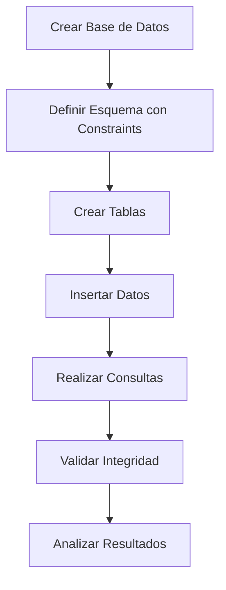
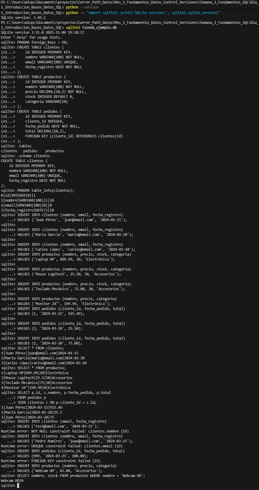

# Introducción a Bases de Datos Relacionales y SQL (Exploración y Análisis de Esquema de Base de Datos Relacional con SQLite)


# Ejercicio: Práctica de SQLite, Constraints e Integridad de Datos

## 📋 Objetivo
Explorar y analizar un esquema de base de datos relacional utilizando SQLite, comprendiendo cómo funcionan las constraints (restricciones) y las relaciones entre tablas para mantener la integridad de los datos.

---

## 🧠 Conceptos Fundamentales: Constraints e Integridad

Para realizar esta actividad es crucial entender los dos conceptos que forman la columna vertebral de este ejercicio: las **constraints (restricciones)** y la **integridad referencial (relaciones)**.

### 1. ¿Qué son las Constraints (Restricciones)?

Piensa en las constraints como los **"guardianes" de tus tablas**. Son reglas de negocio que se definen a nivel de columna o tabla para forzar la integridad, precisión y fiabilidad de los datos.

Si intentas realizar una operación (como `INSERT` o `UPDATE`) que viola una de estas reglas, la base de datos **rechazará la operación** y te devolverá un error. Esto es fundamental porque traslada la responsabilidad de la validación de datos básicos desde la aplicación (Python, Java, etc.) a la propia base de datos, haciéndola más robusta.

En este ejercicio, usaremos las siguientes:

* **`PRIMARY KEY` (Clave Primaria):** Es el identificador único para cada fila de la tabla (ej. el `id` de un cliente). No puede ser nulo y no puede repetirse.
* **`NOT NULL` (No Nulo):** Obliga a que una columna siempre deba tener un valor; no puede dejarse vacía (ej. el `nombre` de un producto).
* **`UNIQUE` (Único):** Garantiza que todos los valores en una columna sean diferentes entre sí (ej. el `email` de un cliente, para evitar cuentas duplicadas).
* **`DEFAULT` (Valor por Defecto):** Asigna un valor predeterminado si no se proporciona uno explícitamente al insertar un nuevo registro (ej. asignar `stock = 0` a un producto nuevo).

### 2. ¿Cómo funcionan las Relaciones (Integridad Referencial)?

En una base de datos relacional, los datos se separan en tablas temáticas (como `clientes`, `productos`, `pedidos`) para evitar la redundancia. Las **relaciones** son los puentes lógicos que conectan estas tablas.

Esta conexión se logra usando la constraint **`FOREIGN KEY` (Clave Foránea)**.

* Una clave foránea en una tabla (la tabla "hija", como `pedidos`) apunta a la clave primaria (`PRIMARY KEY`) de otra tabla (la tabla "padre", como `clientes`).

Esto crea lo que se conoce como **Integridad Referencial**, que es la garantía de que las relaciones entre las tablas sean siempre válidas.

**En nuestro proyecto:**

1.  La tabla `pedidos` tiene una columna `cliente_id` (la Clave Foránea).
2.  Esta columna *referencia* a la columna `id` (la Clave Primaria) de la tabla `clientes`.
3.  **Resultado:** La base de datos ahora prohíbe crear un pedido con un `cliente_id` que no exista en la tabla `clientes`. Esto evita tener "pedidos huérfanos" y mantiene los datos limpios y consistentes.

Con estos dos conceptos claros, el siguiente ejercicio práctico demostrará cómo estas reglas se crean y cómo protegen activamente nuestra base de datos.

---

## 🛠️ Requerimientos

- **Sistema operativo:** Windows 11
- **Terminal/Command Line:** Terminal integrada de VS Code
- **Python:** Versión 3.x (SQLite viene incluido)
- **Editor de código:** Visual Studio Code
- **Conocimientos previos:** Conceptos básicos de bases de datos relacionales

---

## 📝 Pasos Realizados

### 1. Verificación de SQLite en el Sistema

Primero, verificamos que SQLite esté disponible a través de Python:

```bash
# Verificar versión de Python
python --version

# Verificar versión de SQLite
python -c "import sqlite3; print('SQLite version:', sqlite3.sqlite_version)"
```

**Resultado esperado:**
```
Python 3.x.x
SQLite version: 3.x.x
```

### 2. Creación de Directorio del Proyecto

Creamos la carpeta donde trabajaremos con la base de datos:

```bash
# Crear directorio
mkdir ejercicio-sqlite-db
cd ejercicio-sqlite-db
```

### 3. Inicialización de la Base de Datos

Creamos la base de datos utilizando el shell de SQLite:

```bash
sqlite3 tienda_ejemplo.db
```

**Resultado:**
```
SQLite version 3.x.x
Enter ".help" for usage hints.
sqlite>
```
**⚠️ Nota Importante: Activación de Claves Foráneas (FOREIGN KEY)**

Por defecto, SQLite *entiende* la sintaxis de `FOREIGN KEY` (por eso la vemos en `.schema`) pero **no las valida** (no las "refuerza") para mantener compatibilidad con bases de datos antiguas.

Debemos activar esta validación manualmente **cada vez** que iniciamos una sesión con el siguiente comando PRAGMA:

```sql
PRAGMA foreign_keys = ON;
```

Con este comando, la base de datos ahora **SÍ RECHAZARÁ** cualquier `INSERT` o `UPDATE` que viole una regla de clave foránea.

### 4. Creación del Esquema de Base de Datos

#### 4.1 Crear tabla de clientes

```sql
CREATE TABLE clientes (
    id INTEGER PRIMARY KEY,
    nombre VARCHAR(100) NOT NULL,
    email VARCHAR(100) UNIQUE,
    fecha_registro DATE NOT NULL
);
```

**Constraints aplicadas:**
- `PRIMARY KEY`: El campo `id` identifica de forma única cada cliente
- `NOT NULL`: Los campos `nombre` y `fecha_registro` son obligatorios
- `UNIQUE`: El campo `email` no puede repetirse

#### 4.2 Crear tabla de productos

```sql
CREATE TABLE productos (
    id INTEGER PRIMARY KEY,
    nombre VARCHAR(100) NOT NULL,
    precio DECIMAL(10,2) NOT NULL,
    stock INTEGER DEFAULT 0,
    categoria VARCHAR(50)
);
```

**Constraints aplicadas:**
- `PRIMARY KEY`: El campo `id` identifica de forma única cada producto
- `NOT NULL`: Los campos `nombre` y `precio` son obligatorios
- `DEFAULT 0`: Si no se especifica stock, se asigna automáticamente 0

#### 4.3 Crear tabla de pedidos

```sql
CREATE TABLE pedidos (
    id INTEGER PRIMARY KEY,
    cliente_id INTEGER,
    fecha_pedido DATE NOT NULL,
    total DECIMAL(10,2),
    FOREIGN KEY (cliente_id) REFERENCES clientes(id)
);
```

**Constraints aplicadas:**
- `PRIMARY KEY`: El campo `id` identifica de forma única cada pedido
- `NOT NULL`: El campo `fecha_pedido` es obligatorio
- `FOREIGN KEY`: El campo `cliente_id` debe corresponder a un `id` existente en la tabla `clientes`

### 5. Exploración de la Estructura de la Base de Datos

#### 5.1 Ver todas las tablas creadas

```sql
.tables
```

**Resultado:**
```
clientes  pedidos   productos
```

#### 5.2 Ver estructura de tabla específica

```sql
.schema clientes
```

**Resultado:**
```sql
CREATE TABLE clientes (
    id INTEGER PRIMARY KEY,
    nombre VARCHAR(100) NOT NULL,
    email VARCHAR(100) UNIQUE,
    fecha_registro DATE NOT NULL
);
```

#### 5.3 Ver información detallada de columnas

```sql
PRAGMA table_info(clientes);
```

**Resultado:**
```
cid  name              type          notnull  dflt_value  pk
---  ----------------  ------------  -------  ----------  --
0    id                INTEGER       0        NULL        1
1    nombre            VARCHAR(100)  1        NULL        0
2    email             VARCHAR(100)  0        NULL        0
3    fecha_registro    DATE          1        NULL        0
```

**Interpretación:**
- `cid`: Índice de la columna
- `name`: Nombre de la columna
- `type`: Tipo de dato
- `notnull`: 1 si tiene constraint NOT NULL, 0 si permite NULL
- `dflt_value`: Valor por defecto
- `pk`: 1 si es PRIMARY KEY, 0 si no lo es

### 6. Inserción de Datos de Prueba

#### 6.1 Insertar clientes

```sql
INSERT INTO clientes (nombre, email, fecha_registro) 
VALUES ('Juan Pérez', 'juan@email.com', '2024-01-15');

INSERT INTO clientes (nombre, email, fecha_registro) 
VALUES ('María García', 'maria@email.com', '2024-02-20');

INSERT INTO clientes (nombre, email, fecha_registro) 
VALUES ('Carlos López', 'carlos@email.com', '2024-03-10');
```

#### 6.2 Insertar productos

```sql
INSERT INTO productos (nombre, precio, stock, categoria) 
VALUES ('Laptop HP', 899.99, 10, 'Electrónica');

INSERT INTO productos (nombre, precio, stock, categoria) 
VALUES ('Mouse Logitech', 25.50, 50, 'Accesorios');

INSERT INTO productos (nombre, precio, stock, categoria) 
VALUES ('Teclado Mecánico', 75.00, 30, 'Accesorios');

INSERT INTO productos (nombre, precio, categoria) 
VALUES ('Monitor 24"', 199.99, 'Electrónica');
```

**Nota:** El último producto no especifica stock, por lo que automáticamente se asigna 0 (valor DEFAULT).

#### 6.3 Insertar pedidos

```sql
INSERT INTO pedidos (cliente_id, fecha_pedido, total) 
VALUES (1, '2024-03-15', 925.49);

INSERT INTO pedidos (cliente_id, fecha_pedido, total) 
VALUES (2, '2024-03-18', 25.50);

INSERT INTO pedidos (cliente_id, fecha_pedido, total) 
VALUES (1, '2024-03-20', 75.00);
```

### 7. Consultas de Verificación

#### 7.1 Ver todos los clientes

```sql
SELECT * FROM clientes;
```

**Resultado:**
```
id  nombre         email              fecha_registro
--  -------------  -----------------  --------------
1   Juan Pérez     juan@email.com     2024-01-15
2   María García   maria@email.com    2024-02-20
3   Carlos López   carlos@email.com   2024-03-10
```

#### 7.2 Ver todos los productos

```sql
SELECT * FROM productos;
```

**Resultado:**
```
id  nombre              precio   stock  categoria
--  ------------------  -------  -----  -----------
1   Laptop HP           899.99   10     Electrónica
2   Mouse Logitech      25.50    50     Accesorios
3   Teclado Mecánico    75.00    30     Accesorios
4   Monitor 24"         199.99   0      Electrónica
```

#### 7.3 Ver pedidos con información del cliente

```sql
SELECT p.id, c.nombre, p.fecha_pedido, p.total 
FROM pedidos p
JOIN clientes c ON p.cliente_id = c.id;
```

**Resultado:**
```
id  nombre         fecha_pedido  total
--  -------------  ------------  ------
1   Juan Pérez     2024-03-15    925.49
2   María García   2024-03-18    25.50
3   Juan Pérez     2024-03-20    75.00
```

### 8. Análisis de Constraints y Pruebas de Integridad

#### 8.1 Prueba de constraint NOT NULL

```sql
-- ❌ Esto FALLARÁ: intentar insertar cliente sin nombre
INSERT INTO clientes (email, fecha_registro) 
VALUES ('test@email.com', '2024-03-25');
```

**Resultado:**
```
Error: NOT NULL constraint failed: clientes.nombre
```

**Conclusión:** La base de datos protege la integridad rechazando registros incompletos.

#### 8.2 Prueba de constraint UNIQUE

```sql
-- ❌ Esto FALLARÁ: intentar insertar email duplicado
INSERT INTO clientes (nombre, email, fecha_registro) 
VALUES ('Pedro Ramírez', 'juan@email.com', '2024-03-25');
```

**Resultado:**
```
Error: UNIQUE constraint failed: clientes.email
```

**Conclusión:** La base de datos previene duplicados en campos únicos.

#### 8.3 Prueba de constraint FOREIGN KEY

```sql
-- ❌ Esto FALLARÁ: intentar crear pedido con cliente inexistente
-- (Nota: Esto solo fallará si ejecutaste 'PRAGMA foreign_keys = ON;' como se indica en la Sección 3)
INSERT INTO pedidos (cliente_id, fecha_pedido, total) 
VALUES (999, '2024-03-25', 100.00);
```

**Resultado:**
```
Error: FOREIGN KEY constraint failed
```

**Conclusión:** La base de datos mantiene la integridad referencial entre tablas.

#### 8.4 Prueba de constraint DEFAULT

```sql
-- ✅ Esto FUNCIONARÁ: insertar producto sin especificar stock
INSERT INTO productos (nombre, precio, categoria) 
VALUES ('Webcam HD', 45.00, 'Accesorios');

-- Verificar que el stock sea 0
SELECT nombre, stock FROM productos WHERE nombre = 'Webcam HD';
```

**Resultado:**
```
nombre      stock
----------  -----
Webcam HD   0
```

**Conclusión:** Los valores DEFAULT se asignan automáticamente cuando no se especifican.

---

## 📊 Análisis Detallado de Constraints

### Tabla Resumen de Columnas NOT NULL

| Tabla      | Columnas NOT NULL                    |
|------------|--------------------------------------|
| clientes   | `nombre`, `fecha_registro`           |
| productos  | `nombre`, `precio`                   |
| pedidos    | `fecha_pedido`                       |

**Interpretación:** Estas columnas representan información esencial que no puede omitirse para que los registros tengan sentido.

### Tabla de Claves Primarias (PRIMARY KEY)

| Tabla      | Clave Primaria | Función                                    |
|------------|----------------|--------------------------------------------|
| clientes   | `id`           | Identificador único de cada cliente        |
| productos  | `id`           | Identificador único de cada producto       |
| pedidos    | `id`           | Identificador único de cada pedido         |

**Interpretación:** Las claves primarias garantizan que cada registro sea único e identificable.

### Tabla de Claves Foráneas (FOREIGN KEY)

| Tabla      | Columna FK      | Referencia     | Función                                      |
|------------|-----------------|----------------|----------------------------------------------|
| pedidos    | `cliente_id`    | clientes(id)   | Vincula cada pedido con un cliente existente |

**Interpretación:** Las claves foráneas establecen relaciones entre tablas y garantizan consistencia referencial.

### Diagrama de Relaciones

```
┌─────────────────┐         ┌─────────────────┐         ┌─────────────────┐
│   clientes      │         │    pedidos      │         │   productos     │
├─────────────────┤         ├─────────────────┤         ├─────────────────┤
│ id (PK)         │◄───────┤│ id (PK)         │         │ id (PK)         │
│ nombre          │         │ cliente_id (FK) │         │ nombre          │
│ email (UNIQUE)  │         │ fecha_pedido    │         │ precio          │
│ fecha_registro  │         │ total           │         │ stock (DEF=0)   │
└─────────────────┘         └─────────────────┘         │ categoria       │
                                                        └─────────────────┘
```

---

## ✅ Verificación Final

### Checklist de completitud:

- [x] SQLite verificado y funcionando
- [x] Base de datos creada exitosamente
- [x] Tabla `clientes` creada con constraints
- [x] Tabla `productos` creada con constraints
- [x] Tabla `pedidos` creada con constraints y FOREIGN KEY
- [x] Datos de prueba insertados en las tres tablas
- [x] Estructura explorada con `.tables`, `.schema` y `PRAGMA`
- [x] Constraints NOT NULL probadas y verificadas
- [x] Constraint UNIQUE probada y verificada
- [x] Constraint FOREIGN KEY probada y verificada
- [x] Constraint DEFAULT probada y verificada
- [x] Consultas JOIN realizadas exitosamente

---

## 📚 Comandos Útiles de SQLite - Referencia Rápida

| Comando | Propósito |
|---------|-----------|
| `sqlite3 nombre.db` | Crear/abrir base de datos |
| `.help` | Mostrar ayuda de comandos |
| `.tables` | Listar todas las tablas |
| `.schema [tabla]` | Mostrar estructura de tabla(s) |
| `.quit` o `.exit` | Salir de SQLite |
| `.mode column` | Mejorar visualización en columnas |
| `.headers on` | Mostrar encabezados de columnas |
| `.width` | Ajustar ancho de columnas |
| `PRAGMA table_info(tabla)` | Información detallada de columnas |
| `.databases` | Listar bases de datos conectadas |
| `.output archivo.txt` | Redirigir salida a archivo |

---

## 🎯 Conceptos Clave Aprendidos

### 1. Constraints (Restricciones)
Las constraints son reglas que protegen la integridad de los datos:

- **PRIMARY KEY**: Identifica únicamente cada registro
- **NOT NULL**: Obliga a que un campo tenga valor
- **UNIQUE**: Previene valores duplicados
- **FOREIGN KEY**: Mantiene relaciones consistentes entre tablas
- **DEFAULT**: Asigna valores automáticamente

### 2. Integridad Referencial
Las FOREIGN KEYS garantizan que:
- No existan pedidos de clientes inexistentes
- Las relaciones entre tablas sean válidas
- Los datos relacionados permanezcan consistentes

### 3. Modelado de Datos
El esquema refleja la realidad del negocio:
- Clientes realizan pedidos
- Productos están disponibles en inventario
- Pedidos están vinculados a clientes específicos

---

## 🔄 Flujo de Trabajo con SQLite



**Explicación del flujo:**
1. **Crear Base de Datos**: Inicializar archivo .db
2. **Definir Esquema**: Diseñar tablas y relaciones
3. **Crear Tablas**: Ejecutar sentencias CREATE TABLE
4. **Insertar Datos**: Agregar registros de prueba
5. **Realizar Consultas**: Extraer y analizar información
6. **Validar Integridad**: Probar constraints
7. **Analizar Resultados**: Verificar funcionamiento

---
## ✅ Evidencia


## 💡 Conclusiones

### ¿Cómo las constraints protegen la integridad de los datos?

1. **Prevención de errores**: Rechazan automáticamente datos inválidos
2. **Consistencia**: Mantienen reglas de negocio a nivel de base de datos
3. **Validación automática**: No dependen de la aplicación para validar
4. **Documentación implícita**: Las constraints documentan las reglas del sistema

### ¿Cómo se mantienen las relaciones entre tablas?

Las **FOREIGN KEYS** establecen vínculos que:
- Garantizan que los datos relacionados existan
- Previenen inconsistencias (pedidos huérfanos)
- Documentan las relaciones del modelo de datos
- Pueden configurarse para acciones en cascada (eliminar relacionados)

### Diferencias entre SQLite y otros SGBD

**Ventajas de SQLite:**
- ✅ No requiere servidor
- ✅ Archivo único portable
- ✅ Perfecto para desarrollo y aprendizaje
- ✅ Ligero y rápido

**Limitaciones:**
- ⚠️ No soporta múltiples escritores concurrentes
- ⚠️ Menos tipos de datos que PostgreSQL/MySQL
- ⚠️ No apto para aplicaciones de alto tráfico

---

## 🚀 Próximos Pasos

1. **Consultas avanzadas**: JOINs complejos, subconsultas, agregaciones
2. **Índices**: Mejorar rendimiento de consultas
3. **Transacciones**: Garantizar atomicidad de operaciones
4. **Triggers**: Automatizar acciones ante eventos
5. **Vistas**: Crear consultas reutilizables
6. **Migración**: Conectar SQLite con Python/otros lenguajes

---

## 📖 Recursos Adicionales

- [Documentación oficial de SQLite](https://www.sqlite.org/docs.html)
- [SQLite Tutorial](https://www.sqlitetutorial.net/)
- [SQL Fundamentals](https://www.w3schools.com/sql/)
- [Ejemplo práctico en GitHub](https://github.com/sqlitebrowser/sqlitebrowser)

---

## 📝 Notas del Ejercicio

- **Fecha de realización**: Noviembre 2025
- **Entorno**: Windows 11, VS Code, Python 3.x
- **Base de datos**: tienda_ejemplo.db
- **Registros creados**: 3 clientes, 5 productos, 3 pedidos

---

[Volver al índice principal](../../../README.md) | [Volver al Mes 1](../../README.md) | [Volver a Semana 2](../README.md) | [Día Siguiente →](../Dia_2_Consultas_Basicas/README.md)
