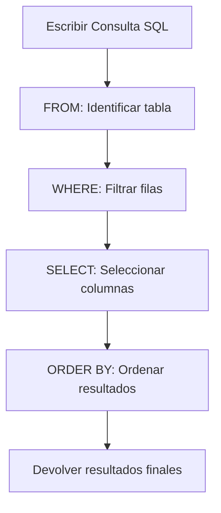
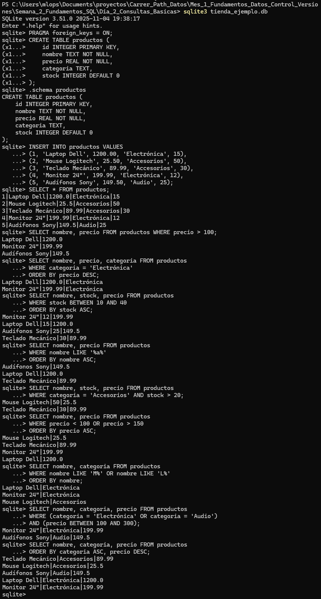

# Consultas Básicas (SELECT, WHERE, ORDER BY)

#  Ejercicio: Consultas Básicas en Base de Datos de Ventas con SQLite

## 📋 Objetivo
Practicar y dominar las consultas básicas en SQL utilizando SQLite, incluyendo filtrado de datos con WHERE, ordenamiento con ORDER BY, y operadores como LIKE, BETWEEN, AND y OR para extraer información específica de una base de datos.

---

## 🧠 Conceptos Fundamentales: La Anatomía de una Consulta

Antes de ejecutar comandos, es vital entender la lógica de una consulta SQL. Piensa en SQL (Structured Query Language) como el idioma que usamos para "hacerle preguntas" a nuestra base de datos.

El objetivo de este ejercicio es dominar la "pregunta" más común de todas: **`SELECT`**.

Una consulta `SELECT` nos permite **leer** y **recuperar** datos. Casi siempre sigue la misma estructura lógica, que podemos ver como la anatomía de nuestra pregunta:

1.  **`SELECT`** - El **QUÉ**: ¿Qué columnas (información) quieres ver?
    * *Ejemplo: `SELECT nombre, precio`*
2.  **`FROM`** - El **DÓNDE**: ¿De qué tabla vienes a buscar esa información?
    * *Ejemplo: `FROM productos`*
3.  **`WHERE`** - El **FILTRO**: ¿Bajo qué condiciones? ¿Qué filas específicas te interesan?
    * *Ejemplo: `WHERE categoria = 'Electrónica'`*
4.  **`ORDER BY`** - El **ORDEN**: ¿Cómo quieres organizar (ordenar) los resultados?
    * *Ejemplo: `ORDER BY precio DESC`*

### El Poder del `WHERE`: Filtrado y Operadores

La cláusula `WHERE` es el verdadero cerebro de una consulta de filtrado. Por sí sola, solo establece la *intención* de filtrar, pero necesita **operadores** para ejecutar la lógica:

* **Operadores de Comparación:** Son la forma más básica de filtro (`=`, `>`, `<`, `>=`, `<=`).
* **Operadores Lógicos (`AND` / `OR`):** Nos permiten crear reglas complejas.
    * `AND`: Exige que **todas** las condiciones se cumplan (ej. categoría 'Electrónica' **Y** precio > 100).
    * `OR`: Pide que **al menos una** condición se cumpla (ej. stock < 10 **O** stock > 50).
* **Operadores Especiales (`BETWEEN` / `LIKE`):** Son atajos potentes.
    * `BETWEEN`: Simplifica un rango (es un atajo para `columna >= valor1 AND columna <= valor2`).
    * `LIKE`: Es el motor de búsqueda de patrones en texto. Usa "comodines" (`%` para cualquier texto, `_` para un solo carácter) para encontrar coincidencias parciales (ej. `nombre LIKE 'M%'` significa "nombre que empieza con M").

En este ejercicio, practicaremos cómo combinar todas estas cláusulas y operadores para pasar de "ver todos los datos" a "extraer la información precisa y ordenada que necesitamos".

---

## 🛠️ Requerimientos

- **Sistema operativo:** Windows 11
- **Terminal/Command Line:** Terminal integrada de VS Code
- **Python:** Versión 3.x (SQLite viene incluido)
- **Editor de código:** Visual Studio Code
- **Base de datos:** Nueva base de datos `tienda_ejemplo.db`
- **Conocimientos previos:** Conceptos básicos de SQL y bases de datos relacionales

---

## 📝 Pasos Realizados

### 1. Preparación del Entorno

#### 1.1 Crear directorio del proyecto

```bash
# Crear nueva carpeta para el ejercicio
mkdir ejercicio-consultas-sql-basicas
cd ejercicio-consultas-sql-basicas
```

#### 1.2 Inicializar base de datos SQLite

```bash
sqlite3 tienda_ejemplo.db
```

**Resultado:**
```
SQLite version 3.x.x
Enter ".help" for usage hints.
sqlite>
```
**⚠️ Nota Importante: Activación de Claves Foráneas (FOREIGN KEY)**

Por defecto, SQLite *entiende* la sintaxis de `FOREIGN KEY` (por eso la vemos en `.schema`) pero **no las valida** (no las "refuerza") para mantener compatibilidad con bases de datos antiguas.

Debemos activar esta validación manualmente **cada vez** que iniciamos una sesión con el siguiente comando PRAGMA:

```sql
PRAGMA foreign_keys = ON;
```

Con este comando, la base de datos ahora **SÍ RECHAZARÁ** cualquier `INSERT` o `UPDATE` que viole una regla de clave foránea.

### 2. Creación del Esquema de Base de Datos

#### 2.1 Crear tabla de productos

```sql
CREATE TABLE productos (
    id INTEGER PRIMARY KEY,
    nombre TEXT NOT NULL,
    precio REAL NOT NULL,
    categoria TEXT,
    stock INTEGER DEFAULT 0
);
```

**Constraints aplicadas:**
- `PRIMARY KEY`: Campo `id` identifica únicamente cada producto
- `NOT NULL`: Campos `nombre` y `precio` son obligatorios
- `DEFAULT 0`: Si no se especifica stock, se asigna 0 automáticamente

#### 2.2 Verificar estructura de la tabla

```sql
.schema productos
```

**Resultado:**
```sql
CREATE TABLE productos (
    id INTEGER PRIMARY KEY,
    nombre TEXT NOT NULL,
    precio REAL NOT NULL,
    categoria TEXT,
    stock INTEGER DEFAULT 0
);
```

### 3. Inserción de Datos de Ejemplo

```sql
INSERT INTO productos VALUES
(1, 'Laptop Dell', 1200.00, 'Electrónica', 15),
(2, 'Mouse Logitech', 25.50, 'Accesorios', 50),
(3, 'Teclado Mecánico', 89.99, 'Accesorios', 30),
(4, 'Monitor 24"', 199.99, 'Electrónica', 12),
(5, 'Audífonos Sony', 149.50, 'Audio', 25);
```

**Verificación de inserción:**
```sql
SELECT * FROM productos;
```

**Resultado:**
```
id  nombre              precio    categoria      stock
--  ------------------  --------  -------------  -----
1   Laptop Dell         1200.0    Electrónica    15
2   Mouse Logitech      25.5      Accesorios     50
3   Teclado Mecánico    89.99     Accesorios     30
4   Monitor 24"         199.99    Electrónica    12
5   Audífonos Sony      149.5     Audio          25
```

---

## 🔍 Consultas Básicas Realizadas

### 4. Consulta 1: Productos con Precio Mayor a $100

**Objetivo:** Filtrar productos costosos (precio > 100)

```sql
SELECT nombre, precio FROM productos WHERE precio > 100;
```

**Resultado esperado:**
```
nombre              precio
------------------  --------
Laptop Dell         1200.0
Monitor 24"         199.99
Audífonos Sony      149.5
```

**Análisis:**
- Se utilizó la cláusula `WHERE` para filtrar registros
- Operador de comparación `>` (mayor que)
- Se seleccionaron solo las columnas `nombre` y `precio`
- **Total de resultados:** 3 productos

---

### 5. Consulta 2: Productos de Electrónica Ordenados por Precio (Descendente)

**Objetivo:** Mostrar productos electrónicos del más caro al más barato

```sql
SELECT nombre, precio, categoria FROM productos
WHERE categoria = 'Electrónica'
ORDER BY precio DESC;
```

**Resultado esperado:**
```
nombre              precio    categoria
------------------  --------  -----------
Laptop Dell         1200.0    Electrónica
Monitor 24"         199.99    Electrónica
```

**Análisis:**
- `WHERE categoria = 'Electrónica'`: Filtra por categoría específica
- `ORDER BY precio DESC`: Ordena de mayor a menor precio
- `DESC` significa "descendente" (de mayor a menor)
- **Total de resultados:** 2 productos

---

### 6. Consulta 3: Productos con Stock entre 10 y 40

**Objetivo:** Encontrar productos con inventario medio (ni muy poco ni mucho stock)

```sql
SELECT nombre, stock, precio FROM productos
WHERE stock BETWEEN 10 AND 40
ORDER BY stock ASC;
```

**Resultado esperado:**
```
nombre              stock  precio
------------------  -----  --------
Monitor 24"         12     199.99
Laptop Dell         15     1200.0
Audífonos Sony      25     149.5
Teclado Mecánico    30     89.99
```

**Análisis:**
- `BETWEEN 10 AND 40`: Operador de rango (inclusivo en ambos extremos)
- `ORDER BY stock ASC`: Ordena de menor a mayor stock
- `ASC` significa "ascendente" (de menor a mayor)
- **Total de resultados:** 4 productos

---

### 7. Consulta 4: Productos que Contienen 'a' en el Nombre

**Objetivo:** Buscar productos cuyo nombre incluya la letra 'a' (mayúscula o minúscula)

```sql
SELECT nombre, precio FROM productos
WHERE nombre LIKE '%a%'
ORDER BY nombre ASC;
```

**Resultado esperado:**
```
nombre              precio
------------------  --------
Audífonos Sony      149.5
Laptop Dell         1200.0
Teclado Mecánico    89.99
```

**Análisis:**
- `LIKE '%a%'`: Búsqueda de patrón (case-insensitive en SQLite)
- `%` es un comodín que significa "cualquier texto"
- `%a%` significa: "cualquier texto, luego 'a', luego cualquier texto"
- `ORDER BY nombre ASC`: Orden alfabético
- **Total de resultados:** 3 productos

---

## 🧪 Experimentación con Variaciones

### 8. Variación 1: Productos de Accesorios con Stock Mayor a 20

**Objetivo:** Combinar filtros con el operador AND

```sql
SELECT nombre, stock, precio FROM productos
WHERE categoria = 'Accesorios' AND stock > 20;
```

**Resultado esperado:**
```
nombre              stock  precio
------------------  -----  --------
Mouse Logitech      50     25.5
Teclado Mecánico    30     89.99
```

**Análisis:**
- `AND`: Ambas condiciones deben cumplirse
- Filtra por categoría Y stock
- **Total de resultados:** 2 productos

---

### 9. Variación 2: Productos Baratos o Caros (Excluir Rango Medio)

**Objetivo:** Usar el operador OR para seleccionar extremos

```sql
SELECT nombre, precio FROM productos
WHERE precio < 100 OR precio > 150
ORDER BY precio ASC;
```

**Resultado esperado:**
```
nombre              precio
------------------  --------
Mouse Logitech      25.5
Teclado Mecánico    89.99
Monitor 24"         199.99
Laptop Dell         1200.0
```

**Análisis:**
- `OR`: Al menos una condición debe cumplirse
- Productos menores a $100 O mayores a $150
- Excluye productos entre $100 y $150
- **Total de resultados:** 4 productos

---

### 10. Variación 3: Productos que Empiezan con 'M' o 'L'

**Objetivo:** Usar LIKE con múltiples patrones

```sql
SELECT nombre, categoria FROM productos
WHERE nombre LIKE 'M%' OR nombre LIKE 'L%'
ORDER BY nombre;
```

**Resultado esperado:**
```
nombre              categoria
------------------  -----------
Laptop Dell         Electrónica
Monitor 24"         Electrónica
Mouse Logitech      Accesorios
```

**Análisis:**
- `LIKE 'M%'`: Comienza con 'M'
- `LIKE 'L%'`: Comienza con 'L'
- `%` al final significa "seguido de cualquier texto"
- **Total de resultados:** 3 productos

---

### 11. Variación 4: Productos de Electrónica o Audio con Precio entre 100 y 300

**Objetivo:** Combinar múltiples condiciones con AND/OR

```sql
SELECT nombre, categoria, precio FROM productos
WHERE (categoria = 'Electrónica' OR categoria = 'Audio')
AND (precio BETWEEN 100 AND 300);
```

**Resultado esperado:**
```
nombre              categoria      precio
------------------  -------------  --------
Monitor 24"         Electrónica    199.99
Audífonos Sony      Audio          149.5
```

**Análisis:**
- Paréntesis agrupan condiciones lógicas
- Filtra por múltiples categorías
- Y además filtra por rango de precio
- **Total de resultados:** 2 productos

---

### 12. Variación 5: Productos Ordenados por Múltiples Criterios

**Objetivo:** Ordenar primero por categoría, luego por precio

```sql
SELECT nombre, categoria, precio FROM productos
ORDER BY categoria ASC, precio DESC;
```

**Resultado esperado:**
```
nombre              categoria      precio
------------------  -------------  --------
Teclado Mecánico    Accesorios     89.99
Mouse Logitech      Accesorios     25.5
Audífonos Sony      Audio          149.5
Laptop Dell         Electrónica    1200.0
Monitor 24"         Electrónica    199.99
```

**Análisis:**
- `ORDER BY categoria ASC`: Primero ordena por categoría (A-Z)
- `precio DESC`: Dentro de cada categoría, ordena por precio (mayor a menor)
- Ordenamiento multinivel
- **Total de resultados:** 5 productos (todos)

---

## 📊 Resumen de Operadores y Cláusulas SQL

### Tabla de Operadores Utilizados

| Operador | Descripción | Ejemplo |
|----------|-------------|---------|
| `=` | Igualdad exacta | `categoria = 'Electrónica'` |
| `>` | Mayor que | `precio > 100` |
| `<` | Menor que | `precio < 100` |
| `>=` | Mayor o igual | `stock >= 10` |
| `<=` | Menor o igual | `stock <= 40` |
| `BETWEEN` | Rango inclusivo | `stock BETWEEN 10 AND 40` |
| `LIKE` | Búsqueda de patrón | `nombre LIKE '%a%'` |
| `AND` | Ambas condiciones | `categoria = 'Audio' AND precio > 100` |
| `OR` | Al menos una condición | `precio < 100 OR precio > 150` |

### Tabla de Cláusulas SQL

| Cláusula | Propósito | Ejemplo |
|----------|-----------|---------|
| `SELECT` | Especificar columnas a mostrar | `SELECT nombre, precio` |
| `FROM` | Especificar tabla de origen | `FROM productos` |
| `WHERE` | Filtrar registros | `WHERE precio > 100` |
| `ORDER BY` | Ordenar resultados | `ORDER BY precio DESC` |
| `ASC` | Orden ascendente (menor a mayor) | `ORDER BY stock ASC` |
| `DESC` | Orden descendente (mayor a menor) | `ORDER BY precio DESC` |

### Patrones LIKE Comunes

| Patrón | Significado | Ejemplo de coincidencia |
|--------|-------------|-------------------------|
| `'%a%'` | Contiene 'a' en cualquier posición | "L**a**ptop", "M**a**rí**a**" |
| `'M%'` | Comienza con 'M' | "**M**ouse", "**M**onitor" |
| `'%o'` | Termina con 'o' | "Teclad**o**", "Aurifon**o**" |
| `'_a%'` | Segunda letra es 'a' | "L**a**ptop", "T**a**blet" |

---

## ✅ Verificación Final

### Checklist de completitud:

- [x] Base de datos `tienda_ejemplo.db` creada
- [x] Tabla `productos` creada con constraints correctas
- [x] 5 productos insertados exitosamente
- [x] Consulta 1: Filtrado por precio (WHERE) ejecutada
- [x] Consulta 2: Filtrado por categoría con ordenamiento (ORDER BY DESC) ejecutada
- [x] Consulta 3: Filtrado por rango (BETWEEN) con ordenamiento (ASC) ejecutada
- [x] Consulta 4: Búsqueda de patrones (LIKE) ejecutada
- [x] Variación 1: Operador AND probado
- [x] Variación 2: Operador OR probado
- [x] Variación 3: Múltiples patrones LIKE probados
- [x] Variación 4: Combinación compleja de condiciones probada
- [x] Variación 5: Ordenamiento multinivel probado
- [x] Todos los resultados verificados y documentados

---

## 🎯 Conceptos Clave Aprendidos

### 1. Cláusula WHERE - Filtrado de Datos
La cláusula `WHERE` permite filtrar registros según condiciones específicas:

```sql
-- Sintaxis básica
SELECT columnas FROM tabla WHERE condicion;

-- Ejemplos prácticos
WHERE precio > 100          -- Comparación numérica
WHERE categoria = 'Audio'   -- Comparación de texto
WHERE stock BETWEEN 10 AND 40  -- Rango
WHERE nombre LIKE '%a%'     -- Patrón de texto
```

**Beneficios:**
- Reduce el volumen de datos devueltos
- Mejora el rendimiento de las consultas
- Permite extraer información específica

---

### 2. Cláusula ORDER BY - Ordenamiento
`ORDER BY` organiza los resultados según criterios específicos:

```sql
-- Sintaxis
SELECT columnas FROM tabla ORDER BY columna [ASC|DESC];

-- Ejemplos
ORDER BY precio DESC        -- Mayor a menor
ORDER BY nombre ASC         -- Alfabético A-Z
ORDER BY categoria, precio DESC  -- Multinivel
```

**Características:**
- `ASC` es el orden por defecto (se puede omitir)
- `DESC` invierte el orden
- Se pueden ordenar por múltiples columnas

---

### 3. Operador LIKE - Búsqueda de Patrones
`LIKE` permite búsquedas flexibles en campos de texto:

```sql
-- Comodines
%   -- Representa cero o más caracteres
_   -- Representa exactamente un carácter

-- Ejemplos
LIKE '%Dell%'    -- Contiene "Dell"
LIKE 'M%'        -- Comienza con M
LIKE '%o'        -- Termina con o
LIKE '_a%'       -- Segunda letra es 'a'
```

---

### 4. Operador BETWEEN - Rangos
`BETWEEN` simplifica filtros de rango (inclusivo):

```sql
-- En lugar de
WHERE precio >= 100 AND precio <= 300

-- Usamos
WHERE precio BETWEEN 100 AND 300
```

**Ventajas:**
- Más legible
- Menos propenso a errores
- Funciona con números, fechas y texto

---

### 5. Operadores Lógicos AND/OR
Combinan múltiples condiciones:

```sql
-- AND: Todas las condiciones deben cumplirse
WHERE categoria = 'Audio' AND precio > 100

-- OR: Al menos una condición debe cumplirse
WHERE precio < 50 OR precio > 200

-- Combinación con paréntesis
WHERE (categoria = 'Audio' OR categoria = 'Electrónica')
AND precio BETWEEN 100 AND 300
```

**Prioridad:**
- `AND` tiene mayor prioridad que `OR`
- Usar paréntesis para claridad y control

---

## 💡 Mejores Prácticas

### 1. Escritura de Consultas
```sql
-- ✅ BIEN: Legible, con formato
SELECT nombre, precio, stock
FROM productos
WHERE categoria = 'Electrónica'
  AND precio > 100
ORDER BY precio DESC;

-- ❌ MAL: Difícil de leer
SELECT nombre,precio,stock FROM productos WHERE categoria='Electrónica' AND precio>100 ORDER BY precio DESC;
```

### 2. Uso de Operadores
```sql
-- ✅ BIEN: Usar BETWEEN para rangos
WHERE stock BETWEEN 10 AND 40

-- ❌ MAL: Menos legible
WHERE stock >= 10 AND stock <= 40
```

### 3. Ordenamiento
```sql
-- ✅ BIEN: Especificar ASC/DESC explícitamente
ORDER BY precio DESC

-- ⚠️ FUNCIONA pero menos claro
ORDER BY precio  -- Por defecto es ASC
```

### 4. Búsqueda de Texto
```sql
-- ✅ BIEN: LIKE para búsquedas parciales
WHERE nombre LIKE '%Dell%'

-- ❌ MAL: Igualdad exacta (muy restrictivo)
WHERE nombre = 'Dell'  -- No encontrará "Laptop Dell"
```

---

## 📈 Comparación de Resultados

### Análisis Cuantitativo de Consultas

| Consulta | Condición Principal | Registros Devueltos | Porcentaje del Total |
|----------|---------------------|---------------------|----------------------|
| Todos los productos | Ninguna | 5 | 100% |
| Precio > $100 | `WHERE precio > 100` | 3 | 60% |
| Categoría Electrónica | `WHERE categoria = 'Electrónica'` | 2 | 40% |
| Stock entre 10-40 | `WHERE stock BETWEEN 10 AND 40` | 4 | 80% |
| Nombre contiene 'a' | `WHERE nombre LIKE '%a%'` | 4 | 80% |

**Observaciones:**
- La mayoría de los productos tienen un stock moderado (10-40)
- El 60% de los productos cuestan más de $100
- La búsqueda por patrón de texto es muy inclusiva (80%)

---

## 🔄 Flujo de Ejecución de Consultas SQL



**Orden de ejecución interna:**
1. `FROM`: Se identifica la tabla
2. `WHERE`: Se filtran las filas
3. `SELECT`: Se seleccionan las columnas
4. `ORDER BY`: Se ordenan los resultados

**Nota:** Este es el orden lógico, aunque SQL está optimizado para ejecutar de manera eficiente.

---

## ✅ Evidencia


---

## 🚀 Próximos Pasos

### Conceptos a explorar:

1. **Funciones de agregación**: `COUNT()`, `SUM()`, `AVG()`, `MIN()`, `MAX()`
2. **GROUP BY**: Agrupar resultados y calcular estadísticas
3. **HAVING**: Filtrar grupos (similar a WHERE pero para grupos)
4. **JOINs**: Combinar datos de múltiples tablas
5. **Subconsultas**: Consultas dentro de consultas
6. **CASE WHEN**: Lógica condicional en SELECT
7. **DISTINCT**: Eliminar duplicados
8. **LIMIT**: Limitar número de resultados

### Ejercicios propuestos:

```sql
-- Ejercicio 1: Contar productos por categoría
SELECT categoria, COUNT(*) as cantidad
FROM productos
GROUP BY categoria;

-- Ejercicio 2: Calcular valor total del inventario
SELECT SUM(precio * stock) as valor_total_inventario
FROM productos;

-- Ejercicio 3: Precio promedio por categoría
SELECT categoria, AVG(precio) as precio_promedio
FROM productos
GROUP BY categoria
ORDER BY precio_promedio DESC;
```

---

## 📖 Recursos Adicionales

- [SQLite SELECT Documentation](https://www.sqlite.org/lang_select.html)
- [SQL Tutorial - W3Schools](https://www.w3schools.com/sql/)
- [SQLite LIKE Operator](https://www.sqlite.org/lang_expr.html#like)
- [SQL Operators Reference](https://www.sqlitetutorial.net/sqlite-operators/)

---

## 📝 Comandos Útiles de SQLite

```sql
-- Mejorar visualización de resultados
.mode column
.headers on
.width auto

-- Ver estructura de tabla
.schema productos

-- Exportar resultados a CSV
.mode csv
.output resultados.csv
SELECT * FROM productos;
.output stdout

-- Limpiar pantalla (en algunos terminales)
.shell clear

-- Salir de SQLite
.quit
```

---

## 📅 Notas del Ejercicio

- **Fecha de realización**: Noviembre 2025
- **Entorno**: Windows 11, VS Code, Python 3.x, SQLite 3.x
- **Base de datos**: tienda_ejemplo.db
- **Registros trabajados**: 5 productos
- **Consultas ejecutadas**: 9 (4 básicas + 5 variaciones)
- **Categorías**: Electrónica, Accesorios, Audio

---

## ✨ Conclusiones

Este ejercicio permitió dominar los fundamentos de las consultas SQL:

1. **Filtrado efectivo** con WHERE y operadores de comparación
2. **Ordenamiento** de resultados con ORDER BY
3. **Búsqueda flexible** con LIKE y comodines
4. **Rangos** eficientes con BETWEEN
5. **Lógica compleja** con AND/OR

Las consultas SQL son la base del trabajo con bases de datos. Dominar estos conceptos permite extraer información valiosa de grandes volúmenes de datos de manera eficiente y precisa.

---

[Volver al índice principal](../../../README.md) | [Volver al Mes 1](../../README.md) | [Volver a Semana 2](../README.md) | [Día Siguiente →](../Dia_3_Joins_Relaciones/README.md)
