# Joins y Relaciones entre Tablas

# Ejercicio: Consultas con JOINs en Esquema de Ventas con SQLite

## 📋 Objetivo
Dominar las consultas SQL con JOINs (INNER JOIN, LEFT JOIN) para combinar datos de múltiples tablas relacionadas, comprendiendo cómo funcionan las relaciones entre tablas y la integridad referencial en bases de datos relacionales.

---

## 🧠 Conceptos Fundamentales: Normalización y JOINs

Antes de escribir consultas, debemos entender por qué nuestra base de datos está dividida en tres tablas (`clientes`, `productos`, `pedidos`) en lugar de una sola tabla gigante.

### 1. ¿Por qué separamos los datos? (Normalización)

Este diseño se llama **normalización**, y su objetivo principal es **evitar la redundancia de datos**.

* **Problema:** Si tuviéramos una sola tabla, tendríamos que repetir la información de "Ana García" (su email, ciudad, etc.) por *cada* producto que compre. Si ella se muda, tendríamos que actualizar 10 filas diferentes. Esto es ineficiente y propenso a errores.
* **Solución:** Almacenamos la información de Ana *una sola vez* en la tabla `clientes`. Almacenamos el "Laptop Dell" *una sola vez* en `productos`. Luego, la tabla `pedidos` actúa como un **puente** o tabla de unión, que simplemente dice: "El cliente con `id=1` compró el producto con `id=1`".

### 2. ¿Cómo volvemos a unir los datos? (Claves y JOINs)

La normalización resuelve el problema de la redundancia, pero crea uno nuevo: la información está fragmentada. Para obtener un informe útil (como "qué productos compró Ana García"), necesitamos volver a ensamblar las piezas.

Aquí es donde entran las **Claves Foráneas (Foreign Keys)** y los **`JOINs`**:

* **Claves Foráneas (FK):** Son la "dirección" o el "puntero" que conecta las tablas.
    * `pedidos.cliente_id` apunta a `clientes.id`.
    * `pedidos.producto_id` apunta a `productos.id`.
* **`JOIN`:** Es la instrucción SQL que le dice a la base de datos: "Toma la tabla `pedidos`, sigue la dirección `cliente_id` para encontrar la información del cliente en `clientes`, y sigue la dirección `producto_id` para encontrar la información del producto en `productos`".

### 3. ¿Qué tipo de JOIN usar? (INNER vs. LEFT)

El tipo de `JOIN` que elijamos determina *qué* filas se incluyen en el resultado final, especialmente cuando faltan datos.

* **`INNER JOIN` (La Intersección):** Es el más restrictivo. Solo devuelve filas si existe una **coincidencia en AMBAS tablas**.
    * **Analogía:** "Muéstrame solo los clientes *que tengan* pedidos".
    * En nuestro ejercicio, si usamos un `INNER JOIN` entre `clientes` y `pedidos`, **Pedro Martínez NO aparecerá** en el resultado, porque no tiene ninguna coincidencia en la tabla `pedidos`.

* **`LEFT JOIN` (La Tabla Principal + Coincidencias):** Es más inclusivo. Devuelve **TODAS** las filas de la tabla de la "izquierda" (la primera que se menciona, `FROM clientes...`) y, si encuentra una coincidencia en la tabla de la "derecha" (`...LEFT JOIN pedidos...`), la incluye. Si no hay coincidencia, simplemente rellena las columnas de la derecha con `NULL`.
    * **Analogía:** "Muéstrame *todos* mis clientes. Si han hecho pedidos, muéstramelos también".
    * En nuestro ejercicio, **Pedro Martínez SÍ aparecerá** en el resultado, pero tendrá `NULL` en las columnas de `fecha_pedido` y `total`.

Este ejercicio se centra en dominar estas dos uniones para responder preguntas de negocio precisas.


---

## 🛠️ Requerimientos

- **Sistema operativo:** Windows 11
- **Terminal/Command Line:** Terminal integrada de VS Code
- **Python:** Versión 3.x (SQLite viene incluido)
- **Editor de código:** Visual Studio Code
- **Base de datos:** Nueva base de datos `tienda_ejemplo.db`
- **Conocimientos previos:** SQL básico, claves primarias y foráneas, consultas SELECT con WHERE

---

## 📝 Pasos Realizados

### 1. Preparación del Entorno

#### 1.1 Crear directorio del proyecto

```bash
# Navegar a la carpeta del Career Path
cd Carrer_Path_Datos

# Crear nueva carpeta para el ejercicio
mkdir ejercicio-joins-sql
cd ejercicio-joins-sql
```

#### 1.2 Inicializar base de datos SQLite

```bash
sqlite3 tienda_ejemplo.db
```

**Resultado:**
```
SQLite version 3.x.x
Enter ".help" for usage hints.
sqlite>
```

**⚠️ Nota Importante: Activación de Claves Foráneas (FOREIGN KEY)**

Por defecto, SQLite *entiende* la sintaxis de `FOREIGN KEY` (por eso la vemos en `.schema`) pero **no las valida** (no las "refuerza") para mantener compatibilidad con bases de datos antiguas.

Debemos activar esta validación manualmente **cada vez** que iniciamos una sesión con el siguiente comando PRAGMA:

```sql
PRAGMA foreign_keys = ON;
```

Con este comando, la base de datos ahora **SÍ RECHAZARÁ** cualquier `INSERT` o `UPDATE` que viole una regla de clave foránea.

### 2. Creación del Esquema de Base de Datos Relacional

#### 2.1 Crear tabla de productos

```sql
CREATE TABLE productos (
    id INTEGER PRIMARY KEY,
    nombre TEXT NOT NULL,
    precio REAL NOT NULL,
    categoria TEXT,
    stock INTEGER DEFAULT 0
);
```

**Constraints aplicadas:**
- `PRIMARY KEY`: Campo `id` identifica únicamente cada producto
- `NOT NULL`: Campos `nombre` y `precio` son obligatorios
- `DEFAULT 0`: Si no se especifica stock, se asigna 0 automáticamente

#### 2.2 Crear tabla de clientes

```sql
CREATE TABLE clientes (
    id INTEGER PRIMARY KEY,
    nombre TEXT NOT NULL,
    email TEXT UNIQUE,
    ciudad TEXT
);
```

**Constraints aplicadas:**
- `PRIMARY KEY`: Campo `id` identifica únicamente cada cliente
- `NOT NULL`: Campo `nombre` es obligatorio
- `UNIQUE`: El campo `email` no puede repetirse

#### 2.3 Crear tabla de pedidos (con relaciones)

```sql
CREATE TABLE pedidos (
    id INTEGER PRIMARY KEY,
    cliente_id INTEGER,
    producto_id INTEGER,
    cantidad INTEGER NOT NULL,
    fecha_pedido DATE NOT NULL,
    total REAL,
    FOREIGN KEY (cliente_id) REFERENCES clientes(id),
    FOREIGN KEY (producto_id) REFERENCES productos(id)
);
```

**Constraints aplicadas:**
- `PRIMARY KEY`: Campo `id` identifica únicamente cada pedido
- `NOT NULL`: Campos `cantidad` y `fecha_pedido` son obligatorios
- `FOREIGN KEY (cliente_id)`: Vincula el pedido con un cliente existente
- `FOREIGN KEY (producto_id)`: Vincula el pedido con un producto existente

#### 2.4 Verificar estructura de las tablas

```sql
.tables
```

**Resultado:**
```
clientes  pedidos   productos
```

```sql
.schema
```

**Resultado completo:**
```sql
CREATE TABLE productos (
    id INTEGER PRIMARY KEY,
    nombre TEXT NOT NULL,
    precio REAL NOT NULL,
    categoria TEXT,
    stock INTEGER DEFAULT 0
);
CREATE TABLE clientes (
    id INTEGER PRIMARY KEY,
    nombre TEXT NOT NULL,
    email TEXT UNIQUE,
    ciudad TEXT
);
CREATE TABLE pedidos (
    id INTEGER PRIMARY KEY,
    cliente_id INTEGER,
    producto_id INTEGER,
    cantidad INTEGER NOT NULL,
    fecha_pedido DATE NOT NULL,
    total REAL,
    FOREIGN KEY (cliente_id) REFERENCES clientes(id),
    FOREIGN KEY (producto_id) REFERENCES productos(id)
);
```

### 3. Inserción de Datos de Ejemplo

#### 3.1 Insertar productos

```sql
INSERT INTO productos VALUES
(1, 'Laptop Dell', 1200.00, 'Electrónica', 15),
(2, 'Mouse Logitech', 25.50, 'Accesorios', 50),
(3, 'Teclado Mecánico', 89.99, 'Accesorios', 30),
(4, 'Monitor 24"', 199.99, 'Electrónica', 12),
(5, 'Audífonos Sony', 149.50, 'Audio', 25);
```

#### 3.2 Insertar clientes

```sql
INSERT INTO clientes VALUES
(1, 'Ana García', 'ana@email.com', 'Madrid'),
(2, 'Carlos López', 'carlos@email.com', 'Barcelona'),
(3, 'María Rodríguez', 'maria@email.com', 'Madrid'),
(4, 'Pedro Martínez', 'pedro@email.com', 'Valencia');
```

#### 3.3 Insertar pedidos

```sql
INSERT INTO pedidos VALUES
(1, 1, 1, 1, '2024-01-15', 1200.00),
(2, 1, 2, 2, '2024-01-20', 51.00),
(3, 2, 4, 1, '2024-01-18', 199.99),
(4, 2, 3, 1, '2024-01-22', 89.99),
(5, 3, 5, 1, '2024-02-01', 149.50);
```

**Nota importante:** 
- El cliente con `id=1` (Ana García) tiene 2 pedidos
- El cliente con `id=2` (Carlos López) tiene 2 pedidos
- El cliente con `id=3` (María Rodríguez) tiene 1 pedido
- El cliente con `id=4` (Pedro Martínez) **NO tiene pedidos** (para demostrar LEFT JOIN)

#### 3.4 Verificar datos insertados

```sql
-- Ver todos los productos
SELECT * FROM productos;

-- Ver todos los clientes
SELECT * FROM clientes;

-- Ver todos los pedidos
SELECT * FROM pedidos;
```

**Resultado de clientes:**
```
id  nombre              email                 ciudad
--  ------------------  --------------------  ----------
1   Ana García          ana@email.com         Madrid
2   Carlos López        carlos@email.com      Barcelona
3   María Rodríguez     maria@email.com       Madrid
4   Pedro Martínez      pedro@email.com       Valencia
```

**Resultado de pedidos:**
```
id  cliente_id  producto_id  cantidad  fecha_pedido  total
--  ----------  -----------  --------  ------------  ------
1   1           1            1         2024-01-15    1200.0
2   1           2            2         2024-01-20    51.0
3   2           4            1         2024-01-18    199.99
4   2           3            1         2024-01-22    89.99
5   3           5            1         2024-02-01    149.5
```

---

## 🔗 Diagrama de Relaciones

```
┌──────────────────┐         ┌──────────────────┐         ┌──────────────────┐
│   productos      │         │    pedidos       │         │    clientes      │
├──────────────────┤         ├──────────────────┤         ├──────────────────┤
│ id (PK)          │◄────────│ id (PK)          │────────►│ id (PK)          │
│ nombre           │         │ cliente_id (FK)  │         │ nombre           │
│ precio           │         │ producto_id (FK) │         │ email (UNIQUE)   │
│ categoria        │         │ cantidad         │         │ ciudad           │
│ stock            │         │ fecha_pedido     │         └──────────────────┘
└──────────────────┘         │ total            │
                             └──────────────────┘
```

---

## 🔍 Consultas con JOINs

### 4. INNER JOIN: Clientes con Pedidos

**Objetivo:** Mostrar SOLO los clientes que tienen al menos un pedido

```sql
SELECT c.nombre, p.fecha_pedido, p.total
FROM clientes c
INNER JOIN pedidos p ON c.id = p.cliente_id;
```

**Resultado esperado:**
```
nombre              fecha_pedido  total
------------------  ------------  ------
Ana García          2024-01-15    1200.0
Ana García          2024-01-20    51.0
Carlos López        2024-01-18    199.99
Carlos López        2024-01-22    89.99
María Rodríguez     2024-02-01    149.5
```

**Análisis:**
- `INNER JOIN`: Solo devuelve registros donde hay coincidencia en AMBAS tablas
- **Total de filas:** 5 (cada pedido genera una fila)
- **Cliente sin pedidos:** Pedro Martínez NO aparece (no tiene pedidos)
- **Clientes con múltiples pedidos:** Ana y Carlos aparecen varias veces

---

### 5. INNER JOIN con Información de Producto

**Objetivo:** Mostrar clientes, productos comprados y totales

```sql
SELECT c.nombre AS cliente, 
       prod.nombre AS producto,
       p.cantidad,
       p.fecha_pedido, 
       p.total
FROM pedidos p
INNER JOIN clientes c ON p.cliente_id = c.id
INNER JOIN productos prod ON p.producto_id = prod.id
ORDER BY p.fecha_pedido;
```

**Resultado esperado:**
```
cliente             producto            cantidad  fecha_pedido  total
------------------  ------------------  --------  ------------  ------
Ana García          Laptop Dell         1         2024-01-15    1200.0
Carlos López        Monitor 24"         1         2024-01-18    199.99
Ana García          Mouse Logitech      2         2024-01-20    51.0
Carlos López        Teclado Mecánico    1         2024-01-22    89.99
María Rodríguez     Audífonos Sony      1         2024-02-01    149.5
```

**Análisis:**
- **Doble INNER JOIN**: Combina 3 tablas (pedidos, clientes, productos)
- Muestra información completa de cada pedido
- `ORDER BY p.fecha_pedido`: Ordena por fecha cronológicamente
- **Total de filas:** 5 pedidos

---

### 6. LEFT JOIN: Todos los Clientes (con o sin pedidos)

**Objetivo:** Mostrar TODOS los clientes, incluso los que no han realizado pedidos

```sql
SELECT c.nombre, 
       COUNT(p.id) AS num_pedidos, 
       SUM(p.total) AS total_compras
FROM clientes c
LEFT JOIN pedidos p ON c.id = p.cliente_id
GROUP BY c.id, c.nombre
ORDER BY num_pedidos DESC;
```

**Resultado esperado:**
```
nombre              num_pedidos  total_compras
------------------  -----------  -------------
Ana García          2            1251.0
Carlos López        2            289.98
María Rodríguez     1            149.5
Pedro Martínez      0            NULL
```

**Análisis:**
- `LEFT JOIN`: Devuelve TODOS los registros de la tabla izquierda (clientes)
- **Pedro Martínez aparece** con 0 pedidos y total NULL
- `COUNT(p.id)`: Cuenta pedidos (0 si no hay)
- `SUM(p.total)`: Suma totales (NULL si no hay pedidos)
- `GROUP BY`: Agrupa por cliente
- **Total de filas:** 4 (un registro por cliente)

---

### 7. LEFT JOIN con Filtro: Clientes de Madrid

**Objetivo:** Mostrar todos los clientes de Madrid con sus pedidos (si existen)

```sql
SELECT c.nombre, 
       c.ciudad, 
       p.fecha_pedido, 
       p.total
FROM clientes c
LEFT JOIN pedidos p ON c.id = p.cliente_id
WHERE c.ciudad = 'Madrid'
ORDER BY c.nombre, p.fecha_pedido;
```

**Resultado esperado:**
```
nombre              ciudad  fecha_pedido  total
------------------  ------  ------------  ------
Ana García          Madrid  2024-01-15    1200.0
Ana García          Madrid  2024-01-20    51.0
María Rodríguez     Madrid  2024-02-01    149.5
```

**Análisis:**
- `WHERE c.ciudad = 'Madrid'`: Filtra DESPUÉS del JOIN
- Solo muestra clientes de Madrid
- Si un cliente de Madrid no tuviera pedidos, aparecería con NULL
- **Total de filas:** 3 (pedidos de clientes madrileños)

---

### 8. Clientes SIN Pedidos (usando LEFT JOIN y NULL)

**Objetivo:** Identificar clientes que nunca han comprado

```sql
SELECT c.nombre, c.email, c.ciudad
FROM clientes c
LEFT JOIN pedidos p ON c.id = p.cliente_id
WHERE p.id IS NULL;
```

**Resultado esperado:**
```
nombre              email                 ciudad
------------------  --------------------  ----------
Pedro Martínez      pedro@email.com       Valencia
```

**Análisis:**
- `LEFT JOIN`: Incluye todos los clientes
- `WHERE p.id IS NULL`: Filtra solo clientes sin pedidos
- **Uso práctico:** Campañas de marketing para clientes inactivos
- **Total de filas:** 1 (Pedro Martínez)

---

### 9. Productos Más Vendidos

**Objetivo:** Ver qué productos se han vendido más

```sql
SELECT prod.nombre AS producto,
       COUNT(p.id) AS veces_vendido,
       SUM(p.cantidad) AS unidades_vendidas,
       SUM(p.total) AS ingresos_totales
FROM productos prod
LEFT JOIN pedidos p ON prod.id = p.producto_id
GROUP BY prod.id, prod.nombre
ORDER BY veces_vendido DESC;
```

**Resultado esperado:**
```
producto            veces_vendido  unidades_vendidas  ingresos_totales
------------------  -------------  -----------------  ----------------
Laptop Dell         1              1                  1200.0
Mouse Logitech      1              2                  51.0
Teclado Mecánico    1              1                  89.99
Monitor 24"         1              1                  199.99
Audífonos Sony      1              1                  149.5
```

**Análisis:**
- `LEFT JOIN desde productos`: Incluiría productos sin ventas
- `COUNT(p.id)`: Cuenta cuántas veces se vendió
- `SUM(p.cantidad)`: Total de unidades vendidas
- `SUM(p.total)`: Ingresos generados por producto
- **Total de filas:** 5 productos

---

### 10. Resumen de Ventas por Ciudad

**Objetivo:** Analizar ventas agrupadas por ciudad de los clientes

```sql
SELECT c.ciudad,
       COUNT(DISTINCT c.id) AS num_clientes,
       COUNT(p.id) AS num_pedidos,
       ROUND(SUM(p.total), 2) AS total_ventas
FROM clientes c
LEFT JOIN pedidos p ON c.id = p.cliente_id
GROUP BY c.ciudad
ORDER BY total_ventas DESC;
```

**Resultado esperado:**
```
ciudad      num_clientes  num_pedidos  total_ventas
----------  ------------  -----------  ------------
Madrid      2             3            1400.5
Barcelona   1             2            289.98
Valencia    1             0            NULL
```

**Análisis:**
- Madrid tiene más clientes y mayor volumen de ventas
- Valencia tiene 1 cliente pero sin pedidos (NULL)
- `COUNT(DISTINCT c.id)`: Cuenta clientes únicos por ciudad
- `ROUND(SUM(p.total), 2)`: Redondea a 2 decimales
- **Total de filas:** 3 ciudades

---

## 📊 Comparación de Tipos de JOIN

### Tabla Comparativa

| Tipo de JOIN | Descripción | Cuándo Usar | Filas Devueltas |
|--------------|-------------|-------------|-----------------|
| **INNER JOIN** | Solo registros con coincidencia en AMBAS tablas | Cuando solo interesan relaciones existentes | Solo coincidencias |
| **LEFT JOIN** | TODOS los registros de la tabla izquierda + coincidencias de la derecha | Cuando necesitas ver todos los registros de la tabla principal | Tabla izquierda completa |
| **RIGHT JOIN** | TODOS los registros de la tabla derecha + coincidencias de la izquierda | Menos común (se puede reemplazar con LEFT JOIN) | Tabla derecha completa |
| **FULL OUTER JOIN** | Todos los registros de ambas tablas | Cuando necesitas ver todo, con o sin coincidencias | Ambas tablas completas |

**Nota:** SQLite solo soporta INNER JOIN y LEFT JOIN nativamente.

---

### Ejemplos Visuales de JOINs

#### INNER JOIN
```
Tabla A (clientes)     Tabla B (pedidos)
┌─────────────┐        ┌─────────────┐
│ Ana         │───────►│ Pedido 1    │  ✅ Se muestra
│ Carlos      │───────►│ Pedido 3    │  ✅ Se muestra
│ María       │───────►│ Pedido 5    │  ✅ Se muestra
│ Pedro       │        │             │  ❌ NO se muestra (sin pedido)
└─────────────┘        └─────────────┘

Resultado: Solo Ana, Carlos y María (con sus pedidos)
```

#### LEFT JOIN
```
Tabla A (clientes)     Tabla B (pedidos)
┌─────────────┐        ┌─────────────┐
│ Ana         │───────►│ Pedido 1    │  ✅ Se muestra
│ Carlos      │───────►│ Pedido 3    │  ✅ Se muestra
│ María       │───────►│ Pedido 5    │  ✅ Se muestra
│ Pedro       │        │             │  ✅ Se muestra (con NULL)
└─────────────┘        └─────────────┘

Resultado: Todos los clientes (Pedro con NULL en pedidos)
```

---

## 📈 Análisis de Resultados

### Comparación Cuantitativa de Consultas

| Consulta | Tipo de JOIN | Tablas Involucradas | Filas Devueltas | Clientes Mostrados |
|----------|--------------|---------------------|-----------------|-------------------|
| Clientes con pedidos | INNER JOIN | clientes, pedidos | 5 | 3 (Ana, Carlos, María) |
| Todos los clientes | LEFT JOIN | clientes, pedidos | 4 | 4 (incluye Pedro) |
| Clientes de Madrid | LEFT JOIN + WHERE | clientes, pedidos | 3 | 2 (Ana, María) |
| Clientes sin pedidos | LEFT JOIN + NULL | clientes, pedidos | 1 | 1 (Pedro) |
| Productos vendidos | LEFT JOIN | productos, pedidos | 5 | N/A |

### Integridad Referencial Verificada

```sql
-- ❌ Esto FALLARÁ: Intentar insertar pedido con cliente inexistente
INSERT INTO pedidos VALUES
(6, 999, 1, 1, '2024-02-15', 100.00);

-- Error: FOREIGN KEY constraint failed
```

**Análisis:**
- La FOREIGN KEY protege la integridad
- No permite pedidos de clientes inexistentes
- Garantiza consistencia de datos

---

## ✅ Verificación Final

### Checklist de completitud:

- [x] Base de datos `tienda_ejemplo.db` creada
- [x] Tabla `productos` creada con 5 productos
- [x] Tabla `clientes` creada con 4 clientes
- [x] Tabla `pedidos` creada con FKs a clientes y productos
- [x] 5 pedidos insertados (algunos clientes con múltiples pedidos)
- [x] Cliente sin pedidos incluido (Pedro Martínez)
- [x] INNER JOIN simple ejecutado
- [x] INNER JOIN con 3 tablas ejecutado
- [x] LEFT JOIN con agregaciones ejecutado
- [x] LEFT JOIN con filtro WHERE ejecutado
- [x] Consulta de clientes sin pedidos ejecutada
- [x] Análisis de productos vendidos ejecutado
- [x] Resumen por ciudad ejecutado
- [x] Integridad referencial verificada
- [x] Comparación de tipos de JOIN documentada

---

## 🎯 Conceptos Clave Aprendidos

### 1. INNER JOIN - Intersección de Tablas

```sql
SELECT columnas
FROM tabla1
INNER JOIN tabla2 ON tabla1.clave = tabla2.clave_foranea;
```

**Características:**
- Solo devuelve filas donde HAY coincidencia en ambas tablas
- Es el JOIN más restrictivo
- Útil para ver relaciones existentes
- Excluye registros sin relación

**Ejemplo práctico:**
"Mostrar SOLO los clientes que han realizado pedidos"

---

### 2. LEFT JOIN - Tabla Completa + Coincidencias

```sql
SELECT columnas
FROM tabla1
LEFT JOIN tabla2 ON tabla1.clave = tabla2.clave_foranea;
```

**Características:**
- Devuelve TODAS las filas de la tabla izquierda
- Incluye coincidencias de la tabla derecha (si existen)
- Si no hay coincidencia, muestra NULL en columnas de la tabla derecha
- Útil para reportes completos

**Ejemplo práctico:**
"Mostrar TODOS los clientes, incluso los que no han comprado"

---

### 3. Funciones de Agregación con JOINs

```sql
COUNT(columna)  -- Cuenta filas no NULL
SUM(columna)    -- Suma valores
AVG(columna)    -- Promedio
MAX(columna)    -- Valor máximo
MIN(columna)    -- Valor mínimo
```

**Uso con GROUP BY:**
```sql
SELECT ciudad, COUNT(*) as total
FROM clientes
GROUP BY ciudad;
```

**Importante:**
- Siempre usar `GROUP BY` con funciones de agregación
- `COUNT(*)` cuenta todas las filas
- `COUNT(columna)` solo cuenta valores no NULL

---

### 4. Alias de Tablas

```sql
-- Sin alias (difícil de leer)
SELECT clientes.nombre, pedidos.total
FROM clientes
INNER JOIN pedidos ON clientes.id = pedidos.cliente_id;

-- Con alias (más legible)
SELECT c.nombre, p.total
FROM clientes c
INNER JOIN pedidos p ON c.id = p.cliente_id;
```

**Beneficios:**
- Código más corto y legible
- Esencial cuando se unen muchas tablas
- Previene ambigüedad en nombres de columnas

---

### 5. Claves Foráneas (FOREIGN KEY)

```sql
FOREIGN KEY (cliente_id) REFERENCES clientes(id)
```

**Propósito:**
- Garantiza que `cliente_id` sea un `id` válido en la tabla `clientes`
- Previene datos huérfanos (pedidos sin cliente)
- Mantiene la integridad referencial
- Documenta las relaciones entre tablas

---

## 💡 Mejores Prácticas

### 1. Usar Alias Consistentes
```sql
-- ✅ BIEN: Alias claros y consistentes
SELECT c.nombre, p.total
FROM clientes c
INNER JOIN pedidos p ON c.id = p.cliente_id;

-- ❌ MAL: Sin alias o confusos
SELECT clientes.nombre, pedidos.total
FROM clientes
INNER JOIN pedidos ON clientes.id = pedidos.cliente_id;
```

### 2. Ordenar Consultas Complejas
```sql
-- ✅ BIEN: Formato legible
SELECT 
    c.nombre, 
    COUNT(p.id) AS num_pedidos
FROM clientes c
LEFT JOIN pedidos p ON c.id = p.cliente_id
GROUP BY c.id, c.nombre
ORDER BY num_pedidos DESC;
```

### 3. Usar IS NULL para Detectar Ausencias
```sql
-- ✅ BIEN: IS NULL (correcto en SQL)
WHERE p.id IS NULL

-- ❌ MAL: = NULL (no funciona)
WHERE p.id = NULL
```

### 4. Especificar Todas las Columnas en GROUP BY
```sql
-- ✅ BIEN: Incluye todas las columnas no agregadas
GROUP BY c.id, c.nombre

-- ⚠️ FUNCIONA en SQLite pero no en otros DBMS
GROUP BY c.id
```

---

## 🔄 Flujo de Ejecución de JOINs

```mermaid
graph TD
    A[SELECT: Especificar columnas] --> B[FROM: Tabla principal]
    B --> C[JOIN: Unir con tabla relacionada]
    C --> D[ON: Condición de unión]
    D --> E[WHERE: Filtrar resultados]
    E --> F[GROUP BY: Agrupar datos]
    F --> G[ORDER BY: Ordenar resultados]
    G --> H[Devolver resultado final]
```



**Orden lógico de ejecución:**
1. `FROM`: Identificar tabla principal
2. `JOIN`: Unir con tablas relacionadas
3. `ON`: Aplicar condición de unión
4. `WHERE`: Filtrar filas
5. `GROUP BY`: Agrupar datos
6. `SELECT`: Seleccionar columnas
7. `ORDER BY`: Ordenar resultados

---

## ✅ Evidencia


---

## 🚀 Próximos Pasos

### Conceptos avanzados a explorar:

1. **Subconsultas (Subqueries)**
```sql
SELECT nombre FROM clientes
WHERE id IN (SELECT cliente_id FROM pedidos);
```

2. **CASE WHEN (Lógica condicional)**
```sql
SELECT nombre,
    CASE 
        WHEN total > 1000 THEN 'Premium'
        WHEN total > 500 THEN 'Regular'
        ELSE 'Básico'
    END AS tipo_cliente
FROM clientes c
LEFT JOIN pedidos p ON c.id = p.cliente_id;
```

3. **HAVING (Filtrar grupos)**
```sql
SELECT ciudad, COUNT(*) as num_clientes
FROM clientes
GROUP BY ciudad
HAVING num_clientes > 1;
```

4. **Índices para Optimización**
```sql
CREATE INDEX idx_cliente_id ON pedidos(cliente_id);
```

5. **Transacciones**
```sql
BEGIN TRANSACTION;
INSERT INTO pedidos VALUES (...);
UPDATE productos SET stock = stock - 1 WHERE id = 1;
COMMIT;
```

---

## 📖 Recursos Adicionales

- [SQLite JOIN Documentation](https://www.sqlite.org/lang_select.html#fromclause)
- [Visual JOIN Explanation](https://www.codeproject.com/Articles/33052/Visual-Representation-of-SQL-Joins)
- [SQL JOINs Tutorial](https://www.w3schools.com/sql/sql_join.asp)
- [Understanding Foreign Keys](https://www.sqlitetutorial.net/sqlite-foreign-key/)

---

## 📝 Comandos Útiles para este Ejercicio

```sql
-- Ver estructura completa de la base de datos
.schema

-- Verificar FOREIGN KEYs
PRAGMA foreign_keys;
PRAGMA foreign_key_list(pedidos);

-- Habilitar FOREIGN KEYs (si no están activas)
PRAGMA foreign_keys = ON;

-- Ver información de tabla
PRAGMA table_info(pedidos);

-- Mejorar visualización
.mode column
.headers on
.width auto

-- Exportar resultados a CSV
.mode csv
.output resultados.csv
SELECT * FROM pedidos;
.output stdout
```

---

## 📅 Notas del Ejercicio

- **Fecha de realización**: Noviembre 2025
- **Entorno**: Windows 11, VS Code, Python 3.x, SQLite 3.x
- **Base de datos**: tienda_ejemplo.db
- **Tablas creadas**: 3 (productos, clientes, pedidos)
- **Registros totales**: 5 productos, 4 clientes, 5 pedidos
- **Relaciones**: 2 FOREIGN KEYs (cliente_id, producto_id)
- **Consultas ejecutadas**: 7 (combinando INNER y LEFT JOINs)

---

## ✨ Conclusiones

Este ejercicio permitió dominar los JOINs en SQL:

1. **INNER JOIN** para ver solo relaciones existentes
2. **LEFT JOIN** para incluir todos los registros de la tabla principal
3. **Funciones de agregación** (COUNT, SUM) combinadas con JOINs
4. **GROUP BY** para análisis estadísticos
5. **Integridad referencial** mediante FOREIGN KEYs
6. **Análisis de negocio** (clientes sin compras, productos más vendidos)

Los JOINs son fundamentales para trabajar con bases de datos relacionales. Permiten combinar información de múltiples tablas y extraer insights valiosos para la toma de decisiones de negocio.

**Diferencia clave aprendida:**
- **INNER JOIN**: "Dame solo lo que coincide"
- **LEFT JOIN**: "Dame todo de la izquierda, y lo que coincida de la derecha"


---

[Volver al índice principal](../../../README.md) | [Volver al Mes 1](../../README.md) | [Volver a Semana 2](../README.md) | [Día Siguiente →](../Dia_4_Funciones_Agregacion_GROUP_BY/README.md)
