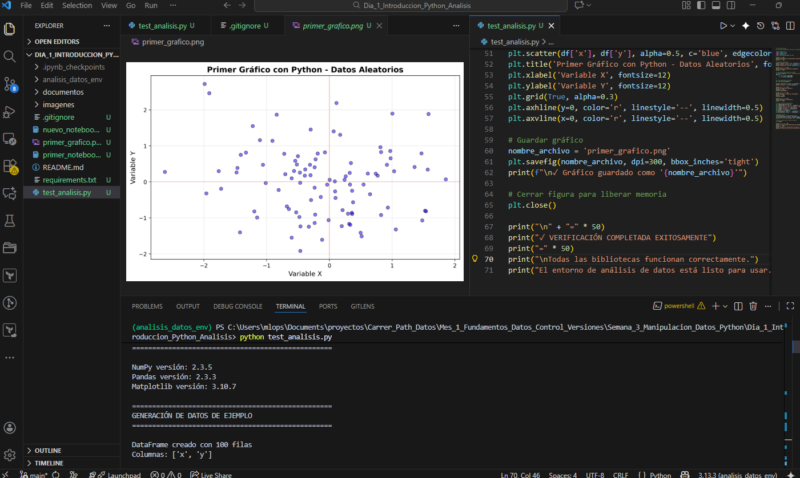

# Introducción a Python para Análisis de Datos

# Ejercicio: Configuración de Entorno Python para Análisis de Datos

## 📋 Objetivo
Configurar un entorno completo de desarrollo en Python para análisis de datos, instalando y verificando las bibliotecas esenciales (NumPy, Pandas, Matplotlib, Jupyter) y creando un primer script de análisis funcional.

---

## 🧠 Conceptos Fundamentales: El Ecosistema Python para el Análisis

La configuración de un entorno robusto es el primer paso en cualquier proyecto de análisis de datos con Python. Este proceso se basa en dos pilares fundamentales: **el aislamiento** y el **conjunto de herramientas estándar**.

### 1. El Aislamiento de Proyectos: Entornos Virtuales (`venv`)

Un **Entorno Virtual** (`venv`) es un directorio autocontenido que aísla un proyecto del resto del sistema.

* **Propósito Clave (Aislamiento):** Cada proyecto puede tener sus propias versiones de las bibliotecas (ej., Pandas 1.0 en un proyecto y Pandas 2.0 en otro) sin que haya conflictos globales.
* **Reproducibilidad:** Facilita la creación del archivo `requirements.txt`, que documenta las dependencias exactas. Esto garantiza que cualquier persona que use el proyecto pueda replicar el entorno de trabajo exacto.
* **Limpieza:** Mantiene el intérprete de Python de tu sistema operativo (el "global") limpio de paquetes específicos de cada proyecto.

### 2. El Gestor de Paquetes: `pip`

**`pip`** es el estándar de facto para instalar, actualizar y eliminar paquetes de Python. Es la herramienta que utilizamos para poblar nuestro entorno virtual con las bibliotecas de análisis.

* **Función:** `pip` busca las bibliotecas en **PyPI** (Python Package Index), el repositorio oficial de paquetes de Python, y las descarga e instala en el entorno activo.

### 3. El Conjunto de Herramientas Core (El Stack de Análisis)

El flujo de trabajo moderno de análisis de datos en Python se basa en un conjunto de bibliotecas que trabajan en conjunto, también conocido como el "Data Science Stack":

| Biblioteca | Rol Principal | Explicación |
| :--- | :--- | :--- |
| **NumPy** | **Computación Numérica** (Base) | Proporciona el objeto central **`array` N-dimensional**, que es mucho más rápido y eficiente que las listas estándar de Python para cálculos a gran escala. Es la base sobre la que se construyen las demás bibliotecas. |
| **Pandas** | **Manipulación y Limpieza de Datos** | Introduce las estructuras de datos **`DataFrame`** y **`Series`**, esenciales para manejar datos tabulares (similares a una hoja de cálculo o una tabla SQL). Es la herramienta principal para limpieza, filtrado y transformación de datos. |
| **Matplotlib** | **Visualización Estática** | La biblioteca fundamental para crear **gráficos estáticos** de alta calidad (histogramas, gráficos de dispersión, líneas) para el Análisis Exploratorio de Datos (EDA). |
| **Jupyter** | **Desarrollo Interactivo** | Permite la creación de **Notebooks**, documentos interactivos que combinan código ejecutable, visualizaciones, y texto narrativo. Es la herramienta estándar para documentar y compartir análisis de datos. |

---

## 🛠️ Requerimientos

- **Sistema operativo:** Windows 11
- **Python:** Versión 3.8 o superior
- **Conexión a internet:** Para descargar paquetes
- **Espacio en disco:** ~1GB para bibliotecas y entornos virtuales
- **Editor de código:** Visual Studio Code
- **Permisos:** Administrador (para instalación de paquetes)

---

## 📝 Pasos Realizados

### 1. Verificación de Python Instalado

#### 1.1 Verificar versión de Python

```bash
python --version
```

**Resultado esperado:**
```
Python 3.x.x
```

**Si Python no está instalado:**
1. Descargar desde [python.org](https://www.python.org/downloads/)
2. Durante la instalación, **marcar la opción "Add Python to PATH"**
3. Reiniciar la terminal después de la instalación

#### 1.2 Verificar pip (gestor de paquetes)

```bash
pip --version
```

**Resultado esperado:**
```
pip 24.x.x from C:\Users\...\Python\Python3x\lib\site-packages\pip (python 3.x)
```

---

### 2. Crear Directorio del Proyecto

#### 2.1 Crear carpeta del proyecto

```bash
# Navegar a la carpeta del Career Path
cd Carrer_Path_Datos

# Crear nueva carpeta para el ejercicio
mkdir ejercicio-python-analisis
cd ejercicio-python-analisis
```

#### 2.2 Abrir carpeta en VS Code

```bash
code .
```

---

### 3. Crear Entorno Virtual

#### 3.1 ¿Qué es un entorno virtual?

Un entorno virtual es un espacio aislado donde instalas paquetes de Python sin afectar la instalación global del sistema. Esto permite:
- Tener diferentes versiones de paquetes para diferentes proyectos
- Evitar conflictos entre dependencias
- Mantener el sistema limpio y organizado

#### 3.2 Crear el entorno virtual

```bash
python -m venv analisis_datos_env
```

**Explicación del comando:**
- `python`: Ejecuta Python
- `-m venv`: Usa el módulo venv para crear entornos virtuales
- `analisis_datos_env`: Nombre del entorno virtual (puede ser cualquier nombre)

**Resultado:**
Se crea una carpeta `analisis_datos_env` con la siguiente estructura:
```
analisis_datos_env/
├── Include/
├── Lib/
├── Scripts/          # En Windows
│   ├── activate      # Script de activación
│   ├── activate.bat
│   ├── python.exe    # Python del entorno
│   └── pip.exe       # Pip del entorno
└── pyvenv.cfg
```

#### 3.3 Activar el entorno virtual

**En Windows (PowerShell o CMD):**
```bash
analisis_datos_env\Scripts\activate
```

**Resultado esperado:**
```
(analisis_datos_env) C:\Users\...\ejercicio-python-analisis>
```

**Nota importante:** El `(analisis_datos_env)` al inicio de la línea indica que el entorno está activo.

**Si aparece un error de permisos en PowerShell:**
```bash
# Ejecutar PowerShell como Administrador y ejecutar:
Set-ExecutionPolicy -ExecutionPolicy RemoteSigned -Scope CurrentUser
```

#### 3.4 Verificar que el entorno está activo

```bash
where python
```

**Resultado esperado (Windows):**
```
C:\Users\...\ejercicio-python-analisis\analisis_datos_env\Scripts\python.exe
```

Esto confirma que estás usando el Python del entorno virtual, no el del sistema.

---

### 4. Instalar Bibliotecas Esenciales

#### 4.1 Actualizar pip (recomendado)

```bash
python -m pip install --upgrade pip
```

**Resultado esperado:**
```
Successfully installed pip-24.x.x
```

#### 4.2 Instalar NumPy

**¿Qué es NumPy?**
- Biblioteca fundamental para computación científica en Python
- Proporciona arreglos multidimensionales (arrays)
- Operaciones matemáticas de alto rendimiento
- Base de Pandas, Matplotlib y otras bibliotecas

```bash
pip install numpy
```

**Resultado esperado:**
```
Collecting numpy
  Downloading numpy-x.x.x-cp3x-cp3x-win_amd64.whl
Installing collected packages: numpy
Successfully installed numpy-x.x.x
```

#### 4.3 Instalar Pandas

**¿Qué es Pandas?**
- Biblioteca para manipulación y análisis de datos
- Proporciona estructuras DataFrame y Series
- Lectura/escritura de archivos CSV, Excel, SQL
- Herramientas para limpieza y transformación de datos

```bash
pip install pandas
```

**Resultado esperado:**
```
Collecting pandas
  Downloading pandas-x.x.x-cp3x-cp3x-win_amd64.whl
Collecting python-dateutil>=2.8.2
Collecting pytz>=2020.1
Collecting tzdata>=2022.1
Installing collected packages: tzdata, pytz, python-dateutil, numpy, pandas
Successfully installed pandas-x.x.x ...
```

#### 4.4 Instalar Matplotlib

**¿Qué es Matplotlib?**
- Biblioteca para crear visualizaciones estáticas, animadas e interactivas
- Gráficos de líneas, barras, dispersión, histogramas, etc.
- Altamente personalizable
- Integración con Jupyter Notebooks

```bash
pip install matplotlib
```

**Resultado esperado:**
```
Collecting matplotlib
  Downloading matplotlib-x.x.x-cp3x-cp3x-win_amd64.whl
Collecting contourpy>=1.0.1
Collecting cycler>=0.10
Collecting fonttools>=4.22.0
Collecting kiwisolver>=1.3.1
Collecting packaging>=20.0
Collecting pillow>=8
Collecting pyparsing>=2.3.1
Installing collected packages: pyparsing, pillow, packaging, kiwisolver, fonttools, cycler, contourpy, matplotlib
Successfully installed matplotlib-x.x.x ...
```

#### 4.5 Instalar Jupyter

**¿Qué es Jupyter?**
- Entorno interactivo para programación
- Notebooks que combinan código, texto y visualizaciones
- Ideal para exploración de datos y documentación
- Usado ampliamente en ciencia de datos

```bash
pip install jupyter
```

**Resultado esperado:**
```
Collecting jupyter
  Downloading jupyter-x.x.x-py3-none-any.whl
Collecting notebook
Collecting qtconsole
Collecting jupyter-console
Collecting nbconvert
Collecting ipykernel
Collecting ipywidgets
[... muchas dependencias ...]
Successfully installed jupyter-x.x.x ...
```

**Nota:** Jupyter instala muchas dependencias, puede tomar varios minutos.

#### 4.6 Ver todas las bibliotecas instaladas

```bash
pip list
```

**Resultado esperado (lista parcial):**
```
Package                   Version
------------------------- ---------
jupyter                   x.x.x
matplotlib                x.x.x
numpy                     x.x.x
pandas                    x.x.x
pip                       24.x.x
[... otras dependencias ...]
```

---

### 5. Verificar Instalación de Bibliotecas

#### 5.1 Verificar versiones con un solo comando

```bash
python -c "import numpy as np; import pandas as pd; import matplotlib; print('NumPy:', np.__version__); print('Pandas:', pd.__version__); print('Matplotlib:', matplotlib.__version__)"
```

**Resultado esperado:**
```
NumPy: 1.26.x
Pandas: 2.1.x
Matplotlib: 3.8.x
```

#### 5.2 Verificar Jupyter

```bash
jupyter --version
```

**Resultado esperado:**
```
Selected Jupyter core packages...
IPython          : 8.x.x
ipykernel        : 6.x.x
ipywidgets       : 8.x.x
jupyter_client   : 8.x.x
jupyter_core     : 5.x.x
jupyter_server   : 2.x.x
jupyterlab       : not installed
nbclient         : 0.x.x
nbconvert        : 7.x.x
nbformat         : 5.x.x
notebook         : 7.x.x
qtconsole        : 5.x.x
traitlets        : 5.x.x
```

---

### 6. Crear Primer Script de Análisis

#### 6.1 Crear archivo test_analisis.py

En VS Code, crear un nuevo archivo llamado `test_analisis.py` con el siguiente contenido:

```python
# test_analisis.py
# Script de prueba para verificar instalación de bibliotecas

import numpy as np
import pandas as pd
import matplotlib
import matplotlib.pyplot as plt

print("=" * 50)
print("VERIFICACIÓN DE BIBLIOTECAS INSTALADAS")
print("=" * 50)

# Verificar versiones
print(f"\nNumPy versión: {np.__version__}")
print(f"Pandas versión: {pd.__version__}")
print(f"Matplotlib versión: {matplotlib.__version__}")

print("\n" + "=" * 50)
print("GENERACIÓN DE DATOS DE EJEMPLO")
print("=" * 50)

# Crear datos de ejemplo con NumPy
np.random.seed(42)  # Para reproducibilidad
datos = {
    'x': np.random.randn(100),
    'y': np.random.randn(100)
}

# Crear DataFrame con Pandas
df = pd.DataFrame(datos)

print(f"\nDataFrame creado con {len(df)} filas")
print(f"Columnas: {list(df.columns)}")

print("\n" + "=" * 50)
print("ESTADÍSTICAS BÁSICAS")
print("=" * 50)
print(df.describe())

print("\n" + "=" * 50)
print("PRIMERAS 5 FILAS DEL DATAFRAME")
print("=" * 50)
print(df.head())

print("\n" + "=" * 50)
print("GENERACIÓN DE GRÁFICO")
print("=" * 50)

# Crear gráfico de dispersión
plt.figure(figsize=(10, 6))
plt.scatter(df['x'], df['y'], alpha=0.5, c='blue', edgecolors='black')
plt.title('Primer Gráfico con Python - Datos Aleatorios', fontsize=14, fontweight='bold')
plt.xlabel('Variable X', fontsize=12)
plt.ylabel('Variable Y', fontsize=12)
plt.grid(True, alpha=0.3)
plt.axhline(y=0, color='r', linestyle='--', linewidth=0.5)
plt.axvline(x=0, color='r', linestyle='--', linewidth=0.5)

# Guardar gráfico
nombre_archivo = 'primer_grafico.png'
plt.savefig(nombre_archivo, dpi=300, bbox_inches='tight')
print(f"\n✓ Gráfico guardado como '{nombre_archivo}'")

# Cerrar figura para liberar memoria
plt.close()

print("\n" + "=" * 50)
print("✓ VERIFICACIÓN COMPLETADA EXITOSAMENTE")
print("=" * 50)
print("\nTodas las bibliotecas funcionan correctamente.")
print("El entorno de análisis de datos está listo para usar.")
```

#### 6.2 Guardar el archivo

Guardar el archivo `test_analisis.py` en la carpeta `ejercicio-python-analisis`.

---

### 7. Ejecutar el Script de Prueba

#### 7.1 Ejecutar el script

```bash
python test_analisis.py
```

**Resultado esperado:**
```
==================================================
VERIFICACIÓN DE BIBLIOTECAS INSTALADAS
==================================================

NumPy versión: 1.26.x
Pandas versión: 2.1.x
Matplotlib versión: 3.8.x

==================================================
GENERACIÓN DE DATOS DE EJEMPLO
==================================================

DataFrame creado con 100 filas
Columnas: ['x', 'y']

==================================================
ESTADÍSTICAS BÁSICAS
==================================================
                x           y
count  100.000000  100.000000
mean     0.059808   -0.023320
std      0.953962    1.014664
min     -2.552990   -2.428003
25%     -0.611139   -0.670668
50%      0.099061   -0.069687
75%      0.739235    0.619926
max      2.269754    2.834055

==================================================
PRIMERAS 5 FILAS DEL DATAFRAME
==================================================
          x         y
0  0.496714 -0.138264
1 -0.138264  0.647689
2  0.647689  1.523030
3  1.523030 -0.234153
4 -0.234153 -0.234137

==================================================
GENERACIÓN DE GRÁFICO
==================================================

✓ Gráfico guardado como 'primer_grafico.png'

==================================================
✓ VERIFICACIÓN COMPLETADA EXITOSAMENTE
==================================================

Todas las bibliotecas funcionan correctamente.
El entorno de análisis de datos está listo para usar.
```

#### 7.2 Verificar archivo de imagen generado

En la carpeta `ejercicio-python-analisis` debe aparecer el archivo `primer_grafico.png`.

**Abrir la imagen para verificar:**
- Doble clic en `primer_grafico.png`
- Debe mostrar un gráfico de dispersión con 100 puntos azules
- Ejes X e Y centrados en 0
- Líneas de referencia en rojo

---

### 8. Crear Primer Jupyter Notebook

#### 8.1 Iniciar Jupyter Notebook

```bash
jupyter notebook
```

**Resultado esperado:**
- Se abre automáticamente el navegador web
- URL: `http://localhost:8888/tree`
- Muestra el explorador de archivos de Jupyter

**Nota:** Para detener Jupyter, presionar `Ctrl + C` en la terminal.

#### 8.2 Crear un nuevo notebook

1. Click en "New" → "Python 3 (ipykernel)"
2. Se abre un nuevo notebook en una pestaña

#### 8.3 Primer notebook de prueba

**Celda 1 - Importar bibliotecas:**
```python
import numpy as np
import pandas as pd
import matplotlib.pyplot as plt

print("Bibliotecas importadas correctamente")
```

**Ejecutar:** Presionar `Shift + Enter`

**Celda 2 - Crear datos:**
```python
# Crear datos de ejemplo
np.random.seed(42)
datos = pd.DataFrame({
    'A': np.random.randn(50),
    'B': np.random.randn(50),
    'C': np.random.randint(1, 10, 50)
})

print(f"DataFrame creado con {len(datos)} filas y {len(datos.columns)} columnas")
datos.head()
```

**Celda 3 - Visualización:**
```python
# Crear gráfico
plt.figure(figsize=(10, 6))
plt.scatter(datos['A'], datos['B'], s=datos['C']*20, alpha=0.6, c=datos['C'], cmap='viridis')
plt.colorbar(label='Valor C')
plt.xlabel('Variable A')
plt.ylabel('Variable B')
plt.title('Visualización de Datos con Matplotlib')
plt.grid(True, alpha=0.3)
plt.show()
```

#### 8.4 Guardar el notebook

1. Click en "File" → "Save and Checkpoint"
2. Renombrar: Click en "Untitled" → "primer_notebook"

#### 8.5 Cerrar Jupyter

En la terminal donde se ejecutó `jupyter notebook`, presionar `Ctrl + C` y confirmar con `y`.

---

### 9. Crear requirements.txt

#### 9.1 ¿Qué es requirements.txt?

Es un archivo que lista todas las dependencias del proyecto con sus versiones, permitiendo replicar el entorno en otro sistema.

#### 9.2 Generar requirements.txt

```bash
pip freeze > requirements.txt
```

#### 9.3 Contenido de requirements.txt

Abrir el archivo `requirements.txt` generado:

```
numpy==1.26.x
pandas==2.1.x
matplotlib==3.8.x
jupyter==x.x.x
[... otras dependencias ...]
```

#### 9.4 Uso futuro de requirements.txt

Para instalar todas las dependencias en un nuevo entorno:
```bash
pip install -r requirements.txt
```

---

### 10. Crear .gitignore

#### 10.1 ¿Por qué un .gitignore?

Para evitar subir archivos innecesarios a Git (como el entorno virtual, archivos temporales, etc.).

#### 10.2 Crear archivo .gitignore

Crear un archivo `.gitignore` en la carpeta del proyecto con el siguiente contenido:

```
# Entorno virtual
analisis_datos_env/
venv/
env/

# Archivos de Python
__pycache__/
*.py[cod]
*$py.class
*.so

# Jupyter Notebook
.ipynb_checkpoints/
*.ipynb_checkpoints

# Archivos de sistema
.DS_Store
Thumbs.db

# Archivos de IDE
.vscode/
.idea/

# Archivos de datos temporales
*.log
*.tmp
```

---

## ✅ Verificación Final

### Checklist de completitud:

- [x] Python instalado y verificado
- [x] pip actualizado
- [x] Entorno virtual creado (`analisis_datos_env`)
- [x] Entorno virtual activado correctamente
- [x] NumPy instalado y verificado
- [x] Pandas instalado y verificado
- [x] Matplotlib instalado y verificado
- [x] Jupyter instalado y verificado
- [x] Script `test_analisis.py` creado y ejecutado
- [x] Gráfico `primer_grafico.png` generado
- [x] Jupyter Notebook iniciado correctamente
- [x] Primer notebook creado y guardado
- [x] Archivo `requirements.txt` generado
- [x] Archivo `.gitignore` creado

---

## 📊 Resumen de Bibliotecas Instaladas

| Biblioteca | Versión | Propósito | Uso Principal |
|------------|---------|-----------|---------------|
| **NumPy** | 1.26.x | Computación numérica | Arrays, operaciones matemáticas |
| **Pandas** | 2.1.x | Análisis de datos | DataFrames, manipulación de datos |
| **Matplotlib** | 3.8.x | Visualización | Gráficos y plots |
| **Jupyter** | x.x.x | Entorno interactivo | Notebooks, exploración de datos |

---

## 🎯 Conceptos Clave Aprendidos

### 1. Entornos Virtuales en Python

**¿Qué son?**
Los entornos virtuales son directorios aislados que contienen una instalación de Python específica y sus paquetes.

**¿Por qué usarlos?**
- **Aislamiento**: Cada proyecto tiene sus propias dependencias
- **Sin conflictos**: Diferentes proyectos pueden usar diferentes versiones de la misma biblioteca
- **Reproducibilidad**: Fácil replicar el entorno en otra máquina
- **Limpieza**: No contaminas la instalación global de Python

**Comandos esenciales:**
```bash
# Crear entorno
python -m venv nombre_entorno

# Activar (Windows)
nombre_entorno\Scripts\activate

# Desactivar
deactivate

# Eliminar entorno
rm -rf nombre_entorno  # o eliminar carpeta manualmente
```

---

### 2. Gestor de Paquetes pip

**¿Qué es pip?**
pip es el gestor de paquetes estándar de Python para instalar y administrar bibliotecas.

**Comandos esenciales:**
```bash
# Instalar paquete
pip install nombre_paquete

# Instalar versión específica
pip install nombre_paquete==1.2.3

# Actualizar paquete
pip install --upgrade nombre_paquete

# Desinstalar paquete
pip uninstall nombre_paquete

# Listar paquetes instalados
pip list

# Mostrar información de un paquete
pip show nombre_paquete

# Exportar dependencias
pip freeze > requirements.txt

# Instalar desde requirements.txt
pip install -r requirements.txt
```

---

### 3. NumPy - Computación Numérica

**Características principales:**
- Arrays multidimensionales eficientes
- Operaciones matemáticas vectorizadas
- Álgebra lineal, transformadas de Fourier, generación de números aleatorios

**Ejemplo básico:**
```python
import numpy as np

# Crear array
arr = np.array([1, 2, 3, 4, 5])

# Operaciones vectorizadas
arr * 2  # [2, 4, 6, 8, 10]
arr + 10  # [11, 12, 13, 14, 15]

# Estadísticas
arr.mean()  # 3.0
arr.std()   # 1.41421356...
```

---

### 4. Pandas - Análisis de Datos

**Estructuras principales:**
- **Series**: Array unidimensional con etiquetas
- **DataFrame**: Tabla bidimensional (como Excel o SQL)

**Características:**
- Lectura/escritura de archivos (CSV, Excel, SQL, JSON)
- Manipulación de datos (filtrado, agrupación, fusión)
- Manejo de datos faltantes
- Operaciones de series temporales

**Ejemplo básico:**
```python
import pandas as pd

# Crear DataFrame
df = pd.DataFrame({
    'nombre': ['Ana', 'Carlos', 'María'],
    'edad': [25, 30, 28],
    'ciudad': ['Madrid', 'Barcelona', 'Valencia']
})

# Operaciones básicas
df.head()  # Primeras 5 filas
df.describe()  # Estadísticas
df[df['edad'] > 27]  # Filtrado
```

---

### 5. Matplotlib - Visualización de Datos

**Características principales:**
- Gráficos de líneas, barras, dispersión, histogramas, etc.
- Personalización completa (colores, etiquetas, leyendas)
- Exportación a múltiples formatos (PNG, PDF, SVG)
- Integración con Pandas y NumPy

**Ejemplo básico:**
```python
import matplotlib.pyplot as plt

# Crear gráfico simple
plt.plot([1, 2, 3, 4], [1, 4, 2, 3])
plt.xlabel('Eje X')
plt.ylabel('Eje Y')
plt.title('Mi Gráfico')
plt.show()
```

---

### 6. Jupyter Notebooks

**¿Qué son?**
Documentos interactivos que combinan código ejecutable, texto narrativo, ecuaciones y visualizaciones.

**Ventajas:**
- **Interactividad**: Ejecuta código celda por celda
- **Documentación**: Mezcla código con explicaciones
- **Visualización**: Gráficos se muestran inline
- **Compartir**: Fácil de compartir y reproducir

**Comandos útiles:**
- `Shift + Enter`: Ejecutar celda y avanzar
- `Ctrl + Enter`: Ejecutar celda sin avanzar
- `A`: Insertar celda arriba
- `B`: Insertar celda abajo
- `D + D`: Eliminar celda
- `M`: Convertir a Markdown
- `Y`: Convertir a código

---

## 💡 Mejores Prácticas

### 1. Siempre usar entornos virtuales

```bash
# ✅ BIEN: Un entorno por proyecto
cd mi_proyecto
python -m venv venv
venv\Scripts\activate
pip install paquetes_necesarios

# ❌ MAL: Instalar todo globalmente
pip install paquetes_necesarios  # Sin entorno virtual
```

### 2. Documentar dependencias

```bash
# ✅ BIEN: Mantener requirements.txt actualizado
pip freeze > requirements.txt

# ❌ MAL: No documentar qué paquetes usas
# (Dificulta replicar el entorno)
```

### 3. Usar .gitignore apropiado

```bash
# ✅ BIEN: Excluir entorno virtual y archivos innecesarios
# Ver sección 10.2 para contenido completo

# ❌ MAL: Subir todo a Git
# (Aumenta tamaño del repositorio innecesariamente)
```

### 4. Nombrar entornos virtuales consistentemente

```bash
# ✅ BIEN: Nombres descriptivos
python -m venv venv           # Estándar simple
python -m venv env            # Alternativa común
python -m venv .venv          # Oculto en Linux/Mac

# ⚠️ FUNCIONA pero menos común
python -m venv mi_super_entorno_largo_123
```

---

## 🔧 Solución de Problemas Comunes

### Problema 1: Python no reconocido

**Error:**
```
'python' is not recognized as an internal or external command
```

**Solución:**
1. Reinstalar Python marcando "Add Python to PATH"
2. O agregar manualmente a PATH: `C:\Users\...\Python3x\`
3. Reiniciar la terminal

---

### Problema 2: pip no funciona

**Error:**
```
'pip' is not recognized...
```

**Solución:**
```bash
# Usar python -m pip en lugar de pip
python -m pip install numpy
```

---

### Problema 3: Error de permisos al activar entorno (PowerShell)

**Error:**
```
cannot be loaded because running scripts is disabled on this system
```

**Solución:**
```powershell
# Ejecutar como Administrador
Set-ExecutionPolicy -ExecutionPolicy RemoteSigned -Scope CurrentUser
```

---

### Problema 4: Matplotlib no muestra gráficos

**Solución:**
```python
# Agregar al final del script
plt.show()

# O en Jupyter
%matplotlib inline
```

---

### Problema 5: ModuleNotFoundError

**Error:**
```
ModuleNotFoundError: No module named 'numpy'
```

**Solución:**
1. Verificar que el entorno virtual esté activado
2. Instalar el módulo: `pip install numpy`
3. Verificar que estás usando el Python correcto: `where python`

---

### Problema 6: Error `[Errno 2] No such file or directory` (Rutas largas)

**Error:**

```
[Errno 2] No such file or directory: '...vendors-node_modules_d3-color_src_color_js-node_modules...'
```

**Contexto:**
El problema es que Jupyter instala archivos con nombres extremadamente largos (especialmente extensiones de JavaScript), y sumado a rutas de carpetas profundas (ej: `C:\Users\...\Documents\proyectos\Carrer_Path_Datos\`), se excede el límite de 260 caracteres de Windows.

**Solución 1: Mover tu proyecto a la raíz (Recomendada)**
Aunque se acorten los nombres de las carpetas, la ruta puede seguir siendo demasiado profunda.

1.  Borra la carpeta `analisis_datos_env` actual (puede estar corrupta).
2.  Crea una carpeta directamente en el disco C (ej: `C:\Dev` o `C:\Proyectos`).
3.  Mueve tu carpeta del proyecto allí (ej: `C:\Dev\M1_S3_D1`).
4.  Abre esa carpeta en VS Code y reinstala:

<!-- end list -->

```powershell
python -m venv venv
.\venv\Scripts\activate
pip install numpy pandas matplotlib jupyter
```

**Solución 2: Habilitar "Long Paths" en Windows (Definitiva)**
Para mantener las carpetas donde están, se debe configurar Windows para aceptar rutas largas.

1.  Abre PowerShell como Administrador.
2.  Ejecuta:

<!-- end list -->

```powershell
New-ItemProperty -Path "HKLM:\SYSTEM\CurrentControlSet\Control\FileSystem" -Name "LongPathsEnabled" -Value 1 -PropertyType DWORD -Force
```

3.  **Reinicia tu computadora** (obligatorio).
4.  Vuelve a intentar instalar las librerías.

---

## ✅ Evidencia


---


## 🚀 Próximos Pasos

### Conceptos a explorar:

1. **Análisis exploratorio de datos (EDA)**
   - Carga de datasets reales
   - Limpieza de datos
   - Visualizaciones avanzadas

2. **Pandas avanzado**
   - GroupBy y agregaciones
   - Merge y Join de DataFrames
   - Series temporales

3. **Visualización avanzada**
   - Seaborn para gráficos estadísticos
   - Plotly para gráficos interactivos
   - Dash para dashboards web

4. **Bibliotecas adicionales**
   - Scikit-learn (Machine Learning)
   - Seaborn (Visualización estadística)
   - Plotly (Gráficos interactivos)
   - Statsmodels (Modelos estadísticos)

---

## 📖 Recursos Adicionales

- [Documentación oficial de Python](https://docs.python.org/3/)
- [NumPy Documentation](https://numpy.org/doc/)
- [Pandas Documentation](https://pandas.pydata.org/docs/)
- [Matplotlib Tutorials](https://matplotlib.org/stable/tutorials/index.html)
- [Jupyter Documentation](https://jupyter.org/documentation)
- [Real Python Tutorials](https://realpython.com/)

---

## 📝 Comandos Útiles - Referencia Rápida

```bash
# Entornos virtuales
python -m venv nombre_env        # Crear
nombre_env\Scripts\activate      # Activar (Windows)
deactivate                       # Desactivar

# pip
pip install paquete              # Instalar
pip install -r requirements.txt  # Instalar desde archivo
pip list                         # Listar instalados
pip freeze > requirements.txt    # Exportar

# Jupyter
jupyter notebook                 # Iniciar
Ctrl + C                        # Detener

# Python
python script.py                 # Ejecutar script
python -c "código"              # Ejecutar código inline
```

---

## 📅 Notas del Ejercicio

- **Fecha de realización**: Noviembre 2025
- **Entorno**: Windows 11, VS Code, Python 3.x
- **Entorno virtual**: analisis_datos_env
- **Bibliotecas instaladas**: NumPy, Pandas, Matplotlib, Jupyter
- **Archivos creados**: test_analisis.py, primer_grafico.png, primer_notebook.ipynb, requirements.txt, .gitignore

---

## ✨ Conclusiones

Este ejercicio estableció las bases para trabajar con Python en análisis de datos:

### Logros alcanzados:

1. **Entorno configurado**: Python y pip funcionando correctamente
2. **Entorno virtual**: Espacio aislado para el proyecto
3. **Bibliotecas esenciales**: NumPy, Pandas, Matplotlib, Jupyter instalados
4. **Primer script**: Verificación exitosa de todas las bibliotecas
5. **Primer notebook**: Jupyter funcionando correctamente
6. **Buenas prácticas**: requirements.txt y .gitignore implementados

### Habilidades adquiridas:

- Crear y gestionar entornos virtuales
- Instalar y verificar paquetes con pip
- Ejecutar scripts de Python
- Trabajar con Jupyter Notebooks
- Generar visualizaciones con Matplotlib
- Documentar dependencias del proyecto

El entorno está completamente configurado y listo para comenzar con análisis de datos reales. Las bibliotecas instaladas (NumPy, Pandas, Matplotlib, Jupyter) son el estándar de la industria y permiten realizar desde análisis exploratorios simples hasta proyectos complejos de ciencia de datos.

### Próximo nivel:

Con este entorno configurado, ahora es posible:
- Cargar y analizar datasets reales (CSV, Excel, bases de datos)
- Realizar limpieza y transformación de datos
- Crear visualizaciones profesionales
- Documentar análisis en Jupyter Notebooks
- Compartir código y resultados de forma reproducible

---

[Volver al índice principal](../../../README.md) | [Volver al Mes 1](../../README.md) | [Volver a Semana 3](../README.md) | [Día Siguiente →](../Dia_2_Extraccion_Datos_Multiples_Fuentes/README.md)
